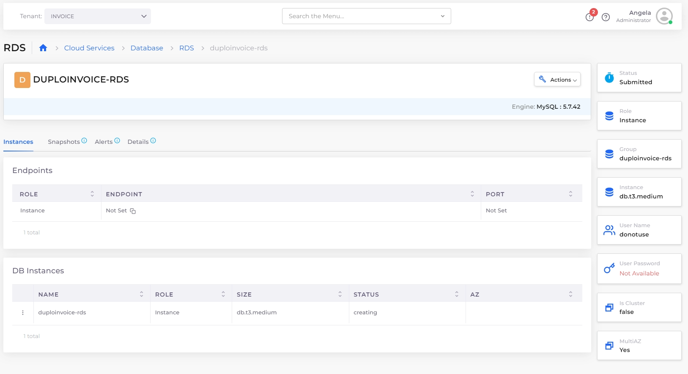

# RDS database

Create, configure, and manage RDS instances directly from the DuploCloud Portal.

DuploCloud supports the following RDS databases in AWS:

| 

<ul><li>MySQL</li><li>PostgreSQL</li><li>MariaDB</li><li>Microsoft SQL-Express</li><li>Microsoft SQL-We</li></ul> | 

<ul><li>Microsoft SQL-Standard</li><li>Aurora MySQL</li><li>Aurora MySQL Serverless</li><li>Aurora PostgreSQL</li><li>Aurora PostgreSQL Serverless</li></ul> |
| ------------------------------------------------------------------------------------------------------------------------ | ------------------------------------------------------------------------------------------------------------------------------------------------------------------- |

\*Support for Aurora Serverless V1 database engines has been deprecated. Do not create V1 engines when using Terraform.


When upgrading RDS versions, use the AWS Console and see your Cloud Provider for compatibility requirements. Note that while versions 5.7.40, 5.7.41, and 5.7.42 cannot be upgraded to version 8.0.28, you can upgrade them to version 8.0.32 and higher.


## Creating an RDS database 

1. In the DuploCloud Portal, navigate to **Cloud Services** -> **Database**.
2. Click **Add**. The **Create a RDS** page displays.

<figure><figcaption>
The <strong>Create a RDS</strong> page in the DuploCloud Portal
</figcaption></figure>

3. Complete the following fields:

<table data-header-hidden><thead><tr><th width="309.111083984375"></th><th></th></tr></thead><tbody><tr><td><strong>RDS Name</strong></td><td>Please provide a unique identifier for the RDS instance that is unique across all Tenants.</td></tr><tr><td><strong>Create from Snapshot</strong> <em>(Optional)</em></td><td>Select this when you want to create RDS instance from existing Snapshot.</td></tr><tr><td><strong>RDS Engine</strong></td><td>Select Database engine for creating RDS instance.</td></tr><tr><td><strong>RDS Engine Version</strong></td><td>Select database engine version. If not selected latest version will be used while creating database. Select type as 'Other' if you don't see desired option in dropdown list.</td></tr><tr><td><strong>Encryption Key</strong> <em>(Optional)</em></td><td>Choose to encrypt the given instance.</td></tr><tr><td><strong>RDS Instance Size</strong></td><td>Instance size for RDS. Select type as 'Other' if you don't see desired option in dropdown list.</td></tr><tr><td><strong>Backup Retention Period in Days</strong></td><td>Specify in days for automated backups. Valid values 1-35. (Optional). If not specified, by default Backup Retention Day would be set as 1.</td></tr><tr><td><strong>Availability Zone Master/Primary</strong> <em>(Optional)</em></td><td>Select an Availability Zone (AZ).</td></tr><tr><td><strong>Certificate Authority</strong></td><td>Select Certificate authority.</td></tr><tr><td><strong>User Name</strong></td><td>Specify an alphanumeric string that defines the login ID for the master user. </td></tr><tr><td><strong>User Password</strong></td><td>Specify a string that defines the password for the master user. Master Password must be at least eight characters long and listed characters are accepted <code>[a-z] [A-Z] [0-9] [- * ! $ % &#x26;]</code>.</td></tr><tr><td><strong>Storage Type</strong> <em>(Optional)</em></td><td>Select the Storage Type: e.g., <strong>Default</strong>, <strong>magnetic (standard)</strong>, <strong>gp2</strong>, <strong>gp3</strong>, <strong>io1</strong>. Default is <strong>gp3</strong>.</td></tr><tr><td><strong>Storage size in GB</strong> <em>(Optional)</em></td><td>Storage allocation for RDS instance in GB.</td></tr><tr><td><strong>DB Name</strong> <em>(Optional)</em></td><td>Specify a name for your Database.</td></tr><tr><td><strong>DB Parameter Group</strong> <em>(Optional)</em></td><td>Database parameters group name.</td></tr><tr><td><strong>DB Subnet Group</strong> <em>(Optional)</em></td><td>Choose a DB subnet group.</td></tr><tr><td><strong>Store Credentials in Secrets Manager</strong></td><td>Enable to store RDS password in AWS Secret Manager.</td></tr><tr><td><strong>Enable MultiAZ</strong></td><td>Enable Multi Availability Zone.</td></tr><tr><td><strong>Enable Logging</strong></td><td>Select to enable logging for the RDS instance.</td></tr><tr><td><strong>Enable Performance Insights</strong></td><td>Enable Performance Insights.</td></tr></tbody></table>

4. Click **Create** to provision the RDS database.

## Creating an Aurora Serverless V2 Cluster database

You can create Aurora Serverless V2 Databases by selecting **Aurora-MySql-Serverless-V2** or **Aurora-PostgreSql-Serverless-V2** from the **RDS Database Engine** list box. Select the **RDS Engine Version** compatible with Aurora Serverless v2. The **RDS Instance Size** of `db.serverless` applies to both engines.

## Creating Aurora databases

### **Create Aurora Serverless V2 Cluster Database**

You can create Aurora Serverless V2 Databases by selecting **Aurora-MySQL-Serverless-V2** or **Aurora-PostgreSQL-Serverless-V2** from the **RDS Engine** list box. Select the RDS Engine Version compatible with Aurora Serverless v2. The **db.serverless** RDS Instance Size applies to both engines.

### **Storage Type Selection for Aurora**

When creating an **Aurora MySQL** or **Aurora PostgreSQL** database, you can select between two storage types:

* **Aurora** (standard storage type for Aurora databases).
* **aurora-iopt1** (optimized for high IOPS performance and low-latency disk operations, ideal for performance-intensive applications).

### Creating a publicly available RDS database

1. [Create a DB subnet group in AWS](https://docs.aws.amazon.com/AmazonElastiCache/latest/mem-ug/SubnetGroups.Creating.html) consisting **only** of public subnets from your VPC.
2. &#x20;In the DuploCloud Portal, navigate to **Cloud Services** -> **Databases**
3. Select the **RDS** tab, and click **Add**. The **Create a RDS** page displays.&#x20;
4. In the **DB Subnet Group** list box select the public DB subnet group you created in AWS.&#x20;
5. Complete the remaining fields according to your requirements.&#x20;
6. Click **Create**. The publicly available RDS database is created.&#x20;

To create a public RDS database, you much first [create a DB subnet group in AWS](https://docs.aws.amazon.com/AmazonElastiCache/latest/dg/SubnetGroups.Creating.html) consisting only of public subnets from your VPC. Then follow the steps above to create an RDS database, selecting the DB subnet group you created from the DB Subnet Group list box.&#x20;


The DB subnet group created in AWS must **only** contain public subnets from your VPC. This configuration is crucial for making the database public.


## Connecting to the database 

Once you create the database, select it and use the **Instances** tab to view the endpoint and credentials. Use the **Endpoints** and credentials to connect to the database from your application running in an EC2 instance. The database is only accessible from inside the EC2 instance in the current Tenant, including the containers running within.

For databases you intend to make publicly available, ensure proper security measures, including broad accessibility, are in place to protect your data.

<figure><figcaption>
The <strong>Instances</strong> tab on the <strong>RDS</strong> details page
</figcaption></figure>


Pass the endpoint, name, and credentials to your application [using environment variables](../../../../automation-platform/overview/aws-services/containers/passing-config-and-secrets.md) for maximum security.


## Updating performance insights for an existing RDS

1. In the DuploCloud Portal, navigate to **Cloud Services** -> **Database** and select the **RDS** tab.&#x20;
2. Click on the RDS name in the **NAME** column.
3. From the **Actions** menu, select **RDS Settings** and then **Update Performance Insights**. The **Update Performance Insights** pane displays.&#x20;
4. Select **Enable Performance Insights**.
5. In the **Performance Insights Retention in Days field**, enter a retention period (1–731 days).
6. From the **Performance Insights Encryption** list box, select an encryption key or select **No Encryption**.
7. **Click Update** to apply the changes.&#x20;

## Managing RDS Certificate Authorities

You can manage the Certificate Authority (CA) for an RDS instance when creating a new RDS database or by updating the CA for an existing database.

### **Choosing a Certificate Authority When Creating an RDS Database**

During the RDS creation process, select a **Certificate Authority** from a dropdown menu.

This option ensures that the RDS instance is set up with the correct certificate authority to encrypt communications using SSL/TLS. The selected CA will validate certificates to ensure secure and trusted connections.

### **Updating the Certificate Authority for an Existing RDS Database**

If you need to update the Certificate Authority used by an existing RDS database, you can do so through the **Actions** menu in the RDS instance settings:

1. Navigate to **Cloud Services** → **Databases**.
2. Select the **RDS** tab.
3. Select the RDS you want to modify from the **NAME** column.
4. From the **Actions** menu, choose **RDS Settings**.
5. Click **Update Certificate Authority**.
6. In the **Certificate Authority** list box, select the new CA to use for the instance.
7. Click **Save** to apply the new CA.
