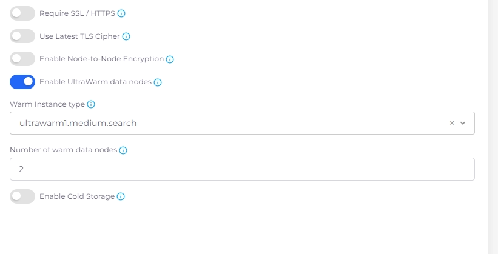

# OpenSearch

1. Navigate to **Cloud Services** -> **Analytics**, select the **OpenSearch** tab, and click the **Add** button. The **Add OpenSearch Domain** page displays.&#x20;
2. In the **Domain Name** field, create a name for the OpenSearch domain.
3. In the **OpenSearch Version** field, select the OpenSearch version you are using.
4. Select your needed instance size from the **Data Instance Size** list box.
5. Enter the the instance count in the **Data Instance Count** field, and choose the correct zone(s) from the **Zone** list box.
6. Optionally, enter a key in the **Encryption Key (Optional)** field.&#x20;
7. In the **Storage (In Gb)** field, enter the amount of storage needed.&#x20;
8. If needed, select a **Master Instance Count** and **Master Instance Size**.&#x20;
9. Use the toggle switches to enable encryption options (**Require SSL/HTTPS, Use Latest TLS Cipher,** or **Enable Node-to-Node Encryption**), if needed.

<figure><figcaption>
The <strong>Add OpenSearch Domain</strong> page.
</figcaption></figure>

10. Optionally, use the toggle switch to **Enable UltraWarm data nodes** (nodes that are optimized for storing large volumes of data cost-effectively). When this option is enabled, additional fields display. Select a **Warm Instance type**, enter **Number of warm data nodes**, and **Enable Cold Storage** as your application requires.\

    <figure><figcaption>
<strong>Enable UltraWarm data nodes</strong> selected, displaying additional options <strong>(Warm Instance type</strong>, <strong>Number of warm data nodes</strong>, and <strong>Enable Cold Storage</strong>)
</figcaption></figure>
11. Click **Submit**. The OpenSearch domain is created.&#x20;

## Managing OpenSearch Logging

See the[ Logging documentation](../use-cases/central-logging/custom-log-collection.md).

