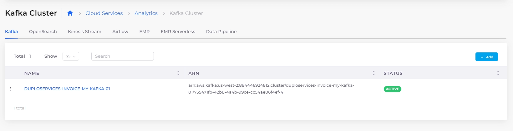

# Kafka Cluster

[Apache Kafka](https://kafka.apache.org/) is a distributed streaming platform that enables the development of real-time, event-driven applications. It is commonly used to build **streaming data pipelines** and **streaming applications** that process and move data between systems in real time. Kafka allows applications to consume and process streams of data at high speed and with high accuracy.

Refer to the [AWS documentation](https://docs.aws.amazon.com/msk/latest/developerguide/what-is-msk.html) for detailed information on using Apache Kafka within the AWS ecosystem.&#x20;


When creating a Kafka cluster in DuploCloud, if you want to choose a specific cluster configuration or configuration revision, you must first create or define that configuration/revision in the AWS Console before you can select it in DuploCloud.


## Creating Kafka clusters

### Creating a provisioned Kafka cluster

1. In the DuploCloud Portal, navigate to **Cloud Services** -> **Analytics**.
2. Click the **Kafka** tab.
3. Click **Add**. The **Create a Kafka Cluster** pane displays.
4. Enter a **Kafka Cluster Name**.
5. In the **Cluster Type** list box, select **Provisioned**.&#x20;
6. From the field list boxes, select you Kafka **Version**, the **Size** of the cluster you want to create, the **Volume** size in gigabytes, and the **Transit Encryption** mode.&#x20;
7. Optionally, select **Availability Zones.** You must specify a minimum of two (2) **Availability Zones** zones.&#x20;
8. Optionally, select a **Number of Broker Nodes**.&#x20;
9.  Optionally, select a **Cluster Configuration** and **Configuration Revision** when creating a Kafka Cluster in DuploCloud. The **Cluster Configuration** and **Configuration Revision** list boxes are prepopulated with configurations and revisions previously defined in the AWS Portal.\

    
<figure><figcaption>
<strong>Create a Kafka Cluster</strong> pane 
</figcaption></figure>

10. Click **Submit**. It may take up to half an hour to create the cluster and display an **Active** status in the **Kafka** tab

<figure><figcaption>
<strong>Kafka</strong> tab with Kafka clusters
</figcaption></figure>

### Creating a serverless Kafka cluster

1. In the DuploCloud Portal, navigate to **Cloud Services** -> **Analytics**.
2. Click the **Kafka** tab.
3.  Click **Add**. The **Create a Kafka Cluster** pane displays.\

    
<figure><figcaption>
The <strong>Create a Kafka Cluster</strong> pane
</figcaption></figure>

4. Enter a **Kafka Cluster Name**.
5. In the **Cluster Type** list box, select **Serverless**.&#x20;
6. Optionally, select **Availability Zones.** You must specify a minimum of two (2) **Availability Zones** zones.&#x20;
7. Click **Submit**. It may take up to half an hour to create the cluster and display an **Active** status in the **Kafka** tab

## Viewing Kafka clusters

View Kafka Clusters by navigating to **Cloud Services** -> **Analytics** in the DuploCloud Portal and selecting the **Kafka** tab.

## Changing Kafka cluster configuration

1. In the DuploCloud Portal, navigate to **Cloud Services** -> **Analytics**.
2. Click the **Kafka** tab.&#x20;
3. Select the Kafka cluster rom the **Name** column. The **Kafka Cluster** page displays.&#x20;
4.  Click the **Actions** menu and select **Change Configuration**. The **Change Cluster Configuration** pane displays.\

    
<figure><figcaption>
Kafka Cluster page <strong>Actions</strong> menu displaying <strong>Change Configuration</strong> option
</figcaption></figure>

5.  From the **Cluster Configuration** list box, select the new cluster configuration.\

    
<figure><figcaption>
<strong>Change Cluster Configuration</strong> pane .
</figcaption></figure>

6. From the **Configuration Revision** list box, select the revision of the new cluster configuration.
7. Click **Submit**. The configuration change is displayed on the **Kafka Cluster** page
