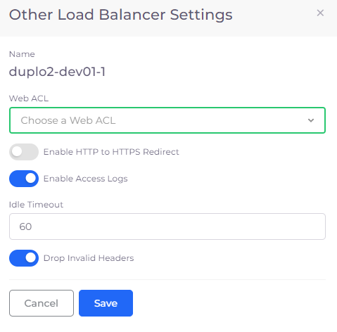
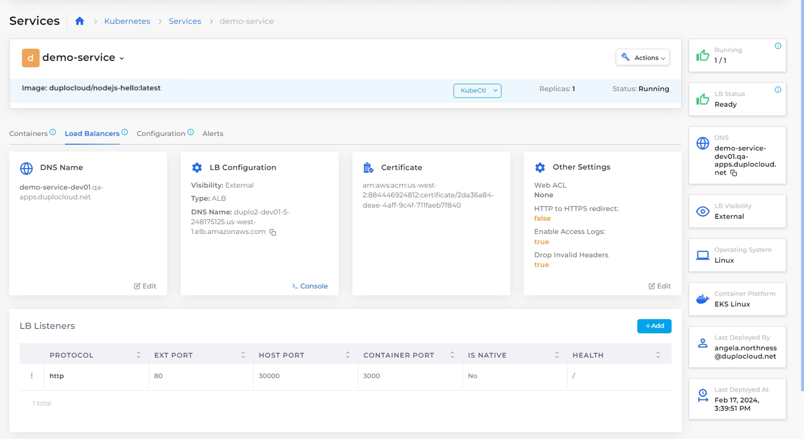

# Step 7: Enable additional options for the Load Balancer (optional)


This step is optional and not necessary to run the example application in this tutorial.

However, while it's not as important to secure a load balancer for a small web application in a tutorial, your production cloud apps require an elevated level of protection.&#x20;

To set up a Web Application Firewall (WAF) for a production application, follow the steps in the [Web Application Firewall procedure](../../aws-services/web-application-firewall-waf.md). You won't set up a WAF in this tutorial.

Otherwise, to skip this step, proceed to the [next page in this tutorial](step-8-create-dns-name.md).


In this tutorial step, for the Application Load Balancer (ALB) you created in [Step 6](../quick-start-duplocloud-docker-services/step-6-create-loadbalancer.md), you will:&#x20;

* Enable access logging to monitor [HTTP message](https://en.wikipedia.org/wiki/HTTP\_message\_body) details.
* Protect against requests that contain [invalid headers](https://en.wikipedia.org/wiki/List\_of\_HTTP\_header\_fields).

_Estimated time to complete Step 7: 5 minutes._

## Prerequisites

Before securing a Load Balancer, verify that you accomplished the tasks in the previous tutorial steps.   Using the DuploCloud Portal, confirm that:

* An [Infrastructure and Plan](../step-1-infrastructure.md) exist, both with the name **NONPROD**.
* The **NONPROD** infrastructure has EKS[ **Enabled**](../step-1-infrastructure.md#check-your-work).&#x20;
* A Tenant with the name [**dev01** has been created](../step-2-tenant.md).
* A Host with the name [**host01** has been created](step-3-create-host.md).
* A Service with the name [**demo-service** has been created](step-5-create-app-via-k8s.md).
* An [HTTPS ALB Load Balancer](../quick-start-duplocloud-docker-services/step-6-create-loadbalancer.md) has been created.&#x20;

### Select the Tenant you created

In the **Tenant** list box, on the upper-left side of the DuploCloud Portal, select the **dev01** Tenant that you created.

## Securing the Load Balancer

1. In the DuploCloud Portal, navigate to **Kubernetes** -> **Services**. The **Services** page displays.
2. From the **Name** column, select the Service to which your Load Balancer is attached (**demo-service**).
3. Click the **Load Balancers** tab.
4. In the **Other Settings** card, click **Edit**. The **Other Load Balancer Settings** pane displays.

<figure><figcaption>
<strong>Load Balancers</strong> tab on the <strong>Services</strong> page with <strong>Other Settings</strong> card
</figcaption></figure>

5. In the **Web ACL** list box, select **None**, because you are not connecting a Web Application Firewall.
6.  For this tutorial, select only the **Enable Access Logs** and **Drop Invalid Headers** options.\
    \

    

    <figure><figcaption>
<strong>Other Load Balancer Settings</strong> pane
</figcaption></figure>

    

7. Accept the **Idle Timeout** default setting and click **Save**. The **Other Settings** card in the **Load Balancers** tab is updated with your selections.

## Checking your work

Verify that the **Other Settings** card contains the selections you made above for:

* **Web ACL** - `None`
* **HTTP to HTTPS Redirect** - `False`
* **Enable Access Logs** - `True`
* **Drop Invalid Headers** - `True`

<figure><figcaption>
<strong>Load Balancers</strong> tab on the <strong>Services</strong> page with <strong>Other Settings</strong> card, including set options 
</figcaption></figure>

