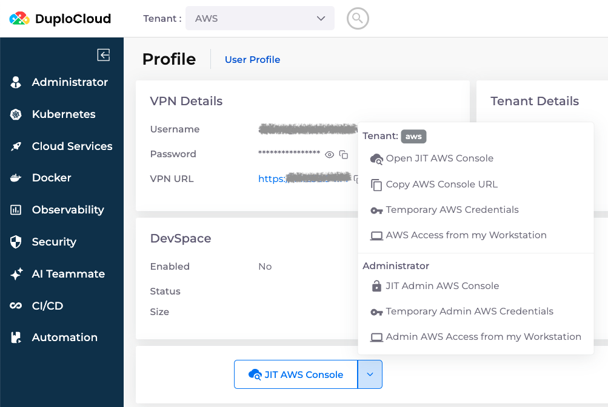

# Just-in-Time (JIT) Access

Most infrastructure work should be done through the DuploCloud portal. It's your interface into the resources it manages.

You can also access AWS outside of DuploCloud to look behind the scenes or develop custom patterns. DuploCloud's JIT generates short-lived AWS console sessions and keys that can only access resources in the tenants the user has access to.

Use DuploCloud-JIT for tasks that require short-term access to AWS resources, such as:

* **One-Time JIT Tasks**: Accessing AWS resources like S3 Buckets or DynamoDB for one-time tasks.
* **Automated Scripts with Short-Lived Access**: Running scripts or CI/CD pipeline tasks that need limited-time access, such as deploying applications or running tests.
* **Ad-Hoc Troubleshooting**: Troubleshooting issues or urgent maintenance that require immediate authentication.
* **Dynamic Access for Temporary Services**: Securely authenticating and interacting with services that are needed for a limited time.
* **Interactive Sessions**: Providing users access to AWS Console for specific tasks without the complexity of permanent credentials.

## Get an AWS Console Session

You can also do this [using `duploctl`](https://cli.duplocloud.com/Jit/#duplo_resource.jit.DuploJit.web).

Access AWS Console using the Console link from your user profile page, or a specific resource page. To access the AWS Console from a specific resource page, see the [AWS Console link](../../overview/use-cases/using-aws-console.md).&#x20;

To access the AWS Console from your user profile page, follow these steps:

1. Click the person icon in the in the upper right corner of the DuploCloud Platform, and select **Profile**.&#x20;
2. Click the **JIT AWS Console** button to get a browser session with access restricted to the currently selected tenant or the **JIT Admin AWS Console** to get an admin session with full access (only available to Administrator users).

From the **JIT AWS Console** list box, you can also select **Copy AWS Console URL**, **Temporary AWS Credentials**, or **AWS access from my Workstation**.&#x20;

<figure><figcaption></figcaption></figure>

If you're an Administrator user but you don't see the Administrator options in the JIT menu, see [Enabling Administrator JIT Access in the UI](jit-access.md#enabling-administrator-jit-access-in-the-ui).

## Configure the AWS CLI

This requires `duploctl`. See its [documentation](https://cli.duplocloud.com/) for installation instructions and more details.

The AWS CLI is most commonly used by Administrator users, so the examples below assume you have Administrator access. See the `duploctl` documentation for instructions for non-Administrator users.

### Using Interactive Credentials (Recommended)

Add a profile like this one to the `~/.aws/config` file. Replace `duplo.cloud.mydomain.com` with the domain name of your DuploCloud portal and `us-west-2` with the region you want to use as the default.

```
[profile duplo.cloud.mydomain.com]
region=us-west-2
output=json
credential_process=duploctl jit aws --host https://duplo.cloud.mydomain.com --admin --interactive
```

Select the `duplo.cloud.mydomain.com` [AWS profile](https://docs.aws.amazon.com/cli/latest/userguide/cli-configure-files.html#cli-configure-files-using-profiles):

```
export AWS_PROFILE=duplo.cloud.mydomain.com
```

When you make the first AWS call, a browser window will open with a prompt to authorize access.

<figure><figcaption><p><strong>Local Access Requested</strong> prompt</p></figcaption></figure>

### Using an API Token

Use this pattern in CICD pipelines and other places where a human won't be present to click approve in the interactive prompt. You'll need an [API token](../../access-control/api-tokens.md).

In automation, it's also often helpful to use the `duploctl jit update_aws_config` [subcommand](https://cli.duplocloud.com/Jit/#duplo_resource.jit.DuploJit.update_aws_config) to update the config file dynamically.

Add a profile like this one to the `~/.aws/config` file. Replace `duplo.cloud.mydomain.com` with the domain name of your DuploCloud portal and `us-west-2` with the region you want to use as the default.

```
[profile duplo.cloud.mydomain.com]
region=us-west-2
output=json
credential_process=duploctl jit aws --host https://duplo.cloud.mydomain.com --admin --token MYTOKEN
```

Select the `duplo.cloud.mydomain.com` [AWS profile](https://docs.aws.amazon.com/cli/latest/userguide/cli-configure-files.html#cli-configure-files-using-profiles):

```
export AWS_PROFILE=duplo.cloud.mydomain.com
```

You won't be prompted to approve access because you passed a token to the `credential_process` parameter.

## Enabling Administrator JIT Access in the UI

1. From the DuploCloud Portal, navigate to **Administrator** -> **System Settings**.
2. Select the **System Config** tab, and click **Add**.
3. From the **Config Type** list box, select **Flags**.&#x20;
4. From the **Key** list box, select **Enable Admin AWS JIT Access On UI**.
5. In the **Value** list box, select **true**.
6. Click **Submit**.

<div align="left"><figure><figcaption></figcaption></figure></div>

## Disabling JIT access for non-admin users

1. From the DuploCloud Portal, navigate to **Administrator** -> **System Settings**.
2. Select the **System Config** tab, and click **Add**. The **Add Config** pane displays.

<div align="left"><figure><figcaption></figcaption></figure></div>

3. From the **Config Type** list box, select **Flags**.&#x20;
4. From the **Key** list box, select **Disable Non-Admin AWS JIT Access On UI**.
5. In the **Value** list box, select **True**. JIT AWS access for non-admin users is disabled.&#x20;

## Configuring JIT timeout for Tenants

By default, JIT sessions expire after one (1) hour. You can modify the session timeout setting for a specific Tenant in the DuploCloud Portal.&#x20;


If you increase the JIT session timeout beyond the AWS default of one (1) hour, you must also [increase the maximum session value for the IAM role ](jit-access.md#configuring-admin-jit-timeout-via-aws-iam-role)assigned to your DuploCloud Tenant.


1. In the DuploCloud Portal, navigate to **Administrator** -> **Tenant**.
2. Select the **Tenant** name from the **NAME** column.
3.  Select the **Settings** tab, and click **Add**. The **Add Tenant Feature** pane displays.\


    <div align="left"><figure><figcaption><p>The <strong>Update Tenant Feature</strong> pane</p></figcaption></figure></div>
4. Select **AWS Access Token Validity** from the **Select Feature** list box.
5. In the **Value** field, enter the length of time JIT access should remain active in seconds.&#x20;
6. Click **Update**. The new setting is displayed on the Tenant details page under the **Settings** tab.

<figure><figcaption><p>The <strong>Settings</strong> tab on the Tenant details page with the <strong>AWS Access Token Validity</strong> setting highlighted</p></figcaption></figure>

## Configuring JIT Timeout for AWS IAM Roles

By default, AWS IAM roles have a maximum session duration of one (1) hour. You can modify the maximum session duration for both the AWS Master IAM role (admin-level) and all Tenant-specific IAM roles in the DuploCloud Portal.

### **Configuring JIT Timeout for the AWS Master IAM Role**

This configuration applies to the AWS Master IAM role and specifies the session duration for administrators who manage AWS resources in the platform. The JIT access duration determines how long an administrator’s session remains active before expiration.

1. From the DuploCloud Portal, navigate to **Administrator** -> **Systems Settings**.
2. Select the **System Config** tab, and click **Add**. The **Add Config** pane displays.&#x20;

<div align="left"><figure><figcaption><p>The <strong>Add Config</strong> pane</p></figcaption></figure></div>

3. From the **Config Type** list box, select **Other**.
4. In the **Other Config Type** field, enter **AppConfig**.
5. In the **Key** field, enter `AdminJitSessionDuration`.
6. In the **Value** field, enter the length of time JIT access should remain active in seconds.&#x20;
7. Click **Submit**. The Admin-JIT session duration is configured.&#x20;

### **Configuring Global JIT Timeout for All Tenants**

This configuration applies to all Tenant-specific IAM roles within the platform. It sets the session duration for all Tenant users or roles, ensuring a consistent JIT session timeout across all Tenants.

1. Navigate to **Administrator -> Systems Settings**.
2.  Select the **System Config** tab, and click **Add**. The **Add Config** pane displays.\
    \


    <div align="left"><figure><figcaption><p>The <strong>Add Config</strong> pane</p></figcaption></figure></div>
3. From the **Config Type** list box, select **AppConfig**.
4. In the **Key** list box, select **AWS Role Max Session Duration**.
5. In the **Value** field, select the desired duration for how long JIT access should remain active, or choose **Custom** and specify a **Custom Duration**.
6. Click **Submit**. The Tenant JIT session duration is configured.
