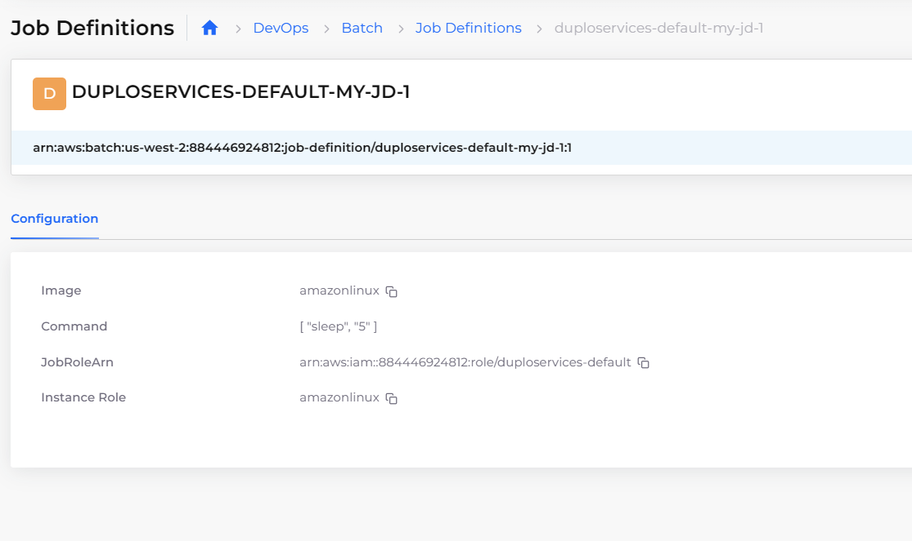

# Batch

You can perform [AWS batch job](https://docs.aws.amazon.com/batch/latest/userguide/jobs.html) processing directly in the DuploCloud Portal without the additional overhead of installed software, allowing you to focus on analyzing results and diagnosing problems.

## Step 1: Create Batch Job Scheduling Policies (Optional)&#x20;

Create scheduling policies to define when your batch job runs.&#x20;

1. From the DuploCloud Portal, navigate to **DevOps** -> **Batch** page, and click the **Scheduling Policies** tab.
2.  Click **Add**. The **Create Batch Scheduling Policy** page displays.


3.  In the **Create Batch Scheduling Policy** page, create batch job scheduling policies using the [AWS documentation](https://docs.aws.amazon.com/batch/latest/userguide/scheduling-policies.html). The fields in the AWS documentation map to the fields on the DuploCloud **Create Batch Scheduling Policy** page.\


    <div align="left">

    <figure><figcaption><p>The AWS Batch <strong>Create Batch Scheduling Policy</strong> page in the DuploCloud Portal</p></figcaption></figure>

    </div>
4. Click **Create**.

## Step 2: Configure Compute Environments

[AWS compute environments](https://docs.aws.amazon.com/batch/latest/userguide/getting-started-eks.html#getting-started-eks-step-1) (Elastic Compute Cloud \[EC2] instances) map to DuploCloud Infrastructures. The settings and constraints in the computing environment define how to configure and automatically launch the instance.

1. In the DuploCloud Portal, navigate to **DevOps** -> **Batch**.&#x20;
2. Click the **Compute Environments** tab.
3.  Click **Add**. The **Add Batch Environment** page displays.\


    <div align="left">

    <figure><figcaption><p>AWS Batch <strong>Add Batch Environment</strong> page in DuploCloud Portal<br></p></figcaption></figure>

    </div>
4. In the **Compute Environment Name** field, enter a unique name for your environment.
5. In the **Type** field, select the environment type (**On-Demand**, **Spot**, **Fargate**, etc.).
6.  Modify additional defaults on the page, as needed, or add configuration parameters in **Other Configurations**. \


    <div align="left">

    <figure><figcaption><p>AWS Batch <strong>Add Batch Environment</strong> page in the DuploCloud Portal</p></figcaption></figure>

    </div>
7.  Click **Create**. The **Compute Environment** is created. \


    <div align="left">

    <figure><figcaption><p>The <strong>Compute Environment</strong> window in the DuploCloud Portal showing the configured environment. </p></figcaption></figure>

    </div>

## Step 3: Create Batch Job Queues

After you define job definitions, create queues for your batch jobs to run in. For more information about batch job queues, see the [AWS instructions for creating a job queue](https://docs.aws.amazon.com/batch/latest/userguide/create-job-queue-ec2.html).

1. From the DuploCloud Portal, navigate to **DevOps** -> **Batch** page, and click the **Queues** tab.
2.  Click **Add**. The **Create Batch Queue** page displays.\


    <div align="left">

    <figure><figcaption><p>The AWS Batch <strong>Create Batch Queue</strong> page in the DuploCloud Portal</p></figcaption></figure>

    </div>
3. In the **Create Batch Queue** page, create batch job queues using the [AWS documentation](https://docs.aws.amazon.com/batch/latest/userguide/job\_queues.html). The fields in the AWS documentation map to the fields on the DuploCloud **Create Batch Queue** page.
4. Click **Create**. The **Batch Queue** is created.&#x20;


For **Priority**, enter a whole number. Job queues with a higher priority are run before those with a lower priority associated with the same compute environment.&#x20;


## Step 4: Create Batch Job Definitions

Before you can run AWS batch jobs, you need to create job definitions specifying how batch jobs are run.

1. From the DuploCloud Portal, navigate to **DevOps** -> **Batch**, and click the **Job Definitions** tab.
2.  Click **Add**. The **Create** **Batch Job Definition** page displays.\


    <div align="left">

    <figure><figcaption><p>AWS Batch <strong>Create Batch Job Definition</strong> page in DuploCloud Portal<br></p></figcaption></figure>

    </div>


3. In the **Create Batch Job Definition** page, define your batch jobs using the [AWS documentation](https://docs.aws.amazon.com/batch/latest/userguide/job\_definitions.html). The fields in the AWS documentation map to the fields on the DuploCloud **Create Batch Job Definition** page.
4. Click **Create**. The **Batch Job Definition** is created.&#x20;

<div align="left">

<figure><figcaption><p>The <strong>Batch Job Definition</strong> configuration is shown in the DuploCloud Portal.</p></figcaption></figure>

</div>

## Step 5: Create a Batch Job

Add a job for AWS batch processing. See the [AWS documentation](https://docs.aws.amazon.com/batch/latest/userguide/jobs.html) for more information about batch jobs.

1. After you [configure your compute environment](batch.md#configuring-compute-environments), in the DuploCloud Portal, navigate to **DevOps -> Batch**, and click the **Jobs** tab.&#x20;
2.  Click **Add**. The **Add Batch Job** page displays.\


    <div align="left">

    <figure><figcaption><p>The <strong>Add Batch Job</strong> page in the DuploCloud Portal</p></figcaption></figure>

    </div>
3. On the **Add Batch Job** page, define a **Job Name**, **Job Definition**, **Job Queue**, and **Job Properties**.
4. Optionally, if you created a [Scheduling Policy ](batch.md#create-batch-job-scheduling-policies-optional)to apply to this job, paste the [YAML code below](batch.md#applying-a-scheduling-policy-to-a-batch-job-optional) into the **Other Properties** field.&#x20;
5. Click **Create**. The Batch job is created.&#x20;

## Create a Batch Job with Scheduling Policy (Optional)

As you C[reate a Batch Job](batch.md#create-a-batch-job), paste the following YAML code into the **Other Properties** field on the **Add Batch Job** page.&#x20;

```yaml
  {    

    "schedulingpriorityoverride": 1,

    "ShareIdentifier": "add_identifier"

}
```

## View Batch Jobs

Navigate from the DuploCloud Portal to **DevOps -> Batch**, and click the **Jobs** tab. The **Jobs** list displays.&#x20;

<figure><figcaption><p>The <strong>Job</strong> list shows the <strong>Batch Job</strong> in the DuploCloud Portal. </p></figcaption></figure>

Click the name of the **Job** to view **Job Details** (**Status, Job ID, Job Queue, Job Definition**).&#x20;

<div align="left">

<figure><figcaption><p>The <strong>Jobs</strong> window shows the running <strong>Batch Job</strong> in the DuploCloud Portal.</p></figcaption></figure>

</div>

## Run AWS Batch jobs

Use the [AWS Best Practices Guide](https://docs.aws.amazon.com/batch/latest/userguide/best-practices.html) for information about running your AWS Batch jobs.
