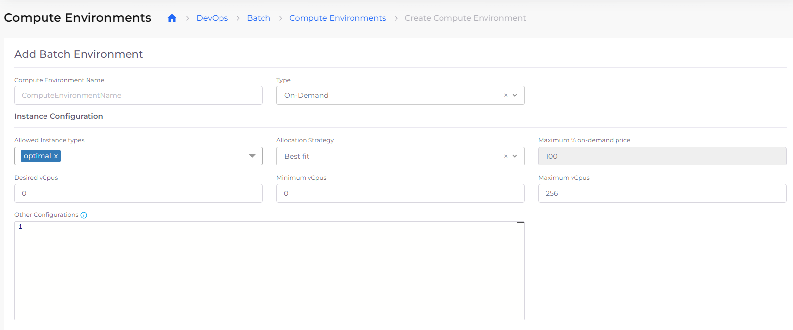
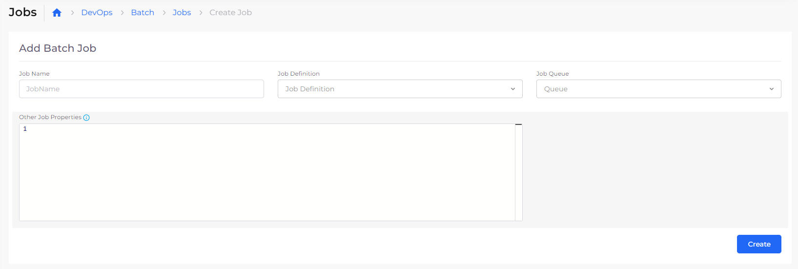
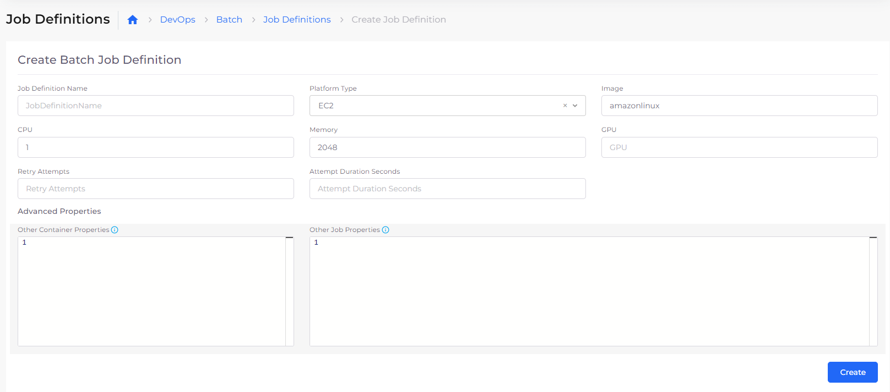
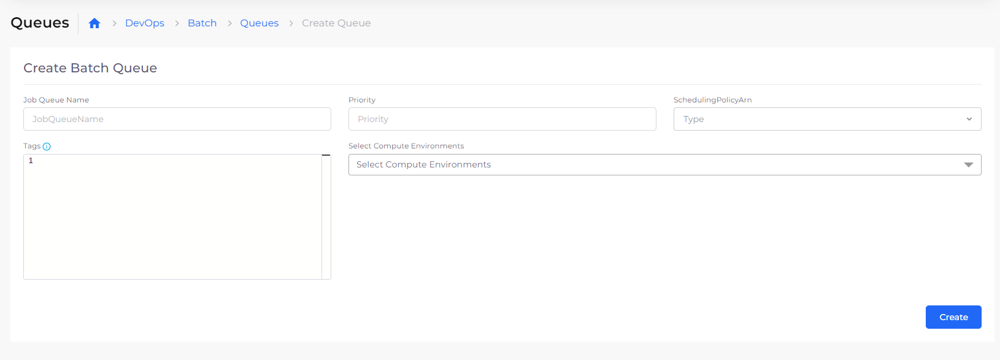
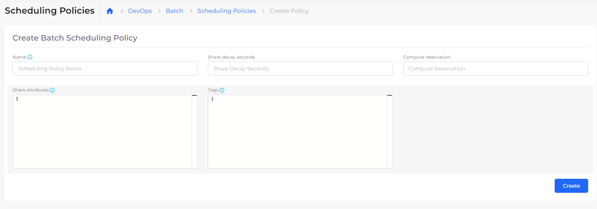

# Batch

You can perform AWS batch processing directly in the DuploCloud Portal without the additional overhead of installed software, allowing you to focus on analyzing results and diagnosing problems.

## Preparing the AWS Batch environment

Before you can use DuploCloud's lightweight AWS Batch processing feature, review the AWS Batch [prerequisites](https://docs.aws.amazon.com/batch/latest/userguide/get-set-up-for-aws-batch.html).

## Configuring Compute Environments

AWS compute environments (Elastic Compute Cloud \[EC2] instances) map to DuploCloud Infrastructures. The settings and constraints in the computing environment define how to configure and automatically launch the instance.

1. In the DuploCloud Portal, navigate to **DevOps** -> **Batch**.&#x20;
2. Click the **Compute Environments** tab.
3.  Click **Add**. The **Add Batch Environment** page displays.

    <figure><figcaption>
AWS Batch <strong>Add Batch Environment</strong> page in DuploCloud Portal
</figcaption></figure>
4. In the **Compute Environment Name** field, enter a unique name for your environment.
5. In the **Type** field, select the environment type (**On-Demand**, **Spot**, **Fargate**, etc.).
6. Modify additional defaults on the page, as needed, or add configuration parameters in **Other Configurations**.&#x20;
7. Click **Create**.

## Add a batch job

Add a job for AWS batch processing.

1. After you [configure your compute environment](batch.md#configuring-compute-environments), In the DuploCloud Portal, click the **Jobs** tab.&#x20;
2.  Click **Add**. The **Add Batch Job** page displays.

    <figure><figcaption>
AWS Batch <strong>Add Batch Job</strong> page in DuploCloud Portal
</figcaption></figure>
3. In the **Add Batch Job** page, define a **Job Name**, **Job Definition**, **Job Queue**, and **Job Properties**.
4. Click **Create**.

## Configuring batch jobs, queues, and scheduling policies

The tabs on the DuploCloud Portal **DevOps** -> **Batch** page can be used to create AWS batch jobs within the portal.&#x20;

[Follow the steps in the AWS documentation](https://docs.aws.amazon.com/batch/latest/userguide/Batch\_GetStarted.html) to set up the needed components for running AWS batch jobs.

### Create batch job definitions

Before you can run AWS batch jobs, you need to create job definitions specifying how batch jobs are run.

1. From the DuploCloud Portal **DevOps** -> **Batch** page, click the **Job Definitions** tab.
2.  Click **Add**. The **Create** **Batch Job Definition** page displays.

    <figure><figcaption>
AWS Batch <strong>Create Batch Job Definition</strong> page in DuploCloud Portal
</figcaption></figure>
3. In the **Create Batch Job Definition** page, define your batch jobs using the [AWS documentation](https://docs.aws.amazon.com/batch/latest/userguide/job\_definitions.html). The fields in the AWS documentation map to the fields on the DuploCloud **Create Batch Job Definition** page.
4. Click **Create**.

### Create batch job queues

After you define job definitions, create queues in which your batch jobs are run.

1. From the DuploCloud Portal **DevOps** -> **Batch** page, click the **Queues** tab.
2.  Click **Add**. The **Create Batch Queue** page displays.

    <figure><figcaption>
AWS Batch <strong>Create Batch Queue</strong> page in DuploCloud Portal
</figcaption></figure>
3. In the **Create Batch Queue** page, create batch job queues using the [AWS documentation](https://docs.aws.amazon.com/batch/latest/userguide/job\_queues.html). The fields in the AWS documentation map to the fields on the DuploCloud **Create Batch Queue** page.
4. Click **Create**.

### Create batch job scheduling policies&#x20;

Finally, create scheduling policies to define when your batch job runs.&#x20;

1. From the DuploCloud Portal **DevOps** -> **Batch** page, click the **Scheduling Policies** tab.
2.  Click **Add**. The **Create Batch Scheduling Policy** page displays.

    <figure><figcaption>
AWS Batch <strong>Create Batch Scheduling Policy</strong> page in DuploCloud Portal
</figcaption></figure>
3. In the **Create Batch Scheduling Policy** page, create batch job scheduling policies using the [AWS documentation](https://docs.aws.amazon.com/batch/latest/userguide/scheduling-policies.html). The fields in the AWS documentation map to the fields on the DuploCloud **Create Batch Scheduling Policy** page.
4. Click **Create**.

## Running AWS Batch jobs

Use the [AWS Best Practices Guide](https://docs.aws.amazon.com/batch/latest/userguide/best-practices.html) for information about running your AWS Batch jobs.
