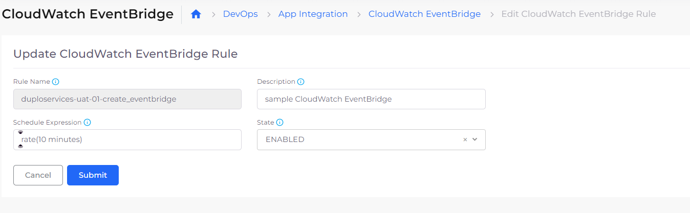
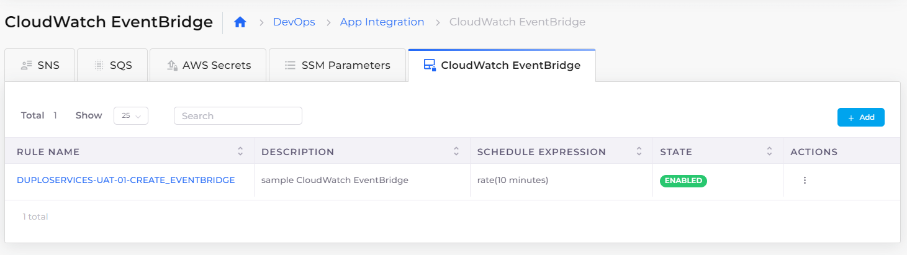
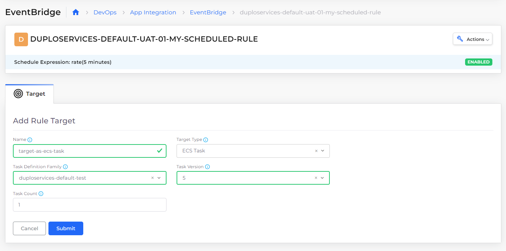
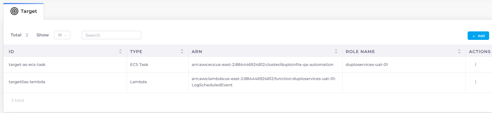

# Eventbridge

Amazon [EventBridge](https://docs.aws.amazon.com/eventbridge) collects and visualizes real-time logs, metrics, and event data in automated dashboards to streamline your cloud infrastructure and application maintenance.

By default, the metrics for a resource are available on the Metrics page in DuploCloud. Some metrics, however, need agents to be installed in the system to collect the information, such as [AWS  SSM Agent](https://docs.aws.amazon.com/systems-manager/latest/userguide/ssm-agent.html).&#x20;

DuploCloud provides a way to automatically install these agents on all the hosts whenever they are provisioned. For more information, refer to the DuploCloud Security White Paper _PCI and HIPAA Compliance with DuploCloud_, and read the **General** section, **Agent Models**, to learn about installing agents for compliance controls and security frameworks[.](https://portal.duplocloud.net/compliance/Implementation.html?\_\_hstc=199910065.5cb100958892546d1fc484f311cab1cc.1640799817379.1643935000925.1643939246257.67&\_\_hssc=199910065.5.1643939246257&\_\_hsfp=29941011#agent-modules)

## Adding and updating a EventBridge rule

1. In the DuploCloud Portal, navigate to **DevOps** -> **App Integration**.
2. Click the **EventBridge** tab.
3.  Click **Add**. The **Add CloudWatch EventBridge Rule** page displays; or to update an existing rule, select the       (  ) icon in the **Actions** column for the rule you want to update, and click **Update**. The **Update EventBridge Rule page** displays.

    <figure><figcaption>
<strong>Add EventBridge Rule</strong> page
</figcaption></figure>
4. In the **Rule Name** field, specify or change the rule name.
5. In the **Description** field, specify or change the rule description.
6. In the **Schedule Expression** field, enter or edit the interval for which you want this rule to run. Use the format: **rate(**_x_ _interval_**)**, where x is a numeric value and _interval_ is **seconds**, **minutes**, **hours**, or **days**. Ensure that you include a blank space between the numeric value _x_ and the _interval_.
7. From the State list box, select **ENABLED**.
8.  Click **Submit**. The rule is displayed in the **EventBridge** tab.

    <figure><figcaption>
<strong>EventBridge</strong> tab with CloudWatch EventBridge rule <strong>ENABLED</strong>
</figcaption></figure>

## Adding and Viewing Targets for EventBridge

An EventBridge [_target_ ](https://docs.aws.amazon.com/eventbridge/latest/userguide/eb-targets.html)is a resource or endpoint to which EventBridge sends an [event](https://docs.aws.amazon.com/eventbridge/latest/userguide/eb-events.html) when the event matches the event pattern defined for a [rule](https://docs.aws.amazon.com/eventbridge/latest/userguide/eb-rules.html). The rule processes [event](https://docs.aws.amazon.com/eventbridge/latest/userguide/eb-events.html) data and sends pertinent information to the target. To deliver event data to a target, EventBridge needs permission to access the target resource. You can define up to five targets for each rule.

You define targets and associated types in DuploCloud. DuploCloud supports types **ECS Task** and **Lambda**.

1. In the DuploCloud Portal, navigate to **DevOps** -> **App Integration**.
2. Click the **EventBridge** tab. The rules you defined are displayed.
3. [Select the EventBridge rule you added or updated](cloud-watch.md#adding-and-updating-a-cloudwatch-eventbridge-rule).&#x20;
4.  In the **Target** tab, click **Add**. The **Add Rule Target** page displays.

    <figure><figcaption>
<strong>Target</strong> tab for an EventBridge rule with <strong>Target Type ECS Task</strong>
</figcaption></figure>
5. In the **Name** field, enter a target name.
6. From the **Target Type** list box, select a target type.
7. From the **Task Definition Family** list box, select a task definition family.
8. In the **Task Version** field, enter a numeric version number.
9.  Click **Submit**. The Target you added is displayed in the **Target** tab.

    <figure><figcaption>
<strong>Target</strong> tab for a CloudWatch EventBridge rule displaying targets for <strong>Target Type</strong> <strong>ECS Task</strong> and <strong>Lambda</strong>
</figcaption></figure>

