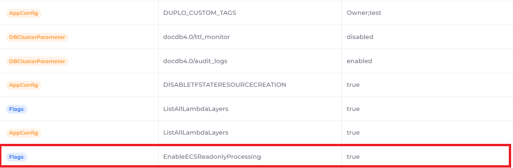
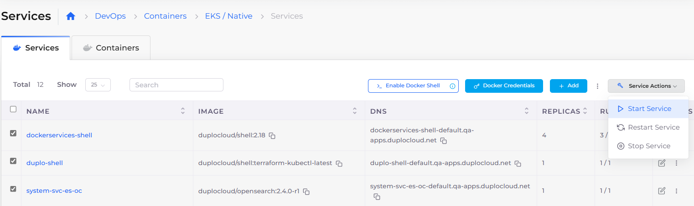

# Containers and Services

## EKS/ECS support for containers and services <a href="#1-toc-title" id="1-toc-title"></a>

DuploCloud supports Elastic Kubernetes Service (EKS/ECS) out of the box.&#x20;

Kubernetes clusters are created during Infrastructure setup using the **Administrator -> Infrastructure** option in the DuploCloud Portal. The cluster is created in the same Virtual Private Cloud (VPC) as the Infrastructure. Building an Infrastructure with an EKS/ECS cluster may take some time.&#x20;

Next, you deploy an application within a Tenant in Kubernetes. The application contains a set of VMs, a Deployment set (Pods), and an application load balancer. Pods can be deployed either through the DuploCloud Portal or through `kubectl,`using HelmCharts.

## DuploCloud Services and Containers <a href="#5-toc-title" id="5-toc-title"></a>

You can deploy native Docker containers in virtual machines (VMs) with the DuploCloud platform. Adding a Service in the DuploCloud Platform is not the same as adding a Kubernetes service.&#x20;

Deploying DuploCloud Services, by clicking the **Add** button in the **EKS/Native** tab, implicitly converts Services into either a deployment set or a StatefulSet. If there are no volume mappings, then the service is mapped to a deployment set. Otherwise, it is mapped to a StatefulSet, which you can force creations of if needed. Most configuration values are self-explanatory, such as **Images**, **Replicas,** and **Environmental Variables**.

You can supply advanced configuration options in the **Other K8 Config** field. The content of this field maps one-to-one with the Kubernetes API. Configurations for deployment are StatefulSets and are supported by placing the appropriate JSON code in the **Other K8 Config** section. For example, to reference Kubernetes Secrets using a YAML config map, create the following JSON code:&#x20;

```json
	"Volumes": [
		{
			"name": "config-volume",
			"configMap": {
				"name": "game-config"
			}
		}
	],
	"VolumesMounts": [
		{
			"name": "config-volume",
			"mountPath": "/etc/config"
		}
	]
}
```

### Adding a DuploCloud EKS/Native Service

1. In the DuploCloud Portal, select **DevOps** -> **Containers** -> **EKS/Native** from the navigation pane.&#x20;
2. Click **Add**. The **Add Service** page displays.
3. Complete the fields on the page, including **Service Name**, **Docker Image** **name**, and number of **Replicas**. Use **Allocation Tags** to deploy the container in a specific set of hosts.&#x20;
4. To force the creation of Kubernetes StatefulSets, select **Yes** in the **Force StatefulSets** field.


Do not use spaces when creating Service or Docker image names.

The number of Replicas that you define must be less than or equal to the number of hosts in the fleet.



### Adding a DuploCloud ECS Service

For an example of how to create an ECS Service, [see this tutorial](../quick-start/quick-start-ecs-services/step-4-create-app-via-ecs.md).

#### Enabling read-only processing for ECS Services

If you want to grant a service read-only access to root filesystems, add a configuration flag in your DuploCloud Infrastructure.

1. In the DuploCloud Portal, navigate to **Administrator** -> **System Settings**.
2. Click the **System Config** tab.
3. Click **Add**. The **Add Config** pane displays.
4. From the **Config Type** list box, select **Other**. The **Other Config Type** field displays.
5. In the **Other Config Type** field, enter **Flags**.
6. In the **Key** field, enter **EnableECSReadonlyProcessing**.
7. in the **Value** field, enter **true**.
8. Click **Submit**.

<figure><figcaption><p><strong>Add Config</strong> pane with <strong>EnableECSReadonlyProcessing Key</strong></p></figcaption></figure>

The new configuration is displayed in the **System Config** tab.

<figure><figcaption><p><strong>EnableECSReadonlyProcessing</strong> configuration enabled with Value of <strong>true</strong> in <strong>System Config</strong> tab</p></figcaption></figure>

#### Creating multiple containers for ECS Services using a Task Definition <a href="#7-toc-title" id="7-toc-title"></a>

You can create up to five (5) containers for ECS services by defining a Task Definition.

1. In the DuploCloud Portal, navigate to **DevOps** -> **Containers** -> **ECS**.
2.  In the Task Definitions tab, click **Add**. The **Add Task Definition** page displays.

    <figure><figcaption><p><strong>Add Task Definition</strong> page for adding multiple containers for ECS Services</p></figcaption></figure>
3. Specify a unique **Name** for the Task Definition.
4. From the **vCPUs** list box, select the number of CPUs to be consumed by the task and change other defaults, if needed.
5. In the **Container - 1** area, specify the **Container Name** of the first container you want to create.
6. In the **Image** field, specify the container Image name, as in the example below.&#x20;
7. Click the Plus Icon (  ) to the left of the **Primary** label, which designates that the first container you are defining is the primary container. The **Container - 2** area displays.&#x20;
8.  Use the   and   icons to collapse and expand the **Container** areas as needed. Specify **Container Name** and **Image** name for each container that you add. Add more containers by clicking the Add Icon (  ) to create up to five (5) containers, in each container area. Delete containers by clicking the Delete ( **X** ) **I**con in each container area.

    <figure><figcaption><p><strong>Primary</strong> label with Add and Expand/Collapse Icons in <strong>Container -1</strong>; Delete Icon in <strong>Container - 2</strong>. <strong>Container - 3</strong> is editable.</p></figcaption></figure>
9. Specify **Port Mappings**, and **Add New** mappings or **Delete** them, if needed.
10. Click **Submit**. Your Task Definition for multiple ECS Service containers is created.

#### Editing multiple containers for ECS Services <a href="#7-toc-title" id="7-toc-title"></a>

To edit the created Task Definition in order to add or delete multiple containers, select the Task Definition in the Task Definitions tab, and from the **Actions** menu, select **Edit Task Definition**.&#x20;

### Displaying Services <a href="#7-toc-title" id="7-toc-title"></a>

Once the deployment commands run successfully, click the **Services** tile on the **Tenants** page. Your deployments are displayed and you can now attach [load balancers](load-balancers.md) for the Services.

<figure><figcaption><p><strong>Tenants</strong> page with <strong>Services</strong> tile</p></figcaption></figure>

### Starting, stopping, and restarting multiple DuploCloud Services <a href="#7-toc-title" id="7-toc-title"></a>

Using the Services page, you can start, stop, and restart multiple services at one time.

1. In the DuploCloud Portal, navigate to **DevOps** -> **Containers** and select either **EKS/Native** or **ECS**.&#x20;
2. Click the **Services** tab.&#x20;
3. Use the checkbox column to select multiple services that you want to start or stop at once.
4. From the **Service Actions** menu, select **Start Service**, **Stop Service**, or **Restart Service.**

Your selected services are started, stopped, or restarted as you specified.

<figure><figcaption><p><strong>Services</strong> page with checkbox column (highlighted) and <strong>Service Actions</strong> menu</p></figcaption></figure>



When you create a service, refer to the registry configuration in **DevOps** -> **Containers** -> **EKS/Native** -> **Services**, in the **Configuration** tab. Note the values in the **Environment Variables** and **Other Docker Config** fields.&#x20;

For example:&#x20;

`{"DOCKER_REGISTRY_CREDENTIALS_NAME":"registry1"}`


## Managing Docker, Kubernetes, and AWS configs and Secrets <a href="#6-toc-title" id="6-toc-title"></a>

See the [Configs and Secrets](../use-cases/passing-secrets/) section for information about creating and managing:

* Docker Registry Credentials
* Configuration and secrets in AWS
* Passing Kubernetes ConfigMaps as Environment Variables (EVs) and files.

### Downloading the Kubectl Token and KubeConfig <a href="#6-toc-title" id="6-toc-title"></a>

DuploCloud provides you with a Just-In-Time (JIT) security token, for fifteen minutes, to access the `kubectl` cluster.&#x20;

1. In the DuploCloud Portal, select **Administrator**-> **Infrastructure** from the navigation pane.&#x20;
2. Select the Infrastructure in the **Name** column.
3. Click the **EKS** tab.&#x20;
4. Copy the temporary **Token** and the **Server Endpoint** (Kubernetes URL) **Value**s from the Infrastructure that you created. You can also download the complete configuration by clicking the **Download Kube Config** button.
5. Run the following commands, locally:

```shell
> kubectl config --kubeconfig=config-demo set-cluster EKS_CLUSTER --server=[EKS_API_URL] --insecure-skip-tls-verify
```

```shell
> kubectl config --kubeconfig=config-demo set-credentials tempadmin --token=[TOKEN]
```

```shell
> kubectl config --kubeconfig=config-demo set-context EKS --cluster=EKS_CLUSTER --user=tempadmin --namespace=duploservices-[TENANTNAME]
```

```shell
> export KUBECONFIG=config-demo
```

```shell
> kubectl config use-context EKS
```

You have now configured `kubectl` to point and access the Kubernetes cluster. You can apply deployment templates by running the following command:

```shell
> kubectl apply -f nginx.yaml
```


```yaml
apiVersion: apps/v1
kind: Deployment
metadata:
  name: nginx-deployment-g
  labels:
    app: nginx-deployment-g
spec:
  replicas: 1
  selector:
    matchLabels:
      app: nginx-deployment-g
  template:
    metadata:
      labels:
        app: nginx-deployment-g
    spec:
      nodeSelector:
        tenantname: "duploservices-stgeast1"
      containers:
      - name: nginx
        image: nginx:latest
        ports:
        - containerPort: 80
```


If you need security tokens of a longer duration, create them on your own. Secure them outside of the DuploCloud environment.

## Elastic Container Service (ECS) Fargate <a href="#9-toc-title" id="9-toc-title"></a>

Fargate is a technology that you can use with ECS to run containers without having to manage servers or clusters of EC2 instances.

For information about Fargate, [contact the DuploCloud support team](https://duplocloud.com/company/contact-us/).
