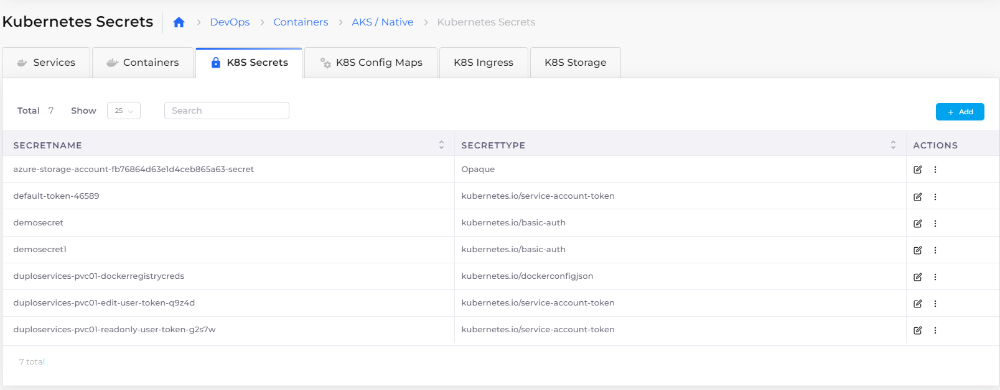

# Containers

## Plans <a href="#2-toc-title" id="2-toc-title"></a>

The DuploCloud Portal comes configured with a default Plan. A [Plan](../../../getting-started/application-focussed-interface/plan.md) configures your Tenants using a set of templates whose parameters are applied to the Tenants in your [Infrastructure](../../../azure/azure-services/infrastructure.md).

## Tenants <a href="#2-toc-title" id="2-toc-title"></a>

To add a Tenant, navigate to **Administrator** -> **Tenant** in the DuploCloud Portal and click **Add**.

Each [Tenant ](../../../azure/azure-services/tenants.md)is mapped to a Namespace in Kubernetes. For example, if a Tenant is called **Analytics** in DuploCloud, the Kubernetes Namespace is called `duploservices-analytics`.&#x20;

All application components within the Analytics Tenant are placed in the `duploservices-analytics` namespace. Since nodes cannot be part of a Kubernetes Namespace, DuploCloud creates a `tenantname` label for all the nodes that are launched within the Tenant. For example, a node launched in the Analytics Tenant is labeled`tenantname: duploservices-analytics`.&#x20;

Any Pods that are launched using the DuploCloud UI have an appropriate Kubernetes `nodeSelector` that ties the Pod to the nodes within the Tenant. If you are deploying via `kubectl,`ensure that your deployment is using the proper `nodeSelector`.

## Hosts <a href="#3-toc-title" id="3-toc-title"></a>

Once the tenant is created, navigate to **DevOps** in the DuploCloud Portal and select the Tenant that you created from the **Tenant** list box.&#x20;

<figure><figcaption><p><strong>Tenant</strong> list box in the DevOps section</p></figcaption></figure>

In **DevOps** -> **Hosts**, create new nodes (**Hosts**).&#x20;


Ensure that the value of **Pool** is set to **Eks Linux**, which is the default value.


## Docker registry credentials and Kubernetes secrets <a href="#4-toc-title" id="4-toc-title"></a>

Set Docker registry credentials and Kubernetes secrets:

1. In the DuploCloud Portal, navigate to  **DevOps** -> **Containers** -> **EKS/Native**. Docker registry credentials are passed to the Kubernetes cluster as `kubernetes.io/dockerconfigjson`.
2. Click **Docker Credentials**. The **Set Docker registry Creds** pane displays.
3. Supply the credentials and click **Submit**.
4. Enable the Docker Shell Service by clicking **Enable Docker Shell**.

## Services <a href="#5-toc-title" id="5-toc-title"></a>

Adding a Service in the DuploCloud Platform is not the same as adding a Kubernetes service.&#x20;

Deploying DuploCloud Services, by clicking the **Add** button in the **EKS/Native** tab, implicitly converts Services into either a deployment set or a StatefulSet. If there are no volume mappings, then the service is mapped to a deployment set. Otherwise, it is mapped to a StatefulSet, which you can force creations of if needed. Most configuration values are self-explanatory, such as **Images**, **Replicas,** and **Environmental Variables**.

You can supply advanced configuration options in the **Other K8 Config** field. The content of this field maps one-to-one with the Kubernetes API. Configurations for deployment are StatefulSets and are supported by placing the appropriate JSON code in the **Other K8 Config** section. For example, to reference Kubernetes Secrets using a YAML config map, create the following JSON code:&#x20;

```json
	"Volumes": [
		{
			"name": "config-volume",
			"configMap": {
				"name": "game-config"
			}
		}
	],
	"VolumesMounts": [
		{
			"name": "config-volume",
			"mountPath": "/etc/config"
		}
	]
}
```


You can deploy any native Docker container in a virtual machine (VM) with the DuploCloud platform.&#x20;


1. In the DuploCloud Portal, select **DevOps** -> **Containers** -> **EKS/Native** from the navigation pane.&#x20;
2. Click **Add**. The **Add Service** page displays.
3. Complete the fields on the page, including **Service Name**, **Docker Image** **name**, and number of **Replicas**. Use **Allocation Tags** to deploy the container in a specific set of hosts.&#x20;
4. To force the creation of Kubernetes StatefulSets, select **Yes** in the **Force StatefulSets** field.


Do not use spaces when creating Service or Docker image names.

The number of Replicas that you define must be less than or equal to the number of hosts in the fleet.



## Kubernetes cluster <a href="#1-toc-title" id="1-toc-title"></a>

### Add multiple Docker Registry Credentials

DuploCloud provides support for pulling images from multiple docker registries.&#x20;

Add multiple Docker Registry Credentials:

1. In the DuploCloud Portal, select **Administrator**-> **Plan** from the navigation pane. The **Plans** page displays. &#x20;
2. Select the Plan in the **Name** column.
3. Click the **Config** tab.
4. Click **Add**. The **Add Config** pane displays.

<figure><figcaption><p><strong>Add Config</strong> pane</p></figcaption></figure>


When you create a service, refer to the registry configuration in **DevOps** -> **Containers** -> **EKS/Native** -> **Services**, in the **Configuration** tab. Note the values in the **Environment Variables** and **Other Docker Config** fields.&#x20;

For example:&#x20;

`{"DOCKER_REGISTRY_CREDENTIALS_NAME":"registry1"}`



### Set Kubernetes Secrets

Optionally, set and reference Kubernetes secrets in your deployment by configuring them with the **EKS/Native** option.&#x20;

<figure><figcaption></figcaption></figure>

### EKS/AKS support <a href="#1-toc-title" id="1-toc-title"></a>

DuploCloud supports Elastic Kubernetes Service (EKS/AKS) out of the box.&#x20;

Kubernetes clusters are created during Infrastructure setup using the **Administrator -> Infrastructure** option in the DuploCloud Portal. The cluster is created in the same Virtual Private Cloud (VPC) as the Infrastructure. Building an Infrastructure with an AKS/EKS cluster may take some time.&#x20;

Next, you deploy an application within a Tenant in Kubernetes. The application contains a set of VMs, a Deployment set (Pods), and an application load balancer. Pods can be deployed either through the DuploCloud Portal or through `kubectl,`using HelmCharts.

### Kubectl token and config <a href="#6-toc-title" id="6-toc-title"></a>

DuploCloud provides you with a Just-In-Time (JIT) security token, for fifteen minutes, to access the `kubectl` cluster.&#x20;

1. In the DuploCloud Portal, select **Administrator**-> **Infrastructure** from the navigation pane.&#x20;
2. Select the Infrastructure in the **Name** column.
3. Click the **EKS** tab.&#x20;
4. Copy the temporary **Token** and the **Server Endpoint** (Kubernetes URL) **Value**s from the Infrastructure that you created. You can also download the complete configuration by clicking the **Download Kube Config** button.
5. Run the following commands, locally:

```shell
> kubectl config --kubeconfig=config-demo set-cluster EKS_CLUSTER --server=[EKS_API_URL] --insecure-skip-tls-verify
```

```shell
> kubectl config --kubeconfig=config-demo set-credentials tempadmin --token=[TOKEN]
```

```shell
> kubectl config --kubeconfig=config-demo set-context EKS --cluster=EKS_CLUSTER --user=tempadmin --namespace=duploservices-[TENANTNAME]
```

```shell
> export KUBECONFIG=config-demo
```

```shell
> kubectl config use-context EKS
```

You have now configured `kubectl` to point and access the Kubernetes cluster. You can apply deployment templates by running the following command:

```shell
> kubectl apply -f nginx.yaml
```


```yaml
apiVersion: apps/v1
kind: Deployment
metadata:
  name: nginx-deployment-g
  labels:
    app: nginx-deployment-g
spec:
  replicas: 1
  selector:
    matchLabels:
      app: nginx-deployment-g
  template:
    metadata:
      labels:
        app: nginx-deployment-g
    spec:
      nodeSelector:
        tenantname: "duploservices-stgeast1"
      containers:
      - name: nginx
        image: nginx:latest
        ports:
        - containerPort: 80
```


If you need security tokens of a longer duration, create them on your own. Secure them outside of the DuploCloud environment.

## Displaying Services <a href="#7-toc-title" id="7-toc-title"></a>

Once the deployment commands run successfully, click the **Services** tile on the **Tenants** page. Your deployments are displayed and you can now attach load balancers for the services.

<figure><figcaption><p><strong>Tenants</strong> page with <strong>Services</strong> tile</p></figcaption></figure>

## Load Balancers, Web Application Firewalls (WAFs), and other workflows <a href="#8-toc-title" id="8-toc-title"></a>

These do not need to be changed. See the following sections for more information:

* [Load Balancers](../../use-cases/load-balancers.md)
* [Web Application Firewalls (WAFs)](../web-application-firewall-waf.md)
* Workflows

## Elastic Container Service (ECS) Fargate <a href="#9-toc-title" id="9-toc-title"></a>

Fargate is a technology that you can use with ECS to run containers without having to manage servers or clusters of EC2 instances.

For information about Fargate, [contact the DuploCloud support team](https://duplocloud.com/company/contact-us/).
