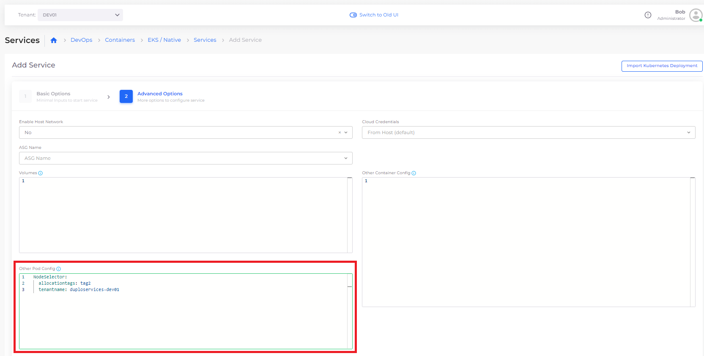

# EKS Containers and Services

## Adding a DuploCloud EKS/Native Service

1. In the DuploCloud Portal, select **DevOps** -> **Containers** -> **EKS/Native** from the navigation pane.&#x20;
2. Click **Add**. The **Add Service** page displays.
3. Complete the fields on the page, including **Service Name**, **Docker Image** **name**, and number of **Replicas**. Use **Allocation Tags** to deploy the container in a specific set of hosts.&#x20;
4. To force the creation of Kubernetes StatefulSets, select **Yes** in the **Force StatefulSets** field.


Do not use spaces when creating Service or Docker image names.

The number of Replicas you define must be less than or equal to the number of hosts in the fleet.


### Adding a Customized Node Selector to an EKS Service

Specifying a node selector allows you to control which Amazon EC2 instances (nodes) in your EKS cluster should be used to run Kubernetes pods. When you specify a node selector for a pod, the Kubernetes scheduler ensures that the pod is only scheduled on nodes that match the criteria you specify

For example, to specify specific Tenants or Allocation Tags in an existing EKS cluster, add a Customized Node Selector in the **Other Pod Config** area, on the **Advanced Options** page, when you [add an EKS Service](eks-containers-and-services.md#adding-a-duplocloud-eks-native-service). This prevents the specified parameters from being overridden by default values, as in the example below.


When specifying parameters such as `tenantname`, specify the fully-qualified system-generated name, such as `duploservices-<tenant-name>`.


<figure><figcaption>
<strong>Other Pod Config</strong> area on the <strong>Advanced Options</strong> page when adding a Service
</figcaption></figure>

