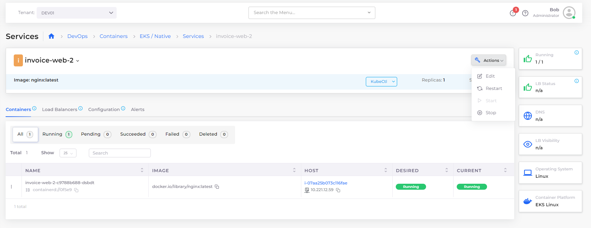
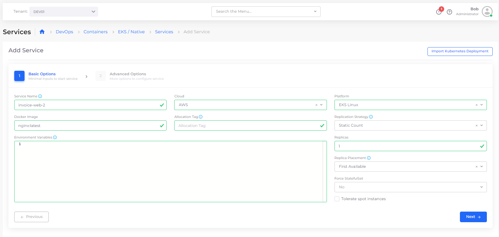
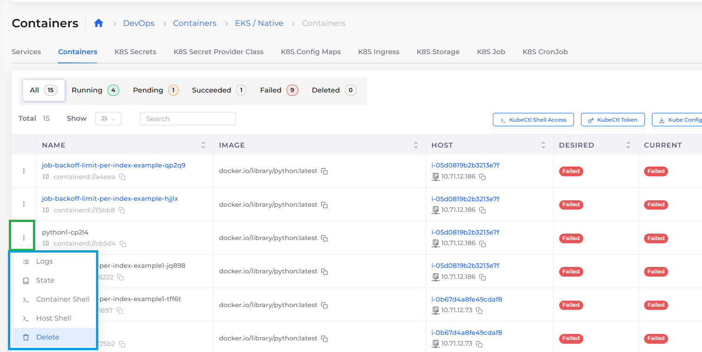
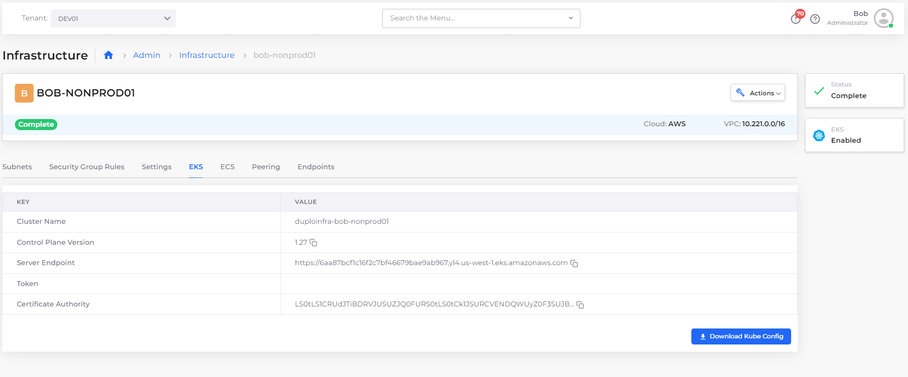

# EKS/Native Containers and Services


For an end-to-end example of creating an EKS Service, see [this tutorial](../../quick-start/quick-start-eks-services/).&#x20;

For a Native Docker Services example, see [this tutorial](../../quick-start/quick-start-duplocloud-docker-services/). &#x20;


## Services

Using the **Services** tab in the DuploCloud Portal (**DevOps** -> **Containers** -> **EKS** -> **Services**), you can display and manage the Services you have defined.

For EKS Services, select the Service **Name** and click the [**Actions** menu](eks-native-containers-and-services.md#7-toc-title-2) to **Edit** or **Delete** Services, in addition to performing other actions, as shown below.&#x20;

<figure><figcaption><p><strong>Actions</strong> menu for EKS Service</p></figcaption></figure>

### Adding a DuploCloud EKS/Native Service

1. In the DuploCloud Portal, select **DevOps** -> **Containers** -> **EKS/Native** from the navigation pane.&#x20;
2. Click **Add**. The **Add Service** page displays.
3. Complete the fields on the page, including **Service Name**, **Docker Image** **name**, and number of **Replicas**. Use **Allocation Tags** to deploy the container in a specific set of hosts.&#x20;
4. To force the creation of Kubernetes StatefulSets, select **Yes** in the **Force StatefulSets** field.


Do not use spaces when creating Service or Docker image names.

The number of Replicas you define must be less than or equal to the number of hosts in the fleet.


<div align="left">



</div>

### Displaying Services <a href="#7-toc-title" id="7-toc-title"></a>

Once the deployment commands run successfully, click the **Services** tile on the **Tenants** page. Your deployments are displayed and you can now attach [load balancers](../load-balancers/) for the Services.

<figure><figcaption><p><strong>Tenants</strong> page with <strong>Services</strong> tile</p></figcaption></figure>

### Starting, stopping, and restarting multiple DuploCloud Services <a href="#7-toc-title" id="7-toc-title"></a>

Using the Services page, you can start, stop, and restart multiple services simultaneously.

1. In the DuploCloud Portal, navigate to **DevOps** -> **Containers** and select **EKS/Native** or **ECS**.&#x20;
2. Click the **Services** tab.&#x20;
3. Use the checkbox column to select multiple services you want to start or stop at once.
4. From the **Service Actions** menu, select **Start Service**, **Stop Service**, or **Restart Service.**

Your selected services are started, stopped, or restarted as you specified.

<figure><figcaption><p><strong>Services</strong> tab with checkbox column (highlighted) and <strong>Service Actions</strong> menu</p></figcaption></figure>

### Importing a Native Kubernetes Service <a href="#7-toc-title" id="7-toc-title"></a>

Using the **Import Kubernetes Deployment** pane, you can add a Service to an existing Kubernetes namespace using Kubernetes YAML.

1. In the DuploCloud Portal, select **DevOps** -> **Containers** -> **EKS/Native** from the navigation pane.&#x20;
2. Click **Add**. The **Add Service** page displays.
3. Click the **Import Kubernetes Deployment** button in the upper right. **The Import Kubernetes Deployment** pane displays.&#x20;
4.  Paste the deployment YAML code, as in the example below, into the **Import Kubernetes Deployment** pane. \


    <div align="left">

    <figure><figcaption><p>YAML code for importing a Native Kubernetes Service</p></figcaption></figure>

    </div>


5. Click **Import**.
6. In the **Add Service** page, click **Next.**
7. Click **Create**. Your Native Kubernetes Service is created.


```yaml
//apiVersion: apps/v1
kind: Deployment
metadata:
  name: nginx-deployment
  namespace: duploservices-my-tenant
  labels:
    app: nginx
spec:
  replicas: 3
  selector:
    matchLabels:
      app: nginx
  template:
    metadata:
      labels:
        app: nginx
    spec:
      containers:
      - name: nginx1
        image: nginx:1.14.2
        ports:
        - containerPort: 80
```


## Kubernetes Containers

Using the **Containers** tab in the DuploCloud Portal, you can display and manage the Containers you have defined.

Use the Options Menu (  ) in each Container row to display **Logs**, **State**, **Container Shell**, **Host Shell,** and **Delete** options.&#x20;

<table><thead><tr><th width="347">Option</th><th>Functionality</th></tr></thead><tbody><tr><td><strong>Logs</strong></td><td>Displays container logs.</td></tr><tr><td><strong>State</strong></td><td>Displays container state configuration, in YAML code, in a separate window.</td></tr><tr><td><strong>Container Shell</strong></td><td>Accesses the Container Shell. To access the <strong>Container Shell</strong> option, you must first set up <a href="../../prerequisites/kubectl-shell.md">Shell access for Docker</a>.</td></tr><tr><td><strong>Host Shell</strong></td><td>Accesses the Host Shell.</td></tr><tr><td><strong>Delete</strong></td><td>Deletes the container.</td></tr></tbody></table>

<figure><figcaption><p><strong>Containers</strong> tab displaying defined containers with highlighted Options Menu</p></figcaption></figure>

### Downloading the Kubectl Token and KubeConfig <a href="#6-toc-title" id="6-toc-title"></a>

DuploCloud provides you with a Just-In-Time (JIT) security token, for fifteen minutes, to access the `kubectl` cluster.&#x20;

1. In the DuploCloud Portal, select **Administrator**-> **Infrastructure** from the navigation pane.&#x20;
2. Select the Infrastructure in the **Name** column.
3. Click the **EKS** tab.&#x20;
4.  Copy the temporary **Token** and the **Server Endpoint** (Kubernetes URL) **Value**s from the Infrastructure that you created. You can also download the complete configuration by clicking the **Download Kube Config** button.\


    <figure><figcaption><p><strong>EKS</strong> tab with <strong>Download KubeConfig</strong> button</p></figcaption></figure>


5. Run the following commands, in a local Bash shell instance:

```shell
> kubectl config --kubeconfig=config-demo set-cluster EKS_CLUSTER --server=[EKS_API_URL] --insecure-skip-tls-verify
```

```shell
> kubectl config --kubeconfig=config-demo set-credentials tempadmin --token=[TOKEN]
```

```shell
> kubectl config --kubeconfig=config-demo set-context EKS --cluster=EKS_CLUSTER --user=tempadmin --namespace=duploservices-[TENANTNAME]
```

```shell
> export KUBECONFIG=config-demo
```

```shell
> kubectl config use-context EKS
```

You have now configured `kubectl` to point and access the Kubernetes cluster. You can apply deployment templates by running the following command:

```shell
> kubectl apply -f nginx.yaml
```


```yaml
apiVersion: apps/v1
kind: Deployment
metadata:
  name: nginx-deployment-g
  labels:
    app: nginx-deployment-g
spec:
  replicas: 1
  selector:
    matchLabels:
      app: nginx-deployment-g
  template:
    metadata:
      labels:
        app: nginx-deployment-g
    spec:
      nodeSelector:
        tenantname: "duploservices-stgeast1"
      containers:
      - name: nginx
        image: nginx:latest
        ports:
        - containerPort: 80
```


If you need security tokens of a longer duration, create them on your own. Secure them outside of the DuploCloud environment.

### Passing Kubernetes Configs and Secrets

[See this section](../../../kubernetes/kubernetes-configs-and-secrets/) in the Duplocloud Kubernetes documentation.

### Downloading and configuring KubeCtl Token

[See this section](../../../kubernetes/kubectl-setup/kubernetes-kubectl-token.md) in the DuploCloud Kubernetes documentation.

### Setting Up Docker Registry Credentials

[See this section](docker-registry-credentials.md) in the DuploCloud documentation.

### Advanced configurations with Kubernetes

You can supply advanced configuration options in the **Other K8s Config** field. The content of this field maps one-to-one with the Kubernetes API. Configurations for deployment are StatefulSets and are supported by placing the appropriate JSON code in the **Other K8s Config** section. For example, to reference Kubernetes Secrets using a YAML config map, create the following JSON code:&#x20;

```yaml
	"Volumes": [
		{
			"name": "config-volume",
			"configMap": {
				"name": "game-config"
			}
		}
	],
	"VolumesMounts": [
		{
			"name": "config-volume",
			"mountPath": "/etc/config"
		}
	]
}
```


`allocationtag` and `tenantname` are reserved DuploCloud keys. If you specify custom values for  `allocationtag` and `tenantname` keys in the `NodeSelector` section of **Other Pod Config**, these values are ignored.&#x20;

