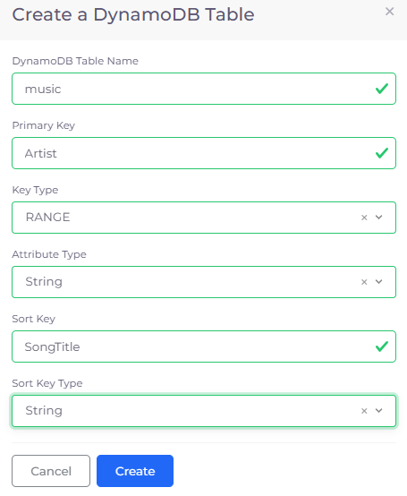

# AWS DynamoDB database tables

When using DynamoDB in DuploCloud AWS, the required permissions to access the DynamoDB from a virtual machine (VM), Lambda functions, and containers are provisioned automatically using Instance profiles. Therefore, no Access Key is required in the Application code.


When you write application code for DynamoDB in DuploCloud AWS, use the IAM role/Instance profile to connect to these services. Use the AWS SDK constructor, which uses the region, if possible.


1. In the DuploCloud Portal, navigate to **Cloud Services** -> **Database.**
2. Click the **DynamoDB** tab.
3.  Click **Add**. The **Create a DynamoDB Table** pane displays.\

    

    <figure><figcaption>
<strong>Create a DynamoDB Table</strong> pane
</figcaption></figure>

    

4. Specify the **DynamoDB Table Name** and other required fields, including **Primary Key**, **Key Type**, **Attribute Type**, **Sort Key**, and **Sort Key Type**.
5. Click **Create**.&#x20;


Perform additional configuration, as needed, in the [AWS Console](../../use-cases/using-aws-console.md) by clicking the **Console**      ( **>\_** ) icon. In the AWS console, you have permission to configure application-specific details of DynamoDB database tables. However, no access or security-level permissions are provided.

