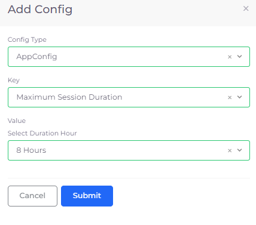
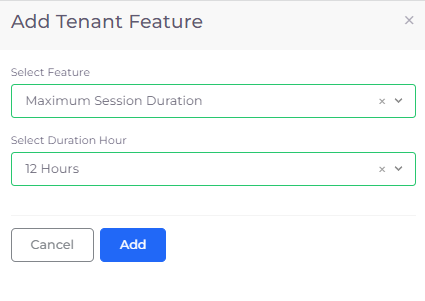
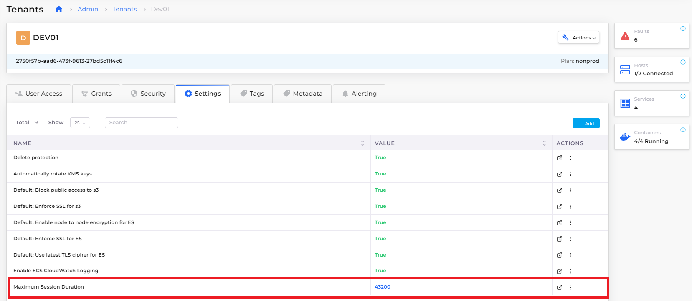

# AWS DynamoDB database tables

When using DynamoDB in DuploCloud AWS, the required permissions to access the DynamoDB from a virtual machine (VM), Lambda functions, and containers are provisioned automatically using Instance profiles. Therefore, no Access Key is required in the Application code.


When you write application code for DynamoDB in DuploCloud AWS, use the IAM role/Instance profile to connect to these services. For example, the AWS SDK constructor which uses the region is recommended.


1. In the DuploCloud Portal, navigate to **DevOps** -> **Database.**
2. Click the **DynamoDB** tab.
3. Click **Add**. The **Create a DynamoDB Table** pane displays.
4. Select the DynamoDB Table Name and other required fields.
5. Click **Create**.
6. Perform more configuration as needed in the AWS Console by clicking the Console **>\_** icon. In the console, you have permission to configure the application-specific details of the DynamoDB. However, no access or security-level permissions are provided.

<figure><figcaption>
<strong>Create a DynamoDB Table</strong> pane
</figcaption></figure>

## Configuring Tenant session duration time for recovery points

Create recovery points for your Dynamo DB tables by customizing Tenant session duration time. In the DuploCloud Portal, you configure the session duration time for all Tenants or for a single Tenant.

For more information about IAM roles and session times, see the [AWS Documentation](https://docs.aws.amazon.com/IAM/latest/UserGuide/id\_roles\_use.html).

### Configuring session duration time for all Tenants

1. In the DuploCloud Portal, navigate to **Administrator** -> **System Settings**. The **System Settings** page displays.
2. Click the **System Config** tab.
3.  Click **Add**. The **App Config** pane displays.

    <figure><figcaption>
<strong>Add Config</strong> pane to set <strong>Key Maximum Session Duration</strong> for all <strong>Tenants</strong>
</figcaption></figure>
4. From the **Config Type** list box, select **AppConfig**.
5. From the **Key** list box, select **Maximum Session Duration**.
6. From the **Select Duration Hour** list box, select the maximum session time in hours or set a **Custom Duration** in seconds.
7.  Click **Submit**. The **Maximum Session Duration Key** and **Value** are displayed in the **System Config** tab. Note that the **Value** you set for maximum session time in hours is displayed in seconds. You can **Delete** or **Update** the setting in the row's **Actions** menu.&#x20;

    <figure><figcaption>
<strong>System Config</strong> tab on <strong>System Settings</strong> page displaying <strong>MaximumSessionDuration</strong> for all Tenants
</figcaption></figure>

### Configuring session duration time for a single Tenant

1. In the DuploCloud Portal, navigate to **Administrator** -> **Tenants**. The **Tenants** page displays.
2. From the **Name** column, select the Tenant for which you want to configure session duration time.
3. Click the **Settings** tab.
4.  Click **Add**. The **Add Tenant Feature** pane displays.

    <figure><figcaption>
<strong>Add Tenant Feature</strong> pane to set <strong>Maximum Session Duration</strong> for a single Tenant
</figcaption></figure>
5. From the **Select Feature** list box, select **Maximum Session Duration**.
6. From the **Select Duration Hour** list box, select the maximum session time in hours or set a **Custom Duration** in seconds.
7.  Click **Add**. The **Maximum Session Duration Name** and **Value** are displayed in the **Settings** tab. Note that the **Value** you set for maximum session time in hours is displayed in seconds. You can **Delete** or **Update** the setting in the row's **Actions** menu.&#x20;

    <figure><figcaption>
<strong>Settings</strong> tab on Tenant page displaying <strong>MaximumSessionDuration</strong> for Tenant <strong>dev01</strong> 
</figcaption></figure>

