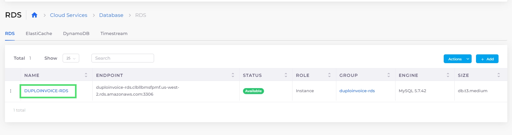

# Add an RDS read replica

By creating an AWS RDS Read Replica of your database, you can:

* Elastically scale your capacity for read-heavy database workloads.
* Boost performance by increasing aggregate read throughput.
* Create standalone database instances.

## Adding a read replica

1. In the DuploCloud Portal, navigate to **Cloud Services** -> **Database.**
2. Click the **RDS** tab.
3.  Select the database that you want to replicate from the **Name** column.\

    <figure><figcaption>
RDS database instance in the DuploCloud Portal
</figcaption></figure>
4.  Click the **Actions** menu. Select **RDS Settings**, and then **Add Replica**. The **Add read replica to: **_**SELECTED\_DATABASE\_NAME**_ pane displays.\

    

    <figure><figcaption>
<strong>Add read replica to:</strong> pane
</figcaption></figure>

    

5. In the **Read Replica Name** field, enter the name of your replica. The Tenant name is prefixed automatically.
6. Select an appropriate **Instance Size** from the list box to match or exceed the database you want to replicate.
7. Click **Create**. Your replica is displayed in the RDS tab with a **Status** of **Submitted**. When the replica is ready for use, the **Status** is **Available**.

<figure><figcaption>
RDS read replica with <strong>Status</strong> of <strong>Submitted</strong>
</figcaption></figure>
