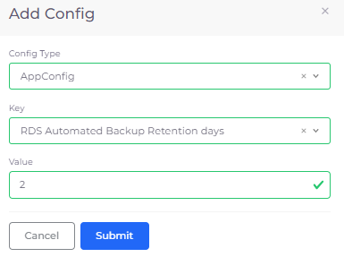

# Backup and restore

## Creating a snapshot 

Create a [snapshot ](https://docs.aws.amazon.com/AmazonRDS/latest/UserGuide/USER\_WorkingWithAutomatedBackups.html)of an RDS.

1. In the DuploCloud Portal, navigate to **DevOps** -> **Database**.
2. In the **RDS** tab, in the row containing your RDS instance, click the **Actions** menu icon (  ) and select **Backup & Restore** -> **Create Snapshot**.&#x20;
3. **Confirm** the snapshot request. Once taken, the snapshot displays in the **Snapshot** tab.

## Restoring a snapshot 

Once backups are available, you can restore them on the next instance creation when you [create an RDS](./#0-toc-title).

## Restoring snapshots to a point in time

You can restore available RDS snapshots to a specific point in time.

1. In the DuploCloud Portal, navigate to **DevOps** -> **Database**.
2. In the **RDS** tab, select an RDS instance containing [snapshots](backup-and-restore.md#0-toc-title).
3. Click the **Snapshots** tab.
4. Click the Actions menu and select **Backup & Restore** -> **Restore to Point in Time**. The **Restore Point in Time** pane displays.
5. In the **Target Name** field, append the RDS name to the prefilled _`TENANT_NAME`_ prefix.
6. Select either the **Last Restorable Time** or **Custom date and time** option. If you select the **Custom date and time** option, specify the date and time in the format indicated.
7. Click **Submit**. Your selected RDS is restored to the point in time you specified.&#x20;

## Configuring an automated backup retention period 

AWS automatically creates and saves backups of your database in Amazon S3. Database backups are kept for a user-specified amount of time called an automated backup retention period. [Read more about RDS backup and restoration on the AWS documentation.](https://aws.amazon.com/rds/features/backup/)&#x20;

### Setting a default automated backup retention period

You can set a default automated backup retention period in the DuploCloud Portal **System Settings**. This will apply to all RDS databases created unless you set a different backup period for a database during database creation.&#x20;

1. In the DuploCloud Portal, navigate to **Administrator** -> **System Settings**.
2. &#x20;Select the **System Config** tab.
3. Click **Add**. The Config pane displays.
4. From the **Config Type** list box, select **AppConfig**.
5. From the **Key** list box, select **RDS Automated Backup Retention days**.
6. In the **Value** field, enter the number of days to retain the backup, from one (**1**) to thirty-five (**35**) days.
7. Click Submit. The System Configs area in the System Config tab is updated with the retention period you entered for the **RDS Automated Backup Retention days** key.


Once the System Settings are configured, the backup retention period applies to newly created databases.&#x20;


### Setting an automated backup retention period for a database

When [creating an RDS database](./#0-toc-title), you can set an automated backup retention period for your database that overrides the backup retention period set in System Settings.&#x20;

1. On the **Create a RDS** page, in the **Backup Retention Period in Days** field, enter a number of days between one (**1**) and thirty-five (**35**).&#x20;
2. Automated backups for this database will be retained for the entered number of days.

<figure><figcaption>
<strong>Create a RDS</strong> page with <strong>Backup Retention Period in Days set to 4.</strong>
</figcaption></figure>


&#x20;If a value is not entered in the **Backup Retention Period in Days** field on the **Create a RDS** page during database creation, the backup retention period configured in Systems Settings will be applied. &#x20;


### Editing an automated backup retention period for a database

You can edit the backup retention period for a database in the databases **Backup & Restore** settings.

1. In the DuploCloud Portal, navigate to **DevOps** -> **Database**.
2. Select the correct **Tenant** from the Tenant list in the upper left.
3. In the **RDS** tab, click on the name of the database you want to configure.
4.  From the **Actions** list, select **Backup & Restore** -> **Update Backup Retention Period**.\

    

    <figure><figcaption>
The <strong>Database Actions Menu</strong> with <strong>Backup &#x26; Restore</strong> -> <strong>Update Backup Retention Period</strong> selected. 
</figcaption></figure>

    

5. The **Update Backup Retention Period** pane displays.
6. In the **Backup Retention Period in Days** field, enter the number of days, between one (**1**) and thirty-five (**35**).&#x20;
7.  Click **Update**. The backup retention period for this database is set to the entered value.\

    

    <figure><figcaption>
The <strong>Update Backup Retention Period</strong> pane.
</figcaption></figure>

    

