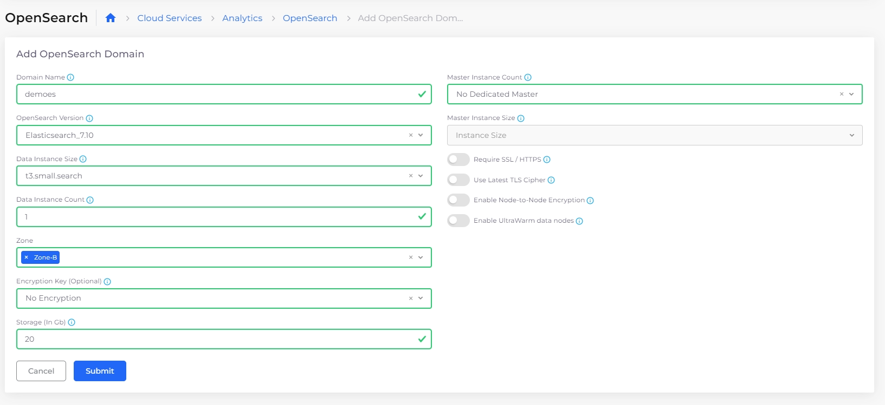

# OpenSearch

To create an OpenSearch domain from the DuploCloud portal, navigate to **Cloud Services** -> **Analytics, select the OpenSearch** tab, and click the **+Add** button above the table.

<figure><figcaption></figcaption></figure>
