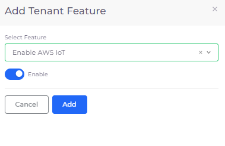
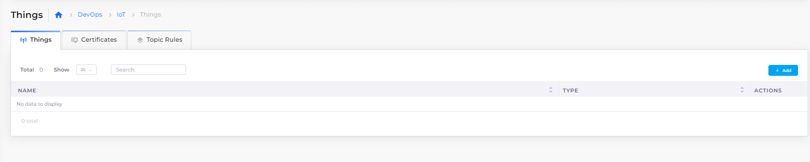
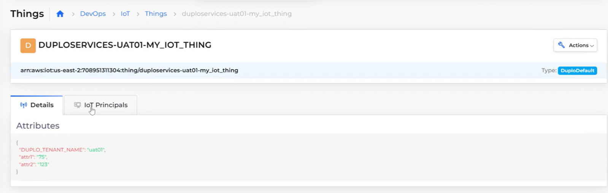
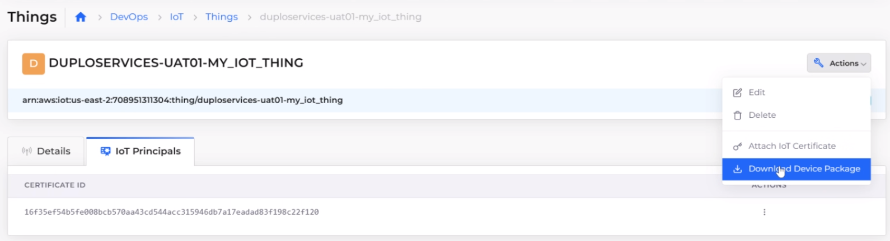
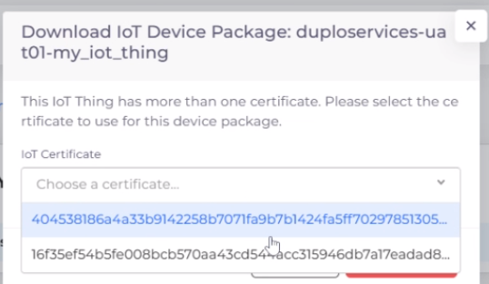
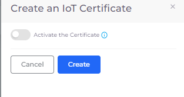
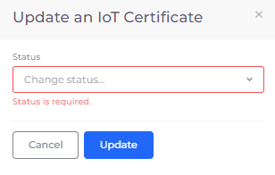
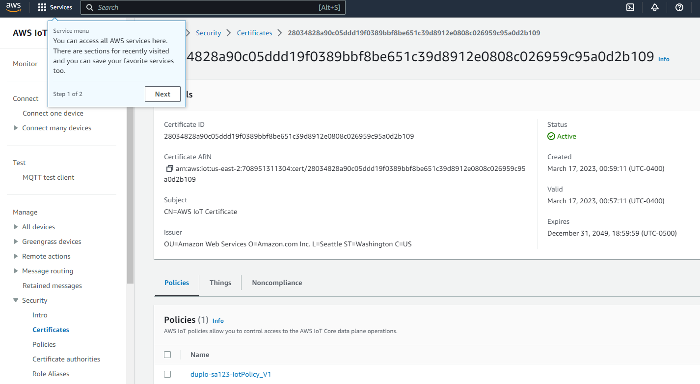

# IoT (Internet of Things)

Connect and manage billions of devices with AWS IoT, per Tenant. Collect, store, and analyze IoT data for industrial, consumer, commercial, and automotive workloads within DuploCloud.

## Enabling IoT for a Tenant&#x20;

1. In the DuploCloud Portal, navigate to **Administrator** -> **Tenants**.
2. Select your Tenant in the **Name** column.
3. Click the **Settings** tab.
4.  Click **Add**. The **Add Tenant Feature** pane displays.

    <figure><figcaption>
<strong>Add Tenant Feature</strong> pane with <strong>Enable AWS IoT</strong> feature selected
</figcaption></figure>
5. From the **Select Feature** list box, choose **Enable AWS IoT** and select **Enable**.
6. Click **Add**. It takes approximately five minutes to enable IoT.&#x20;
7.  Navigate to **DevOps** -> **IoT**.  The IoT **Things** page displays.

    <figure><figcaption>
IoT <strong>Things</strong> page
</figcaption></figure>

## Creating IoT Things

1. In the DuploCloud Portal, navigate to **DevOps** -> **IoT**.
2. Click the **Things** tab.
3.  Click **Add**. The **Create an IoT Thing** pane displays.

    <figure><figcaption>
<strong>Create an IoT Thing</strong> pane with <strong>AttributesACtions</strong> 
</figcaption></figure>
4. In the editable portion of the **Name** field, enter a Thing name.&#x20;
5. From the **IoT Certificate** list box, select an IoT Certificate.
6. From the **IoT Thing Type** list box, select the Thing type that you want to create.
7. In the **Attributes** field, add Thing Attributes in quotes, separated by a comma (**,**).
8. Click **Create**. Your IoT Thing is created and displayed.&#x20;

Select the Thing to view **Details** and **IoT Principals** (certificate information) for the Thing. Use the **Action** menu to **Edit** or **Delete** the Thing, **Attach IoT Certificate**, and **Download Device Package**.

<figure><figcaption>
<strong>Details</strong> and <strong>IoT Principals</strong> tabs on IoT <strong>Things</strong> page
</figcaption></figure>

<figure><figcaption>
<strong>Actions</strong> menu on IoT <strong>Things</strong> page
</figcaption></figure>

## Attach a certificate to a Thing

1. In the DuploCloud Portal, navigate to **DevOps** -> **IoT**.
2. Click the **Things** tab.
3. [Add a certificate](iot-internet-of-things.md#adding-a-certificate) if needed.
4. Select the Thing to which you want to attach a certificate from the **Name** column.
5. Click the Actions menu and select **Attach IoT Certificate**. The **Attach an IoT Certificate** pane displays.
6. From the **IoT Certificate** list box, select an IoT certificate to attach to the Thing.
7. Click **Attach**.

## Download the Device Package for a Thing

1. In the DuploCloud Portal, navigate to **DevOps -> IoT**.&#x20;
2. Click the **Things** tab.&#x20;
3. Select the Thing to which you want to attach a certificate from the **Name** column.&#x20;
4.  Click the **Actions** menu and select **Download Device Package**. The **Download IoT Device Package** window displays.&#x20;

    <figure><figcaption></figcaption></figure>
5. From the **IoT Certificate** list box, select the IoT certificate associated with the Thing's Device Package.&#x20;
6. Click **Download**.

## Certificate management

Add, update, or manage an IoT certificate with the following procedures.

### Adding a certificate

1. In the DuploCloud Portal, navigate to **DevOps** -> **IoT**.
2. Click the **Certificates** tab.
3.  Click **Add**. The **Create an IoT Certificate** pane displays.

    <figure><figcaption>
<strong>Create an IoT Certificate</strong> pane
</figcaption></figure>
4. Select **Activate the Certificate** and click **Create**. The certificate displays.&#x20;

### Updating a certificate

1. In the DuploCloud Portal, navigate to **DevOps** -> **IoT**.
2. Click the **Certificates** tab. The available certificates are displayed and listed by **ID**.
3. In the row for the certificate you want to update, click the  icon in the **Actions** column.
4.  Select **Edit**. The **Update an IoT Certificate** pane displays.

    <figure><figcaption></figcaption></figure>
5. From the **Status** list box, select the new status of the certificate.
6. Click **Update**.

### Manage a certificate using AWS Console

1. In the DuploCloud Portal, navigate to **DevOps** -> **IoT**.
2. Click the **Certificates** tab. Available certificates are displayed and listed by **ID**.
3. In the row for the certificate you want to update, click the  icon in the **Actions** column.
4.  Select **Console**. The AWS Console launches so that you can manage your certificate using AWS.

    <figure><figcaption>
AWS Console for managing certificates
</figcaption></figure>
