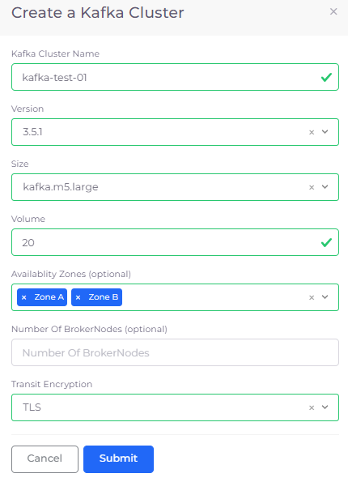
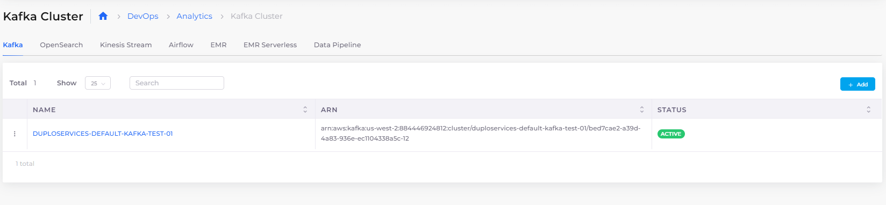

# Kafka Cluster

Apache Kafka (Kafka) is an open-source, distributed streaming platform that enables the development of real-time, event-driven applications. It is used to build real-time streaming data pipelines and real-time streaming applications.&#x20;

A data pipeline reliably processes and moves data from one system to another, and a streaming application is an application that consumes streams of data. Streaming platforms enable developers to build applications that continuously consume and process streams at high speeds, with a high level of accuracy.

For complete documentation on Apache Kafka, see the [AWS documentation](https://docs.aws.amazon.com/msk/latest/developerguide/what-is-msk.html).

## Creating a Kafka Cluster

1. In the DuploCloud Portal, navigate to **DevOps** -> **Analytics**.
2. Click the **Kafka** tab.
3.  Click **Add**. The **Create a Kafka Cluster** pane displays.\

    

    <figure><figcaption>
Create a Kafka Cluster pane 
</figcaption></figure>

    

4. Enter a **Kafka Cluster Name**.
5. From the field list boxes, select a **Version** of Kafka, the **Size** of the cluster you want to create, the **Volume** size in gigabytes, and the **Transit Encryption** mode.
6. Optionally, select **Availability Zones**. You must specify a minimum of two (2) zones.
7.  Click **Submit**. The cluster is created and displayed as **Active** in the **Kafka** tab. It may take up to half an hour to create the cluster.\

    

    <figure><figcaption>
<strong>Kafka</strong> tab with Kafka clusters 
</figcaption></figure>

    

## Viewing Kafka Clusters

View Kafka clusters by navigating to **DevOps** -> **Analytics** in the DuploCloud Portal and selecting the **Kafka** tab.
