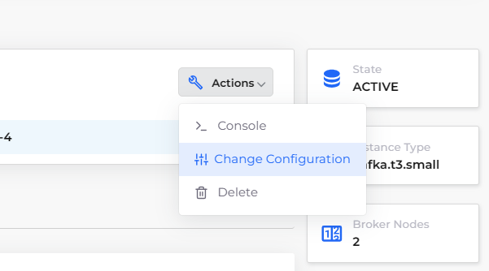
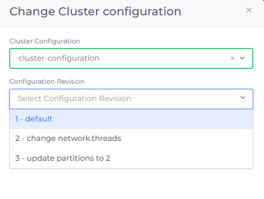
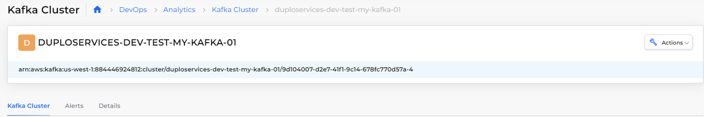

# Kafka Cluster

Apache Kafka (Kafka) is an open-source, distributed streaming platform that enables the development of real-time, event-driven applications. It is used to build real-time streaming data pipelines and real-time streaming applications.&#x20;

A data pipeline reliably processes and moves data from one system to another, and a streaming application is an application that consumes streams of data. Streaming platforms enable developers to build applications that continuously consume and process streams at high speeds, with a high level of accuracy.


When creating a Kafka Cluster in DuploCloud, if you want to select a **Cluster Configuration** and **Configuration Revision**, you must add the configuration or revision in the AWS console before creating the DuploCloud Kafka cluster.&#x20;


For complete documentation on Apache Kafka, see the [AWS documentation](https://docs.aws.amazon.com/msk/latest/developerguide/what-is-msk.html).

## Creating a Kafka Cluster

1. In the DuploCloud Portal, navigate to **DevOps** -> **Analytics**.
2. Click the **Kafka** tab.
3. Click **Add**. The **Create a Kafka Cluster** pane displays.
4. Enter a **Kafka Cluster Name**.
5. From the field list boxes, select a **Version** of Kafka, the **Size** of the cluster you want to create, the **Volume** size in gigabytes, and the **Transit Encryption** mode.&#x20;
6. Optionally, select **Availability Zones** or **Number of BrokerNodes**. You must specify a minimum of two (2) **Availability Zones** zones.&#x20;
7.  Optionally, select a **Cluster Configuration** and **Configuration Revision** when creating a Kafka Cluster in DuploCloud. The **Cluster Configuration** and **Configuration Revision** list boxes are prepopulated with configurations and revisions previously defined in the AWS Portal.\

    

    <figure><figcaption>
<strong>Create a Kafka Cluster</strong> pane 
</figcaption></figure>

    

8.  Click **Submit**. The cluster is created and displayed as **Active** in the **Kafka** tab. It may take up to half an hour to create the cluster.\

    

    <figure><figcaption>
<strong>Kafka</strong> tab with Kafka clusters 
</figcaption></figure>

    

## Viewing Kafka Clusters

View Kafka Clusters by navigating to **DevOps** -> **Analytics** in the DuploCloud Portal and selecting the **Kafka** tab.

## Changing the Configuration of a Kafka Cluster

1. In the DuploCloud Portal, navigate to **DevOps** -> **Analytics**.
2. Click the **Kafka** tab.&#x20;
3. Select the Kafka Cluster with **Active Status** from the **Name** column. The **Kafka Cluster** page displays.&#x20;
4.  Click the **Actions** menu and select **Change Configuration**. The **Change Cluster Configuration** pane displays.\

    <figure><figcaption>
Kafka Cluster page <strong>Actions</strong> menu displaying <strong>Change Configuration</strong> option
</figcaption></figure>

5.  From the **Cluster Configuration** list box, select the new cluster configuration.\

    <figure><figcaption>
<strong>Change Cluster Configuration</strong> pane .
</figcaption></figure>

6. From the **Configuration Revision** list box, select the revision of the new cluster configuration.
7. Click **Submit**. The configuration change is displayed on the **Kafka Cluster** page

<figure><figcaption>
<strong>Kafka Cluster</strong> page with available tabs detailing configuration
</figcaption></figure>
