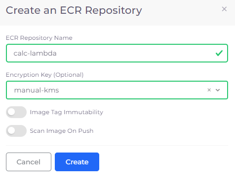

# Configure Lambda with Container Images

## Building Container Images 

Create and Build your Lambda code using `DockerFile`.  Refer to the [AWS documentation](https://docs.aws.amazon.com/lambda/latest/dg/configuration-function-zip.html) for detailed instructions on how to build and test container Images.

## Creating the ECR Repository 

1. In the DuploCloud Portal, navigate to **DevOps** -> **Storage**.
2. Click the **ECR Repository** tab. The **ECR Repository** page displays.
3. Click **Add**. The **Create an ECR Repository** page displays.
4. In the **ECR Repository Name** field, enter the ECR Repository Name.
5.  Click **Create**.

    <figure><figcaption>
<strong>Create an ECR Repository</strong> pane
</figcaption></figure>

## Uploading Container Images to an ECR Repository 

1. Login to ECR
2. Tag the images you have built.
3. Push the images to the ECR Repository that you created.

Refer to the [AWS Documentation](https://docs.aws.amazon.com/AmazonECR/latest/userguide/docker-push-ecr-image.html) for more details about uploading Container Images.

## Configuring Lambda with Container Images

1. Follow the steps for [creating a Lambda Function](./), specifying **Image** in the Package Name field.
2. In the **Image URL** field, enter the URL of the image.
3.  Click **Submit**.

     (3) (1).png>)

