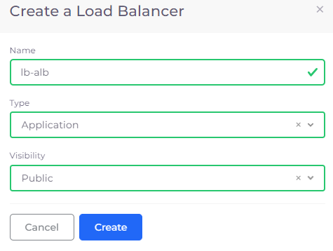
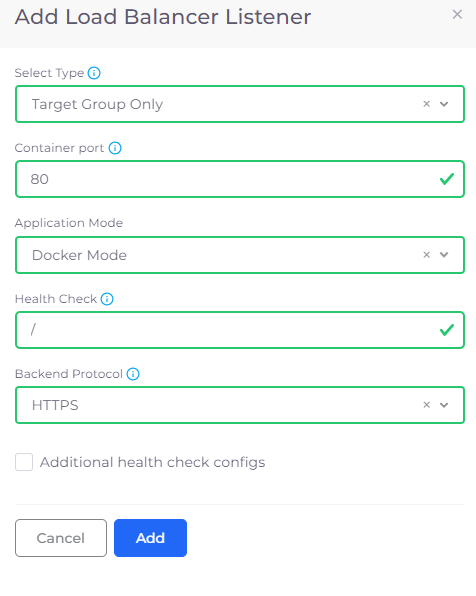
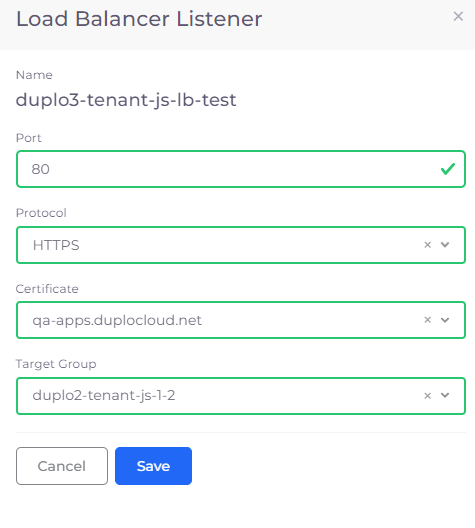
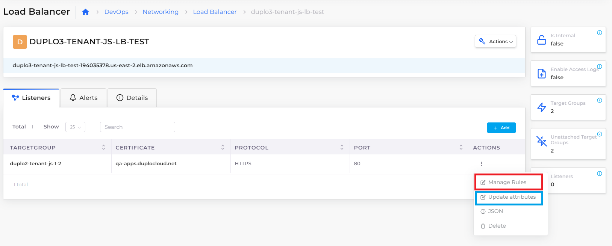
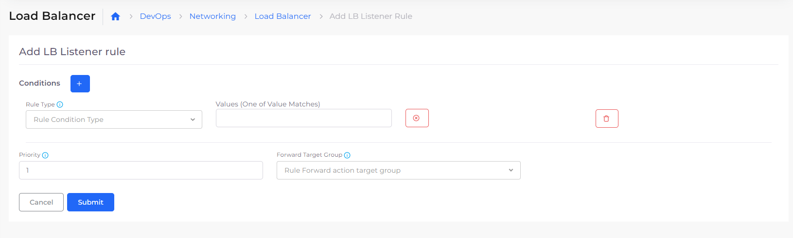
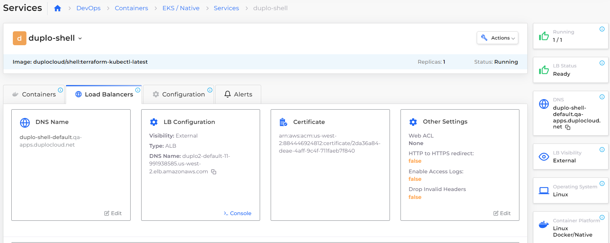
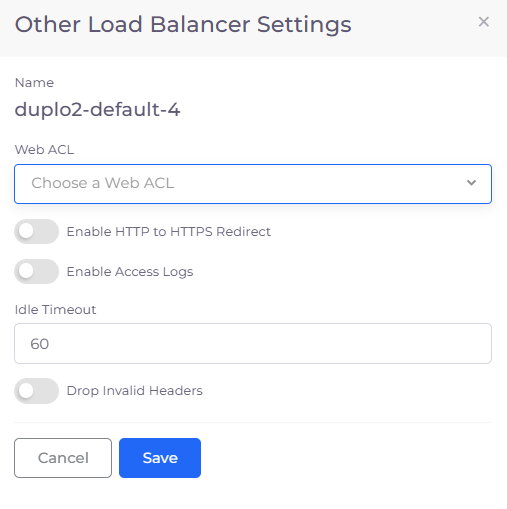

# Load Balancers

Duplo Cloud provides the ability to configure Load Balancers with the type of Application Load Balancer, Network Load Balancer, and Classic Load Balancer.

Duplo Cloud provides the ability to configure Load Balancers with the following types:

* Application Load Balancer - An ALB provides outbound connections to cluster nodes inside the AKS virtual network, translating the private IP address to a public IP address as part of its Outbound Pool.
* Network Load Balancer - An NLB distributes traffic across several servers by using the TCP/IP networking protocol. By combining two or more computers that are running applications into a single virtual cluster, NLB provides reliability and performance for web servers and other mission-critical servers.
* Classic Load Balancer - The legacy AWS Load Balancer (which was retired from AWS support, as of August 2022).

Load Balancers can be configured for Docker Native, EKS-Enabled, and ECS Services from the DuploCloud Portal. Using the Portal, you can configure:

* Service Load Balancers - Application Load Balancers specific to one service. (Navigate to **DevOps**-> **EKS/Native**, select a Service from the list, and click the **Load Balancer** tab).
* Shared and Global load balancers - Application or Network Load Balancers that can be used as a shared Load Balancer between Services and for Global Server Load Balancing (GSLB). (Navigate to **DevOps** -> **Networking** -> **Load Balancers**).


[To share a load balancer between multiple Services](load-balancers.md#2d32), create a Service Load Balancer of type **Target Group Only**.


## Adding a Load Balancer Listener

1. In the DuploCloud Portal, navigate **DevOps** -> **Containers -> EKS/Native**.
2. On the **Services** page, select the Service name in the **Name** column.
3. Click the **Load Balancers** tab.
4. If no Load Balancers exist, click the **Configure Load Balancer** link. If other Load Balancers exist, click **Add** in the **LB listeners** card. The **Add Load Balancer Listener** pane displays.&#x20;
5. From the **Select Type** list box, select a Load Balancer Listener type based on your Load Balancer.
6. Complete other fields as required and click **Add** to add the Load Balancer Listener.

### Adding a Network Load Balancer (NLB) Listener with a custom CIDR

To specify a custom classless inter-domain routing (CIDR) value for an NLB Load Balancer, edit the Load Balancer Listener configuration in the DuploCloud Portal.&#x20;

1. In the DuploCloud Portal, navigate **DevOps** -> **Containers -> EKS/Native**.
2. On the **Services** page, select the Service name in the **Name** column.
3. Click the **Load Balancers** tab.
4. In the **LB Listeners** card, select the Edit Icon () for the Load Balancer you want to edit. The **Edit Load Balancer Listener** pane displays.
5. Click **Add** in the **Custom CIDR** field of the **Edit Load Balancer Listener** pane**.**
6. Add the **Custom CIDR**(s) and press ENTER. In the example below **10.180.12.0/22** and **10.180.8.0/22** are added. Next, [add Security Groups for the CIDR(s)](load-balancers.md#adding-security-groups-for-custom-cidrs) you added.

### Adding Security Groups for NLBs with custom CIDRs

1. Navigate to **Administrator** -> **Infrastructure**. The **Infrastructure** page displays.
2. From the **Name** column, select the appropriate Infrastructure. &#x20;
3. Click the **Security Group Rules** tab.
4. Click **Add** to add a Security Group. The **Add Tenant Security** pane displays.
5. From the **Source Type** list box, select **Ip Address**.
6. From the **IP CIDR** list box, select **Custom**. A field labeled **CIDR notation of allowed hosts** displays.
7. In the **CIDR Notation of allowed hosts** field enter a custom CIDR and complete the other required fields.&#x20;
8. Click **Add** to add the Security Group containing the custom CIDR.

To add more CIDRs, as in the example above, repeat this procedure.

## Adding a Shared Load Balancer

1. In the DuploCloud Portal, navigate to **DevOps** -> **Networking**.
2. Click the **Load Balancer** tab.&#x20;
3.  Click **Add**. The **Create a Load Balancer** pane displays.

    <figure><figcaption></figcaption></figure>
4. In the **Name** field, enter a name for the Load Balancer.
5. From the **Type** list box, select a Load Balancer type.
6. From the **Visibility** list box, select **Public** or **Internal**.
7. Click **Create**.

## Creating a Target Group Only Load Balancer for multiple services 

Instead of creating a unique Load Balancer for each Service you create, you can share a single Load Balancer between multiple Services. This is helpful when your applications run distributed microservices where the requests use multiple services and route traffic based on application URLs, which you can define with Load Balancer Listener Rules.&#x20;

To accomplish this, you:

1. Create a Service Load Balancer with the type Target Group Only. This step creates a Service Load Balancer that includes a Target Group with a pre-defined name.
2. Create a Shared Load Balancer with the Target Group that was defined.
3. Create routing rules for the Shared Load Balancer and the Target Group it defines.

### Creating a Service Load Balancer with the type Target Group Only

[Add a Load Balancer Listener with the type **Target Group Only**](load-balancers.md#adding-a-load-balancer-listener). You can create a Load Balancer Listener with a type of **Target Group** **Only** for Docker Native, EKS Enabled, and ECS Services based on your application requirement. &#x20;


Find the name of the created Target Group but clicking the Info Icon (  ) for the Load Balancer in the **LB Listener** card and searching for the string `TgName`.


<figure><figcaption>
<strong>Add Load Balancer Listener</strong> pane for <strong>Target Group Only Type</strong>
</figcaption></figure>

### Creating a Shared Load Balancer for the Target Group

1. [Create a Shared Load Balancer](load-balancers.md#adding-a-shared-load-balancer) with a **Type** of **Application**.
2. In the **Load Balancer** tab of the **DevOps** -> **Networking** page, select the Load Balancer you created.
3. In the **Listeners** tab, click **Add**. The **Load Balancer Listener** pane displays.
4. Complete all fields, specifying the **Target Group** that was created when you [added a Load Balancer with the **Type Target Group Only** in the previous step](load-balancers.md#creating-a-service-load-balancer-with-the-type-target-group-only).
5. Click **Save**.

<figure><figcaption>
<strong>Load Balancer Listener</strong> pane with <strong>Target Group</strong> specified
</figcaption></figure>

### Adding Routing Rules to the Shared Load Balancer&#x20;


Rules are not supported for Network Load Balancers (NLBs).


1. In the DuploCloud Portal, navigate to **DevOps** -> **Networking**.
2. Click the **Load Balancer** tab.&#x20;
3. Select the [Shared Load Balancer you defined in the previous step](load-balancers.md#creating-a-shared-load-balancer-for-the-target-group).
4. From the **Name** column of the **DevOps** -> **Networking** -> **Load Balancer** page, select the Shared Load Balancer.
5.  In the **Listeners** tab, in the appropriate **Target Group** row, click the **Actions** menu (  ) and select **Manage Rules**. You can also select **Update attributes** from the **Actions** menu, as well, to dynamically update Target Group attributes. The **Listener Rules** page displays.

    <figure><figcaption></figcaption></figure>
6.  The **Add LB Listener rule** page displays.

    <figure><figcaption></figcaption></figure>
7. Create routing rules for the Target Group by setting appropriate **Conditions**. Add Routing Rules by specifying **Rule Type**, **Values**, and **Forward Target Group**. Forward Target Group lists all the Target Groups created for Docker Native, K8s, and ECS Services.&#x20;
8. Click **Submit**.

## Viewing Load Balancer rules&#x20;

View the rules you defined for any Load Balancer

1. In the DuploCloud portal, navigate to **DevOps** -> **Networking**.&#x20;
2. Select the **Load Balancer** tab.&#x20;
3. From the **Name** column, select the Load Balancer whose rules you want to view.
4. In the **Listeners** tab, in the appropriate **Target Group** row, click the **Actions** menu ( ) and select **Manage Rules**.

## Updating Target Group attributes

Update attributes for your defined Target Group.

1. In the DuploCloud portal, navigate to **DevOps** -> **Networking**.&#x20;
2. Select the **Load Balancer** tab.&#x20;
3. From the **Name** column, select the Load Balancer whose defined Target Group attributes you want to modify.
4. In the **Listeners** tab, in the appropriate **Target Group** row, click the **Actions** menu (  ) and select **Update attributes**.

## Additional Load Balancer Settings

You can use the **Other Settings** card in the DuploCloud Portal to set the following features:

* WAF Web ACL
* Enable HTTP to HTTPS redirects
* Enable Access Logging
* Set Idle Timeout
* Drop invalid headers

1. In the DuploCloud Portal, navigate to **DevOps** -> **Containers** -> **EKS/Native**. The **Services** page displays.
2. Select the Service to which your Load Balancer is attached from the **Name** column.
3. Click the **Load Balancers** tab.
4.  In the **Other Settings** card, click **Edit**. The **Other Load Balancer Settings** pane displays.

    <figure><figcaption></figcaption></figure>
5.  In the **Other Load Balancer Settings** pane, select any or all options.

    <figure><figcaption>
<strong>Other Load Balancer Settings</strong> pane
</figcaption></figure>
6. Click **Save**.

