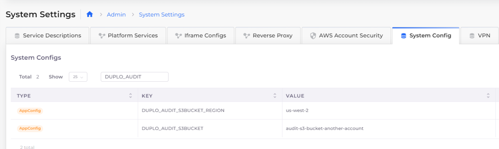

# S3 bucket

Amazon Simple Storage Service (Amazon S3) is an object storage service offering scalability, data availability, security, and performance. You can store and protect any data for data lakes, cloud-native applications, and mobile apps. Read more about S3 and its capabilities [here](https://aws.amazon.com/s3/).

## Creating an S3 bucket

1. In the DuploCloud Portal, navigate to **DevOps** -> **Storage**.
2. Click the **S3** tab.
3.  Click **Add**. The **Create an S3 Bucket pane displays**.

    
4. In the **Name** field, enter a name for the S3 bucket.
5. In the **Region** list box, select the region. You can select **Tenant Region**, **Default Region**, or **Global Region**, and specify **Other Region** to enter a custom region you have defined.
6. Optionally, select **Object Lock**. By using Object Lock, you can store objects using a _write-once-read-many_ (WORM) model. This can prevent objects from being deleted or overwritten for a fixed amount of time or indefinitely. You can also use Object Lock to meet regulatory requirements that require WORM storage or to add another layer of protection against object changes and deletion.&#x20;
7. Click **Create**.

## Setting S3 bucket permissions and policies

You can set specific AWS S3 bucket [permissions and policies](https://docs.aws.amazon.com/AmazonS3/latest/userguide/UsingBucket.html#about-access-permissions-create-bucket) using the DuploCloud Portal. Permissions for virtual machines, Lambda functions, and containers are provisioned automatically through Instance profiles, so no access key is required in your application code. However, when coding your application, be aware of these guidelines:

* Use the IAM role or Instance profile to connect to services.
* Only use the AWS SDK constructor for the region.

Set S3 Bucket permissions in the DuploCloud Portal:

1. In the DuploCloud Portal, navigate to **DevOps** -> **Storage**.
2. Click the **S3** tab.
3. From the **Name** column, select the bucket for which you want to set permissions. The **S3 Bucket** page for your bucket displays.
4. In the **Settings** tab, click **Edit**. The **Edit a S3 Bucket** pane displays.
5. From the **KMS** list box, select the key management system scope (**AWS Default KMS Key**, **Tenant KMS Key**, etc.).
6. Select permissions: **Allow Public Access**, **Enable Access Logs**, or **Enable Versioning**.&#x20;
7. Select an available **Bucket Policy: Require SSL/HTTPS** or **Allow Public Read**. To select the **Allow Public Read** policy, you must select the **Allow Public Access** permission. To ignore all bucket policies for the bucket, select **Ignore Bucket Policies**.
8. Click **Save**. In the **Details** tab, your changed permissions are displayed.

Use this table to map the permission and policies options above with the YAML key/value pair.&#x20;

| Edit a S3 Bucket Option    | Key                         | Value        |
| -------------------------- | --------------------------- | ------------ |
| **Allow Public Access**    | `duplo-allow-public-access` | `true`       |
| **Enable Access Logs**     | `duplo-enable-access-logs`  | `true`       |
| **Enable Versioning**      | `enable-versioning`         | `true`       |
| **Require SSL / HTTPS**    | `duplo-policy`              | `ssl`        |
| **Allow Public Read**      | `duplo-policy`              | `publicread` |
| **Ignore Bucket Policies** | `duplo-policy`              | `ignore`     |


From the **S3 Bucket** page, you can set bucket permissions directly in the AWS Console by clicking the **>\_Console** icon. You have permission to configure the bucket within the AWS Console session, but no access or security-level permissions are available.


## Add a custom prefix for S3 buckets

DuploCloud provides the capability to specify a custom prefix for S3.


**IMPORTANT:** Before you add custom prefixes for S3 buckets, contact the DuploCloud Support Team and ask them to set the `ENABLEAWSRESOURCEMGMTUSINGTAGS` property to`True` in the DuploCloud System. After this property is set, use this procedure to add custom prefixes.


1. IMPORTATIn the DuploCloud Portal, navigate to **Administrator** -> **System Settings**.
2. Click the **System Config** tab.
3. Click **Add**. The **Add Config** pane displays.
4. From the **Config Type** list box, select **AppConfig**.
5. From the **Key** list box, select **Prefix all S3 Bucket Names**.
6. In the **Value** field, enter the custom prefix.
7. Click **Submit**.


Avoid specifying system-reserved prefixes such as`duploservices`.


<div align="left">

<figure><figcaption><p><strong>Add Config</strong> pane for <strong>Key Prefix all S3 Bucket Name</strong></p></figcaption></figure>

</div>

## Configuring a custom S3 bucket for auditing in another AWS account

You can create an S3 bucket for auditing in another account, other than the DuploCloud Master Account.&#x20;

### Prerequisites

1. Verify that the S3 bucket exists in another account, and note the bucket name. In this example, we assume a BUCKET\_REGION of **us-west-2** and a BUCKET name of **audit-s2-bucket-another-account**.
2. Ensure that your S3 bucket has `Duplo Master` permission to access the `S3:PutObject`. Refer to the code snippet below for an example.

```json
{
  "Version": "2012-10-17",
  "Statement": [
  {
            "Effect": "Allow",
            "Principal": {
                "AWS": "arn:aws:iam::accountid:role/duplomaster"
            },
            "Action": "S3:PutObject",
            "Resource": [
                "arn:aws:s3:::arn:aws:s3:::bucknetname/*",
                "arn:aws:s3:::arn:aws:s3:::bucketname"
            ]
        }
  ]
}


```

### Configuring S3 bucket region and bucket name

1. In the DuploCloud Portal, navigate to **Administrator** -> **System Settings**.
2. Click the **System Config** tab.

#### Configuring Bucket Region

Continuing the example above, configure the **S3BUCKET\_REGION**.

1. Click **Add**. The **Add Config** pane displays.
2. From the **Config Type** list box, select **AppConfig**.
3. in the **Key** list box, enter **DUPLO\_AUDIT\_S3BUCKET\_REGION**.
4. In the **Value** field, enter **us-west-2**.
5. Click **Submit**.

#### Configuring Bucket Name

Continuing the example above, configure the **S3BUCKET** name.

1. Click **Add**. The **Add Config** pane displays.
2. From the **Config Type** list box, select **AppConfig**.
3. in the **Key** list box, enter **DUPLO\_AUDIT\_S3BUCKET**.
4. In the **Value** field, enter **audit-s2-bucket-another-account**.
5. Click **Submit**.

Your S3 bucket region and name configurations are displayed in the **System Config** tab.&#x20;

<figure><figcaption><p><strong>System Config</strong> tab with <strong>AppConfig</strong>s for S3 bucket region and name</p></figcaption></figure>


Contact your DuploCloud Support team if you have additional questions or issues.

