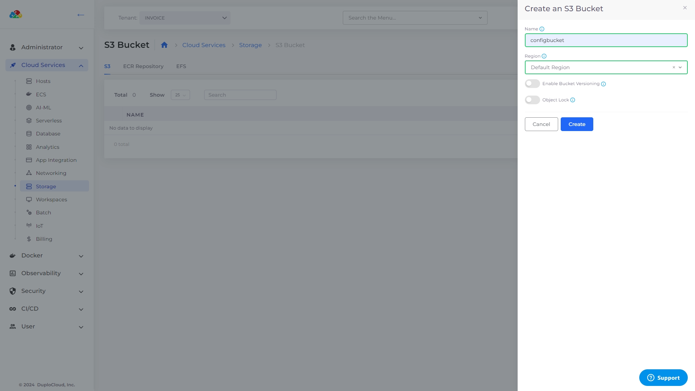
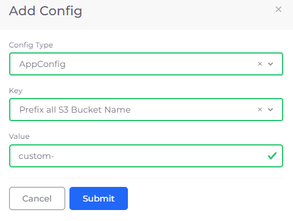

# S3 bucket

Amazon Simple Storage Service (Amazon S3) is an object-storage service offering scalability, data availability, security, and performance. You can store and protect any data for data lakes, cloud-native applications, and mobile apps. Read more about S3 and its capabilities [here](https://aws.amazon.com/s3/).


To configure an S3 bucket for auditing, see the [Auditing ](../use-cases/auditing.md)topic.


## Creating an S3 bucket

1. In the DuploCloud Portal, navigate to **Cloud Services** -> **Storage**.
2. Click the **S3** tab.
3. Click **Add**. The **Create an S3** **Bucket** pane displays.
4. In the **Name** field, enter a name for the S3 bucket. Note that when using the `duplocloud_s3_bucket` resource in Terraform, a unique identifier consisting of the AWS account ID is appended to the bucket name, along with a prefix that includes the tenant name (`duploservices-<tenant_name>-`). This ensures global uniqueness as required by AWS. For more information on adding a custom prefix, see the section on [adding a custom prefix for S3 buckets](#add-a-custom-prefix-for-s3-buckets).
5. In the **Region** list box, select the region. You can select **Tenant Region**, **Default Region**, or **Global Region**, and specify **Other Region** to enter a custom region you have defined.

<figure><figcaption>
The <strong>Create an S3 Bucket</strong> pane
</figcaption></figure>

6. Optionally, select **Enable Bucket Versioning** and/or **Object Lock.** Both of these settings are disabled by default, unless you Enable Bucket Versioning Tenant-wide in **Tenant** **Settings**. For more information about S3 bucket versioning, see the [AWS documentation](https://docs.aws.amazon.com/AmazonS3/latest/userguide/versioning-workflows.html).&#x20;
7. Click **Create**. An S3 bucket is created.


**Enable Bucket Versioning** must be selected to use **Object Lock**.&#x20;


### Enabling bucket versioning for S3 buckets at the Tenant level

You can configure the [Tenant ](../use-cases/tenant-environment/#2-toc-title)to enable bucket versioning by default.&#x20;

1. In the DuploCloud Portal, navigate to **Administrator** -> **Tenants**.
2. Click on the **Tenant** name in the list.
3. In the **Settings** tab, click **Add**. The **Add Tenant Feature** pane displays.
4. Click **Add**. The **Create an S3 Bucket** pane displays.
5. From the **Select Tenant Feature** list box, select **Default: Enable bucket versioning for new S3 buckets**.
6.  Select **Enable.**\

    

    <figure><figcaption>
The <strong>Add Tenant Feature</strong> pane filled to enable bucket versioning for this Tenant. 
</figcaption></figure>

    

7.  Click **Add**. Bucket versioning will be enabled by default on the **Create an S3 Bucket** pane when [creating a new S3 bucket](s3-bucket.md#creating-an-s3-bucket).\

    

    <figure><figcaption>
The <strong>Settings</strong> tab on the <strong>Tenant</strong> page shows bucket versioning is enabled for new S3 buckets.
</figcaption></figure>

    


With this setting configured, all new S3 buckets in the Tenant will automatically have bucket versioning enabled.&#x20;


## Setting S3 bucket permissions and policies

You can set specific AWS S3 bucket [permissions and policies](https://docs.aws.amazon.com/AmazonS3/latest/userguide/UsingBucket.html#about-access-permissions-create-bucket) using the DuploCloud Portal. Permissions for virtual machines, Lambda functions, and containers are provisioned automatically through Instance profiles, so no access key is required in your application code. However, when coding your application, be aware of these guidelines:

* Use the IAM role or Instance profile to connect to services.
* Only use the AWS SDK constructor for the region.

Set S3 Bucket permissions in the DuploCloud Portal:

1. In the DuploCloud Portal, navigate to **Cloud Services** -> **Storage**.
2. Click the **S3** tab.
3. From the **Name** column, select the bucket for which you want to set permissions. The **S3 Bucket** page for your bucket displays.
4. In the **Settings** tab, click **Edit**. The **Edit a S3 Bucket** pane displays.
5. From the **KMS** list box, select the key management system scope (**AWS Default KMS Key**, **Tenant KMS Key**, etc.).
6. Select permissions: **Allow Public Access**, **Enable Access Logs**, or **Enable Versioning**.&#x20;
7. Select an available **Bucket Policy: Require SSL/HTTPS** or **Allow Public Read**. To select the **Allow Public Read** policy, you must select the **Allow Public Access** permission. To ignore all bucket policies for the bucket, select **Ignore Bucket Policies**.
8. Click **Save**. In the **Details** tab, your changed permissions are displayed.

Use this table to map the permission and policies options above with the YAML key/value pair.&#x20;

| Edit a S3 Bucket Option    | Key                         | Value        |
| -------------------------- | --------------------------- | ------------ |
| **Allow Public Access**    | `duplo-allow-public-access` | `true`       |
| **Enable Access Logs**     | `duplo-enable-access-logs`  | `true`       |
| **Enable Versioning**      | `enable-versioning`         | `true`       |
| **Require SSL / HTTPS**    | `duplo-policy`              | `ssl`        |
| **Allow Public Read**      | `duplo-policy`              | `publicread` |
| **Ignore Bucket Policies** | `duplo-policy`              | `ignore`     |


From the **S3 Bucket** page, you can set bucket permissions directly in the AWS Console by clicking the **>\_Console** icon. You have permission to configure the bucket within the AWS Console session, but no access or security-level permissions are available.


## Add a custom prefix for S3 buckets

DuploCloud provides the capability to specify a custom prefix for S3 buckets, enhancing naming conventions and organizational strategies. Before adding custom prefixes, ensure to contact the DuploCloud Support Team to enable the `ENABLEAWSRESOURCEMGMTUSINGTAGS` property. This step is crucial for the custom prefix functionality to be available.

1. In the DuploCloud Portal, navigate to **Administrator** -> **System Settings**.
2. Click the **System Config** tab.
3. Click **Add**. The **Add Config** pane displays.
4. From the **Config Type** list box, select **AppConfig**.
5. From the **Key** list box, select **Prefix all S3 Bucket Names**.
6. In the **Value** field, enter the custom prefix you wish to use, avoiding system-reserved prefixes such as `duploservices`.
7. Click **Submit**.


It's important to avoid using system-reserved prefixes to prevent conflicts. Custom prefixes allow for better management and identification of resources across different tenants or projects.


<figure><figcaption>
<strong>Add Config</strong> pane for <strong>Key Prefix all S3 Bucket Name</strong>
</figcaption></figure>

