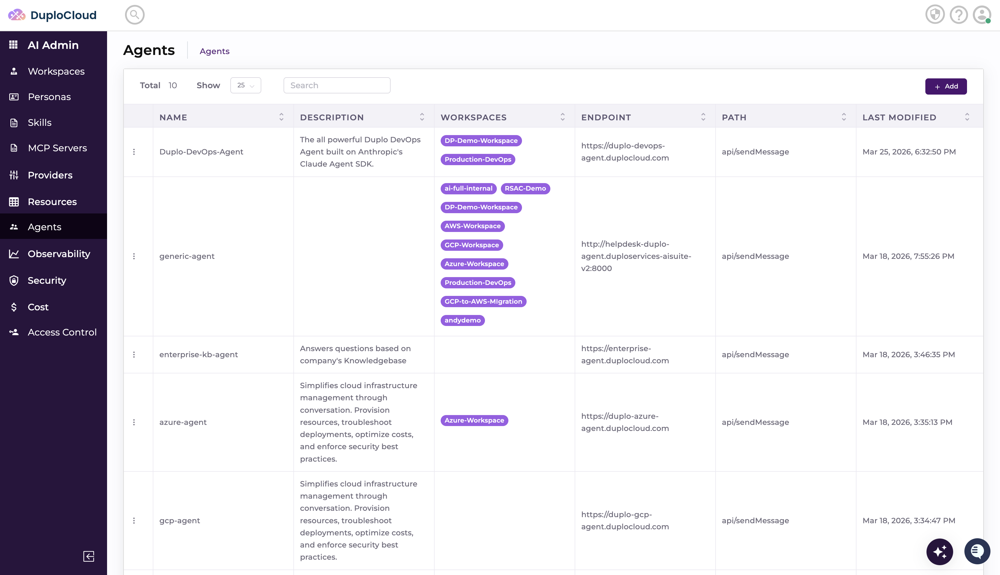

# SSH EC2 instance

Once EC2 Instance is created. You can connect EC2 Instance in two ways from the DuploCloud portal.

Navigate to DevOps --> Hosts and, click on the host to which you need to connect through ssh.

From Action menu > click on ssh, new browser tab would be launched, you can ssh your host using session id. Connection to the host will be launched in a separate browser tab.

Another way is to download the  key from Actions > Connection Details

Follow the instruction listed in the dialog box and you should be connected to the server.
