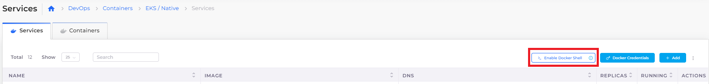
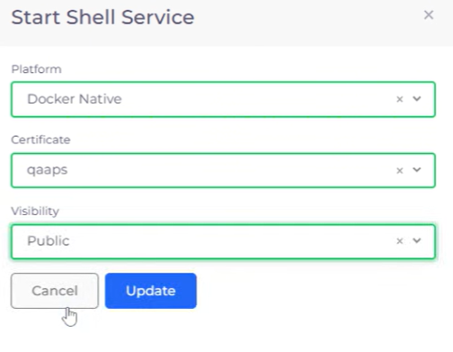
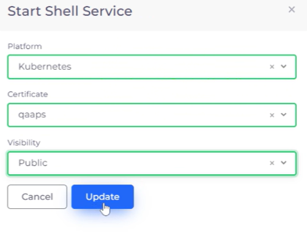
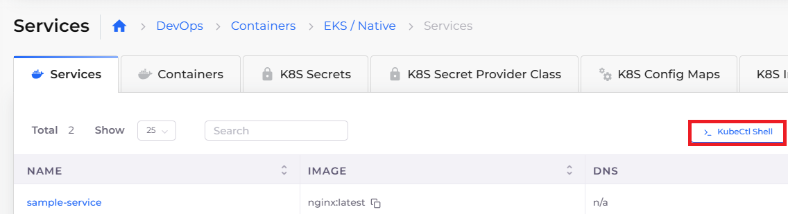
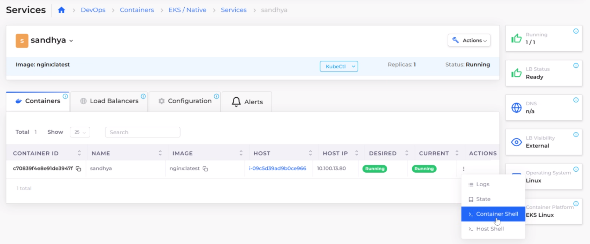
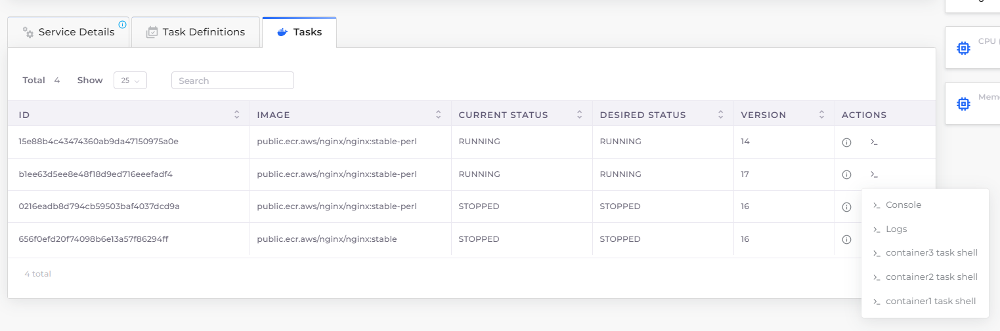

# Shell access

DuploCloud allows shell access into the deployed containers. Shell access is enabled in different ways, depending on if you are using a native Docker method or ECS.

### Access to the Docker Native container shell

To enable shell access for the DuploCloud Docker Native container system:

1.  In the DuploCloud Portal, navigate to **DevOps** -> **Containers** -> **EKS/Native**, displaying the **Services** page.

    <figure><figcaption>
<strong>Enable Docker Shell</strong> button on the <strong>Services</strong> page
</figcaption></figure>
2. Click **Enable Docker Shell**. The **Start Shell Service** pane displays.
3.  From the **Platform** list box, select **Docker Native**.

    <figure><figcaption>
<strong>Start Shell Service</strong> pane with <strong>Docker Native</strong> selected for <strong>Platform</strong>
</figcaption></figure>
4. From the **Certificate** list box, select a certificate name.
5. From the **Visibility** list box, select **Public**.&#x20;
6. Click **Update**.

A provisioned service named **dockerservices-shell** is created, enabling you to access the Service containers using SSH.

### Access to Kubectl shell (K8s) and ECS Task shell

Optionally, DuploCloud provides just-in-time (JIT) access to both the container shell and the `kubectl` shell directly from your browser.&#x20;

In the DuploCloud Portal:

1. In the **Tenant** list box, on the upper-left side of the DuploCloud Portal, select the **Default** Tenant.
2. Navigate to **DevOps** -> **Containers** -> **EKS/Native**, displaying the **Services** page.
3. Click **Enable Docker Shell**. The **Start Shell Service** pane displays.
4. From the **Platform** list box, select **Kubernetes**.
5. From the **Certificate** list box, select a certificate name.
6. From the **Visibility** list box, select **Public**.&#x20;
7. Click **Update**.

<figure><figcaption>
<strong>Start Shell Service</strong> pane with <strong>Kubernetes</strong> (ECS) selected for <strong>Platform</strong>
</figcaption></figure>

Now you can begin using the Kubernetes (K8s) shell from the DuploCloud Portal for K8s services by clicking **KubeCtl Shell** on the **Services** page.

<figure><figcaption>
<strong>KubeCtl Shell</strong> button on the <strong>Services</strong> page
</figcaption></figure>

## View the Host and container shell for Native and Kubernetes&#x20;

1. In the DuploCloud Portal, navigate to **DevOps** -> **Containers** -> **EKS/Native**, displaying the **Services** page.
2. Select a Service from the **Name** column.
3. Click the **Containers** tab.
4. To display the shell for any container, click the  icon in the **Actions** column of the appropriate row.
5.  Select **Container Shell** or **Host Shell** from the **Actions** menu. The container or host shell launches in AWS Systems Manager.&#x20;

    <figure><figcaption>
<strong>Container Shell</strong> and <strong>Host Shell</strong> launch options in the <strong>Actions</strong> column of the <strong>Containers</strong> tab
</figcaption></figure>

## View the ECS task shell &#x20;

You can also view the ECS task shell and select the container shell to which you want to connect.&#x20;

1. In the DuploCloud Portal, navigate to **DevOps** -> **Containers** -> **ECS**, displaying the **Services** page.
2. Click the **Tasks** tab.
3. To display the ECS task shell for any task, click the  icon in the **Actions** column of the appropriate row.
4. Select **Console** for AWS Console access, **Logs** to browse log data, or a **container task shell** of your choice. A browser launches to give you access to the resource you select.

<figure><figcaption>
<strong>ECS task shell</strong> option in the <strong>Actions</strong> menu of the <strong>Tasks</strong> tab
</figcaption></figure>
