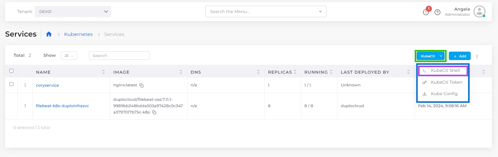

# Shell access for Docker or ECS

DuploCloud allows shell access into the deployed containers. Shell access is enabled differently, depending on whether you use native Docker or ECS.

### Access to the Docker Native container shell

To enable shell access for the DuploCloud Docker Native container system:

1. In the DuploCloud Portal, navigate to **Docker** -> **Services**, displaying the **Services** page.
2. From the **Docker** list box, click **Enable Docker Shell**. The **Start Shell Service** pane displays.

<figure><figcaption>
<strong>Enable Docker Shell</strong> option in the Options Menu for the <strong>Services</strong> page
</figcaption></figure>

<figure><figcaption>
<strong>Start Shell Service</strong> pane
</figcaption></figure>

3. From the **Certificate** list box, select a certificate name.
4. From the **Visibility** list box, select **Public**.&#x20;
5. Click **Update**.

A provisioned service named **dockerservices-shell** is created, enabling you to access the Service containers using SSH.

### Access to the Kubectl (K8s) shell

Optionally, DuploCloud provides just-in-time (JIT) access to both the container shell and the `kubectl` shell directly from your browser.&#x20;

In the DuploCloud Portal:

1. In the **Tenant** list box, on the upper-left side of the DuploCloud Portal, select the **Default** Tenant.
2. Navigate to **Docker** -> **Services**, displaying the **Services** page.
3. Click **Enable Docker Shell**. The **Start Shell Service** pane displays.
4. From the **Platform** list box, select **Kubernetes**.
5. From the **Certificate** list box, select a certificate name.
6. From the **Visibility** list box, select **Public**.&#x20;
7. Click **Update**.

<figure><figcaption>
<strong>Start Shell Service</strong> pane with <strong>Kubernetes</strong> (ECS) selected for <strong>Platform</strong>
</figcaption></figure>

Now you can begin using the Kubernetes (K8s) shell from the DuploCloud Portal for K8s services.

1. Navigate to **Kubernetes** -> **Services**. The **Service** page displays.&#x20;
2. From the **KubeCtl** list box, click **KubeCtl Shell**.

<figure><figcaption>
The <strong>Services</strong> page with the <strong>KubeCtl</strong> list box and <strong>KubeCtl Shell</strong> button highlighted
</figcaption></figure>

## View the Host and container shell for Docker and Kubernetes&#x20;

1. In the DuploCloud Portal, navigate to **Kubernetes** -> **Containers**.
2. Click the options menu () icon in the appropriate row.
3. Select **Container Shell** or **Host Shell** from the **Actions** menu. The container or host shell launches in AWS Systems Manager.&#x20;

<figure><figcaption>
<strong>Container Shell</strong> and <strong>Host Shell</strong> launch options in the menu column of the <strong>Containers</strong> page
</figcaption></figure>

## View the ECS task shell &#x20;

You can also view the ECS task shell and select the container shell to which you want to connect.&#x20;

1. In the DuploCloud Portal, navigate to **Cloud Services** -> **ECS**, displaying the **ECS** **Task Definition page.**
2. Select the name from the **TASK DEFINITION FAMILY NAME** column.
3. Select the **Tasks** tab.
4. To display the ECS task shell for any task, click on the (>\_) icon in the **Actions** column of the appropriate row. Click on **Console** for AWS Console access, **Logs** for log data, or a **container task shell** of your choice. A browser launches to give you access to the resource you select.

<figure><figcaption>
<strong>ECS task shell</strong> option in the menu of the <strong>Tasks</strong> tab
</figcaption></figure>
