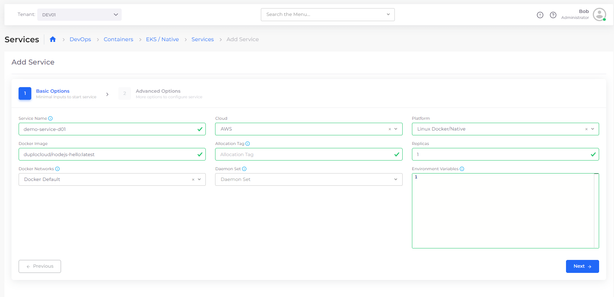
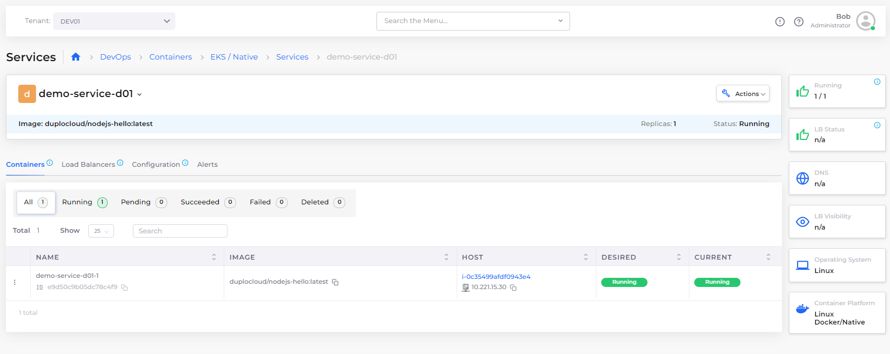

# Step 5: Create a Service

You can use the DuploCloud Portal to create a native Docker service without leaving the DuploCloud interface.

_Estimated time to complete Step 5: 10 minutes._

## Prerequisites

Before creating a Service, verify that you accomplished the tasks in the previous tutorial steps. Using the DuploCloud Portal, confirm that:

* An [Infrastructure and Plan](../step-1-infrastructure.md) exist, both with the name **NONPROD**.
* A Tenant with the name [**dev01** has been created](../step-2-tenant.md).
* An EC2 Host with the name [host01 has been created](step-4-create-ec2-host.md).

### Select the Tenant you created

In the **Tenant** list box, on the upper-left side of the DuploCloud Portal, select the **dev01** Tenant that you created.

<figure><figcaption>
<strong>Tenant</strong> list box in the DuploCloud Portal
</figcaption></figure>

## Creating a Service using native Docker&#x20;

1. In the DuploCloud Portal, navigate to **DevOps** -> **Containers** -> **EKS/Native.**
2. Click **Add**. The **Add Service** **Basic Options** page displays.
3. In the **Service Name** field, enter **demo-service-d01**.
4. From the **Platform** list box, select **Linux/Docker Native**.
5. In the Docker Image field, enter **duplocloud/nodejs-hello:latest**.
6.  From the **Docker Networks** list box, select **Docker Default**.\

    

    <figure><figcaption>
<strong>Add Service Basic Options</strong> page for <strong>Linux/Docker Native</strong> Service
</figcaption></figure>

    

7. Click **Next**. The **Advanced Options** page displays.
8. Click **Create**.\


On the Add Service Basic Options page, you can also specify optional **Environment Variables** (EVs) such as database Host, port, and so on. You can also pass [Docker credentials](../../use-cases/docker-registry-credentials-and-kubernetes-secrets.md) using EVs for testing purposes.&#x20;


## Checking your work

Verify that **demo-service-d01** has a **Current** Status of **Running**.

<figure><figcaption>
<strong>demo-service-d01</strong> Service page displaying a <strong>Running</strong> status
</figcaption></figure>


Once the Service is **Running**, you can check logs for informational messages by clicking the menu icon (  ) to the left of the running Service **Name** on the Service page and selecting the **Logs** option.&#x20;


<figure><figcaption>
Menu icon with Logs option, located to the left of the Running Service <strong>demo-service-d01-1</strong>
</figcaption></figure>
