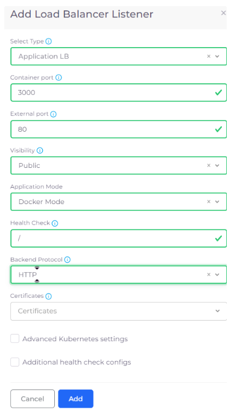
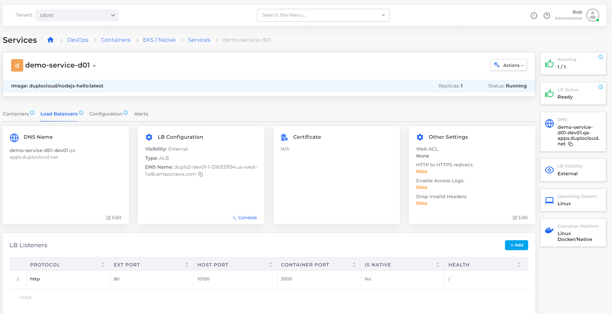
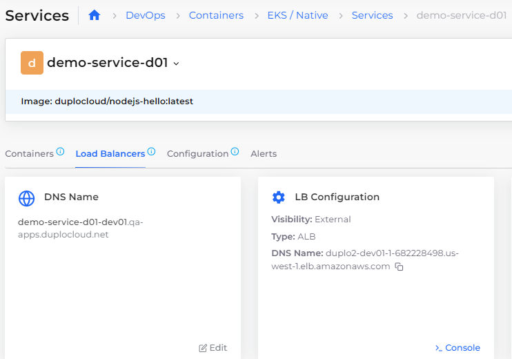

# Step 6: Create a Load Balancer

Now that your DuploCloud Service is running, you have a mechanism to expose the containers and images in which your application resides. But because your containers are running inside a private network, you also need a load balancer to listen on the correct ports in order to access the application.

In this step, we add a Load Balancer Listener to complete this network configuration.

_Estimated time to complete Step 6: 15 minutes._

## Prerequisites

Before creating a Service, verify that you accomplished the tasks in the previous tutorial steps. Using the DuploCloud Portal, confirm that:

* An [Infrastructure and Plan](../step-1-infrastructure.md) exist, both with the name **NONPROD**.
* A Tenant with the name [**dev01** has been created](../step-2-tenant.md).
* An EC2 Host with the name [host01 has been created](step-4-create-ec2-host.md).
* A Service with the name [**demo-service-d01** has been created](step-5-create-app-via-docker-native.md).&#x20;

### Select the Tenant you created

In the **Tenant** list box, on the upper-left side of the DuploCloud Portal, select the **dev01** Tenant that you created.

<figure><figcaption>
<strong>Tenant</strong> list box in the DuploCloud Portal
</figcaption></figure>

## Creating a Load Balancer using native Docker

1. In the DuploCloud Portal, navigate to **DevOps** -> **Containers** -> **EKS/Native.**
2. In the Services tab, select the Service **demo-service-d01** [that you created](step-5-create-app-via-docker-native.md).
3. Click the **Load Balancers** tab.
4. Click the **Configure Load Balancer** link. The **Add Load Balancer Listener** pane displays.
5. From the **Select Type** list box, select **Application LB**.
6. In the **Container Port** field, enter **3000**, the port on which the application running inside the container image (**duplocloud/nodejs-hello:latest**) is running.
7. In the External Port field, enter **80**.
8. From the Visibility list box, select **Public**.
9. From the Application list box, select **Docker Mode**.
10. In the **Health Check** field, enter **/**, indicating that you want the Kubernetes Health Check logs written to the **root** directory.
11. From the **Backend Protocol** list box, select **HTTP**.
12. Click **Add**.

<figure><figcaption>
<strong>Add Load Balancer Listener</strong> pane
</figcaption></figure>

When the **LB Status** card displays **Ready**, your Load Balancer is running and ready for use.

<figure><figcaption>
<strong>Services</strong> page with <strong>LB Status</strong> card displaying <strong>Ready</strong>
</figcaption></figure>

### Securing the Load Balancer

If you want to secure the load balancer created, you can follow the steps specified [here.](../quick-start-eks-services/step-7-secure-the-load-balancer.md)

### Creating a Custom DNS Name

You can modify the DNS name by clicking Edit in the DNS Name card in the Load Balancers tab. For additional information see [this page](../quick-start-eks-services/step-8-create-dns-name.md).

<figure><figcaption>
<strong>DNS Name</strong> card in the <strong>Load Balancers</strong> tab with the <strong>Edit</strong> option
</figcaption></figure>

