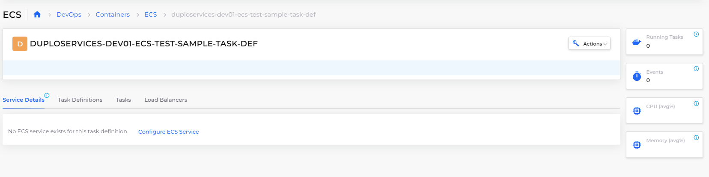
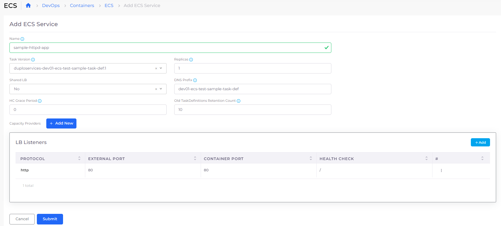

# Step 5: Create the ECS Service and Load Balancer

Now that you've created a Task Definition, you create a Service, which creates a Task (from the definition) to run your application. A Task is the instantiation of a Task Definition within a cluster. After you create a task definition for your application within Amazon ECS, you can specify multiple tasks to run on your cluster, based on your performance and availability requirements.&#x20;

Once a Service is created, you must create a Load Balancer to expose the Service on the network. An Amazon ECS _service_ runs and maintains the desired number of tasks simultaneously in an Amazon ECS cluster.  If any of your tasks fail or stop for any reason, the Amazon ECS service scheduler launches another instance based on parameters specified in your Task Definition. It does so in order to maintain the desired number of tasks created.

_Estimated time to complete Step 5: 10 minutes._

## Prerequisites 

Before creating the ECS Service and Load Balancer, verify that you accomplished the tasks in the previous tutorial steps. Using the DuploCloud Portal, confirm that:

* An [Infrastructure and Plan](../step-1-infrastructure.md) exist, both with the name **NONPROD**.
* The **NONPROD** infrastructure has [ECS **Enabled**](../step-1-infrastructure.md#check-your-work).&#x20;
* A Tenant with the name [**dev01** has been created](../step-2-tenant.md).
* A [Task Definition named **sample-task-def**](step-4-create-app-via-ecs.md) has been created.

## Creating an ECS Service and a Load Balancer&#x20;

Tasks run until an error occurs or a user terminates the Task in the ECS Cluster.

1.  In the DuploCloud Portal's **Tenant** list box. select Tenant **dev01**.\

    

    <figure><figcaption>
DuploCloud <strong>Tenant</strong> list box with Tenant <strong>dev01</strong> selected
</figcaption></figure>

    

2. Navigate to **DevOps** -> **Containers** -> **ECS**.
3. In the **Task Definitions** tab, select the Task Definition Family Name, **DUPLOSERVICES-DEV01-ECS-TEST-sample-task-def**. This is the [Task Definition **Name** that you created ](step-4-create-app-via-ecs.md#creating-a-task-definition)prepended by a unique identified, which includes your Tenant name (**DEV01**) and part of your Infrastructure name (**ECS-TEST**).&#x20;
4.  In the **Service Details** tab, click the **Configure ECS Service** link. The **Add ECS Service** page displays.\

    

    <figure><figcaption>
<strong>Service Details</strong> tab 
</figcaption></figure>

    

5. In the **Name** field, enter **sample-httpd-app** as the Service name.
6.  In the **LB Listeners** area, click **Add**. The **Add Load Balancer Listener** pane displays.\

    

    <figure><figcaption>
<strong>Add Load Balancer Listener</strong> pane for an ECS Service
</figcaption></figure>

    

7. From the **Select Type** list box, select **Application LB**.
8. In the **Container Port** field, enter **80**.
9. In the **External Port** field, enter **80**.
10. From the **Visibility** list box, select **Public**.
11. In the **Heath Check** field, enter **/**, specifying `root`, for the location of Kubernetes Health Check logs.
12. From the **Backend Protocol** list box, select **HTTP**.
13. From the **Protocol Policy** list box, select **HTTP1**.
14. Select other options as needed and click **Add**.
15. On the **Add ECS Service** page, click **Submit**.&#x20;

In the **Service Details** tab, information about the Service and Load Balancer you created is displayed.

<figure><figcaption>
Add ECS Service page
</figcaption></figure>

## Checking Your Work

Verify that the Service and Load Balancer configuration details in the Service Details tab are correct.&#x20;

<figure><figcaption>
<strong>Service Details</strong> tab displayng Service and Load Balancer configuration details
</figcaption></figure>
