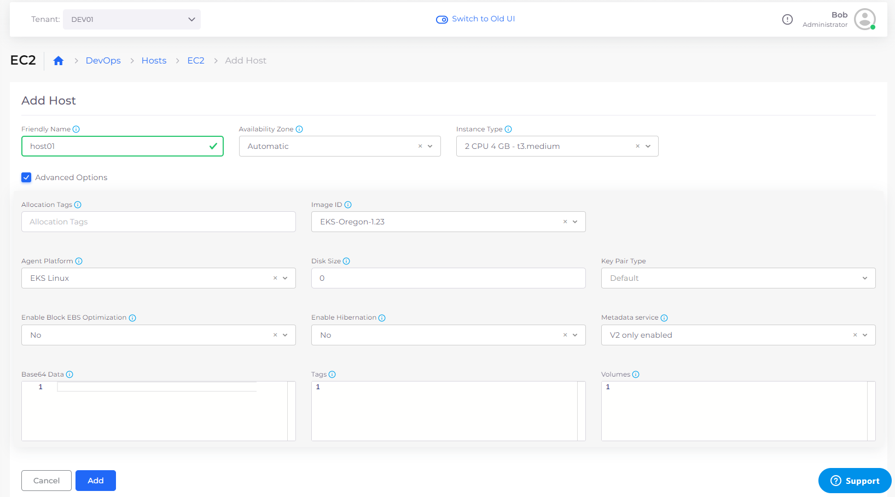
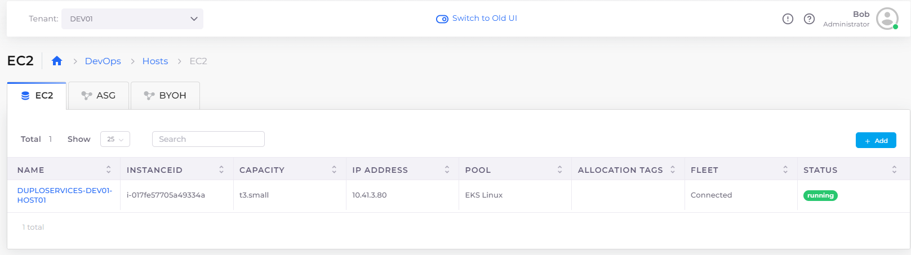

# Step 4: Create a Host

When you create an [AWS EKS](https://docs.aws.amazon.com/eks/latest/userguide/what-is-eks.html) Service, you are using a combination of technologies from AWS  and the [Kubernetes ](kuberhttps://en.wikipedia.org/wiki/Kubernetesnetes)open-source container orchestration system.

Kubernetes uses worker nodes to distribute workloads within a cluster. The cluster automatically distributes the workload among its nodes, enabling seamless scaling as required system resources expand to support your applications.&#x20;

_Estimated time to complete Step 4: 5 minutes._

## Prerequisites

Before creating a Host (essentially a [Virtual Machine](https://en.wikipedia.org/wiki/Virtual\_machine)), verify that you accomplished the tasks in the previous tutorial steps. Using the DuploCloud Portal, confirm that:

* An [Infrastructure and Plan](../step-1-infrastructure.md) exist, both with the name **NONPROD**.
* The **NONPROD** infrastructure has [Kubernetes (EKS or ECS) **Enabled**](../step-1-infrastructure.md#check-your-work).&#x20;
* A Tenant with the name [**dev01** has been created](../step-2-tenant.md).

### Select the Tenant you created

In the **Tenant** list box, on the upper-left side of the DuploCloud Portal, select the **dev01** Tenant that you created.

## Creating a host

1. In the DuploCloud Portal, navigate to **DevOps** -> **Hosts**. The **Hosts** page displays.
2. In the **EC2** tab, click **Add**. The **Add Hosts** page displays.
3. In the **Name** field, enter **host01**.
4. From the **Instance Type** list box, select **2 CPU 4 GB - t3.medium**.
5. Select the **Advanced Options** checkbox to display advanced configuration fields.
6. From the **Agent Platform** list box, select **EKS Linux**.
7. From the **Image ID** list box, select any Image ID that is prefixed by **EKS** (for example, **EKS-Oregon-1.23**).
8.  Click **Add**. The Host is created, initialized, and started. In a few minutes, when the **Status** displays **Running**, the Host is available for use.

    <figure><figcaption>
<strong>EC2 Add Hosts</strong> page
</figcaption></figure>


The EKS **Image ID** is the image published by AWS specifically for an EKS worker in the version of Kubernetes deployed at Infrastructure creation time. For this tutorial, the region is **us-west-2**, where the **NONPROD** Infrastructure was created.&#x20;

If no **Image ID** is available with a prefix of **EKS**, copy the **AMI ID** for the desired EKS version by referring to this [AWS documentation](https://docs.aws.amazon.com/eks/latest/userguide/eks-optimized-amis.html). Select **Other** from the **Image ID** list box and paste the copied **AMI ID** in the **Other Image ID** field. Contact the DuploCloud Support team via your Slack channel if you have questions or issues.


## Checking your work

Verify that the Host you created has a **Status** of **Running**.

<figure><figcaption>
<strong>EC2</strong> tab with Host in <strong>Status Running</strong>
</figcaption></figure>
