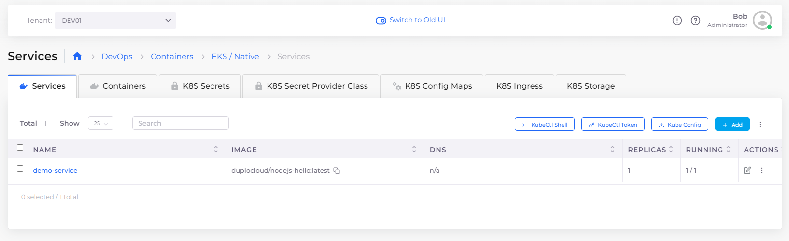

# Step 5: Create a Service

DuploCloud supports three container orchestration technologies to deploy containerized applications in AWS:

* Native EKS
* Native ECS Fargate
* Built-in container orchestration in DuploCloud using EKS/ECS Kubernetes

You can use any of these methods, which all employ Docker containers. This tutorial uses DuploCloud's built-in container orchestration using EKS and Kubernetes


You don't have to have experience with Kubernetes to deploy an application in the DuploCloud Portal. However, it is helpful to be familiar with the [Docker ](https://docs.docker.com/)platform. Docker runs on any platform and provides an easy-to-use UI for creating, running, and managing containers, in which your application code resides.&#x20;


This tutorial will access a pre-built Docker container to deploy a simple `Hello World NodeJS` web app. When you run the application, DuploCloud accesses Docker images in a preconfigured Docker Hub.&#x20;

When you run your own applications, you will choose a public image or provide credentials to access your private repository.  Before you deploy your own applications, [configure your Docker Registry credentials in DuploCloud](../../aws-services/containers/docker-registry-credentials.md).

_Estimated time to complete Step 5: 10 minutes._

## Prerequisites

Before creating a Service, verify that you accomplished the tasks in the previous tutorial steps.   Using the DuploCloud Portal, confirm that:

* An [Infrastructure and Plan](../step-1-infrastructure.md) exist, both with the name **NONPROD**.
* The **NONPROD** infrastructure has [EKS **Enabled**](../step-1-infrastructure.md#check-your-work).&#x20;
* A Tenant with the name [**dev01** has been created](../step-2-tenant.md).
* A host with the name [**host01** has been created](step-3-create-host.md).

### Select the Tenant you created

In the **Tenant** list box, on the upper-left side of the DuploCloud Portal, select the **dev01** Tenant that you created.

## Adding a Service

1. In the DuploCloud Portal, navigate to **DevOps** -> **Containers** -> **EKS/Native**. The **Services** page displays.&#x20;
2.  Click **Add**. The **Add Service** page displays.\

    <figure><figcaption>
<strong>Add Service</strong> page
</figcaption></figure>
3. From the table below, enter the values that correspond to the fields on the **Add Service** page. Accept all other default values for fields not specified.&#x20;
4. Click **Next**. The **Advanced Options** page is displayed.
5. At the bottom of the **Advanced Options** page, click **Create**. Your Service is created and initialized. In about five (5) minutes, in the **Containers** tab, your DuploCloud Service displays a **Current** status of **Running**.&#x20;

| Add a Service page field | Value                            |
| ------------------------ | -------------------------------- |
| **Service Name**         | `demo-service`                   |
| **Docker Image**         | `duplocloud/nodejs-hello:latest` |


Use the **Containers** tab to monitor the Service creation status, between **Desired** (**Running**) and **Current**.


### Deploying a Service on Spot Instances (optional)

Follow the steps in [Creating Services using Autoscaling Groups](../../use-cases/hosts-vms/auto-scaling/auto-scaling-groups/#creating-services-using-autoscaling-groups). In the **Add Service** page, **Basic Options**, Select **Tolerate spot instances**.&#x20;

## Checking your work

Verify that your DuploCloud Service, **demo-service**, has a **Current** status of **Running**.

<figure><figcaption>
<strong>Containers</strong> tab displaying <strong>Desired</strong> and <strong>Current</strong> status (both <strong>Running</strong>)
</figcaption></figure>

