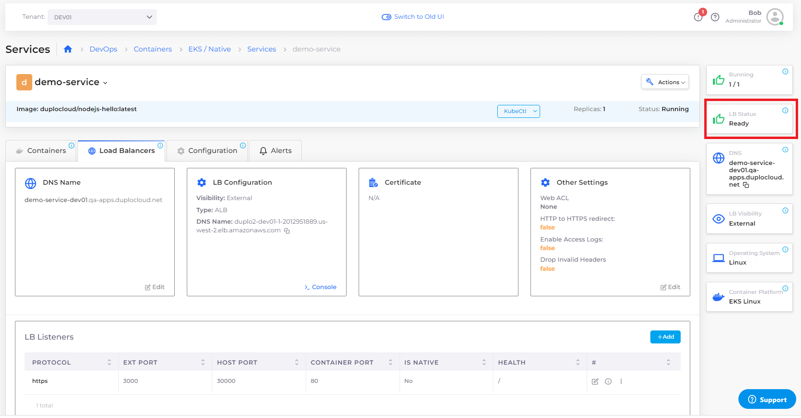

# Step 6: Create a Load Balancer

Now that your DuploCloud Service is running, you have a mechanism to expose the containers and images in which your application resides. But because your containers are running inside a private network, you also need a load balancer to listen on the correct ports in order to access the application.

In this step, we add a Load Balancer Listener to complete this network configuration.

_Estimated time to complete Step 6: 10 minutes._

## Prerequisites

Before creating a Load Balancer, verify that you accomplished the tasks in the previous tutorial steps.   Using the DuploCloud Portal, confirm that:

* An [Infrastructure and Plan](../step-1-infrastructure.md) exist, both with the name **NONPROD**.
* The **NONPROD** infrastructure has [Kubernetes (EKS or ECS) **Enabled**](../step-1-infrastructure.md#check-your-work).&#x20;
* A Tenant with the name [**dev01** has been created](../step-2-tenant.md).
* A Host with the name [**host01** has been created](step-3-create-host.md).
* A Service with the name [**demo-service** has been created](step-5-create-app-via-k8s.md).

### Select the Tenant you created

In the **Tenant** list box, on the upper-left side of the DuploCloud Portal, select the **dev01** Tenant that you created.

## Creating a Load Balancer

1. In the DuploCloud Portal, navigate to **DevOps** -> **Containers** -> **EKS/Native**. The **Services** page displays.&#x20;
2. From the **Name** column, select **demo-service**.
3. Click the **Load Balancers** tab.
4.  Click the **Configure Load Balancer** link. The **Add Load Balancer Listener** pane displays.\

    

    <figure><figcaption>
<strong>Add Load Balancer Listener</strong> pane
</figcaption></figure>

    

5. From the **Type** list box, select **Application LB**.
6. In the **Container Port** field, enter **3000**. This is the configured port on which the application inside the Docker Container Image `duplocloud/nodejs-hello:latest` is running.&#x20;
7. In the **External Port** field, enter **80**. This is the port through which users will access the web application.
8. From the **Visibility** list box, select **Public**.
9. From the **Application Mode** list box, select **Docker Mode**.
10. Type **/** (forward-slash) in the **Health Check** field to indicate that the cluster we want Kubernetes to perform Health Checks on is located at the `root` level.
11. In the **Backend Protocol** list box, select **HTTP**.
12. Click **Add**. The Load Balancer is created and initialized. Monitor the **LB Status** card on the **Services** page. When the Load Balancer is ready for use the **LB Status** card displays **Ready**.&#x20;

## Check your work

1. Verify that the Load Balancer has an **LB Status** of **Ready**.&#x20;
2. On the **Services** page, in the **LB Configuration** card, note the **DNS Name** of the **ALB** Load Balancer that you created.&#x20;
3. In the **LB Listeners** area of the **Services** page, note the configuration details of the Load Balancer's **HTTPS** protocol, which you specified, when you added it above.

<figure><figcaption>
<strong>Load Balancers</strong> tab containing <strong>LB Configuration</strong> card displaying <strong>Type ALB</strong> Load Balancer and <strong>DNS Name</strong>
</figcaption></figure>

