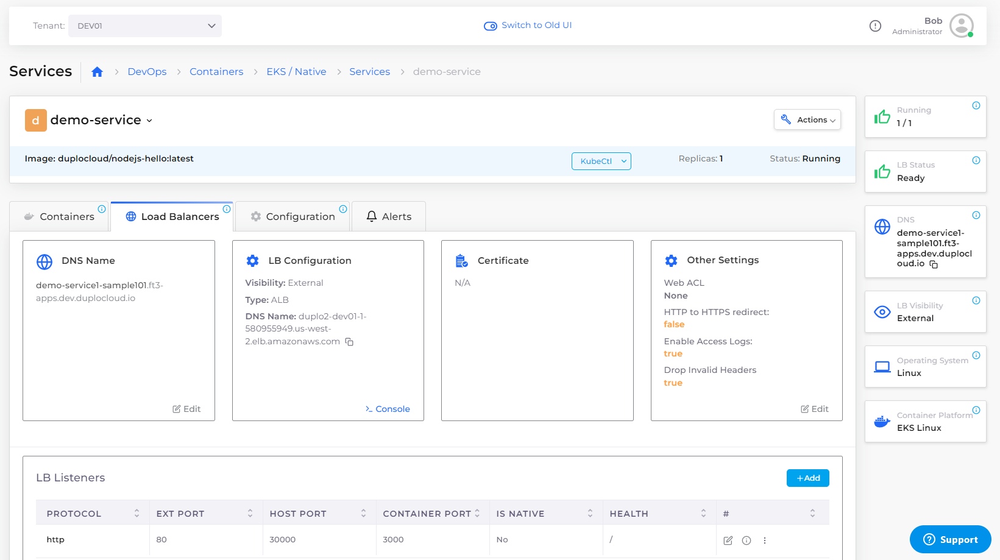
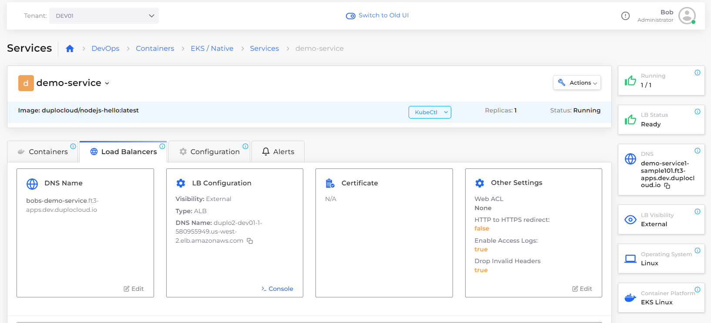

# Step 8: Create a custom DNS Name (optional)


It is possible to modify the DNS Name after you create a Load Balancer Listener for ease of use and reference by your applications, but it isn't necessary to run your application or complete this tutorial.

To skip this step, proceed to [test your application and complete this tutorial](step-9-test-the-application.md).


Once the load balancer is created, DuploCloud programs an autogenerated DNS Name registered to **demo-service** in the [Route 53](../../prerequisites/route-53-hosted-zone.md) domain. Before you create _production_ deployments, you must [create the Route 53](../../prerequisites/route-53-hosted-zone.md) Hosted Zone domain, if the DuploCloud staff has not already created one for you. For this tutorial, it is not necessary to create the domain. &#x20;

_Estimated time to complete Step 8: 5 minutes._

## Prerequisites

Before securing a Load Balancer, verify that you accomplished the tasks in the previous tutorial steps.   Using the DuploCloud Portal, confirm that:

* An [Infrastructure and Plan](../step-1-infrastructure.md) exist, both with the name **NONPROD**.
* The **NONPROD** infrastructure has [EKS **Enabled**](../step-1-infrastructure.md#check-your-work).&#x20;
* A Tenant with the name [**dev01** has been created](../step-2-tenant.md).
* A Host with the name [**host01** has been created](step-3-create-host.md).
* A Service with the name [**demo-service** has been created](step-5-create-app-via-k8s.md).
* An [HTTPS ALB Load Balancer](../quick-start-duplocloud-docker-services/step-6-create-loadbalancer.md) has been created.&#x20;

### Select the Tenant you created

In the **Tenant** list box, on the upper-left side of the DuploCloud Portal, select the **dev01** Tenant that you created.

## Creating a Custom DNS Name

1. In the DuploCloud Portal, navigate to **DevOps** -> **Containers** -> **EKS/Native**. The **Services** page displays.
2. From the **Name** column, select **demo-service**.
3.  Click the **Load Balancers** tab. The ALB Load Balancer configuration is displayed.\

    

    <figure><figcaption>
<strong>Load Balancers</strong> tab on the <strong>Services</strong> page with <strong>DNS Name</strong> card 
</figcaption></figure>

    

4. In the **DNS Name** card, click **Edit**. The prefix in the DNS Name is editable.
5. Edit the **DNS Name** and select a meaningful DNS Name prefix.
6. Click **Save**. A **Success** message briefly displays at the top center of the DuploCloud Portal.

An entry for your new DNS name is now registered with **demo-service**.

## Checking your work

The **DNS Name** card displays your modified DNS Name.   &#x20;

<figure><figcaption>
<strong>Load Balancers</strong> tab on the <strong>Services</strong> page with <strong>DNS Name</strong> card, displaying new <strong>DNS Name</strong>
</figcaption></figure>

&#x20;                                        &#x20;
