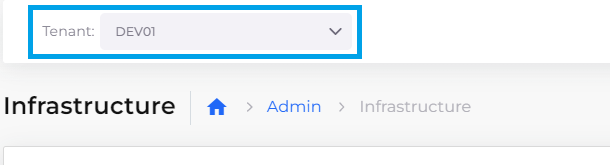
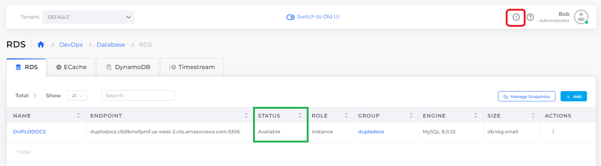
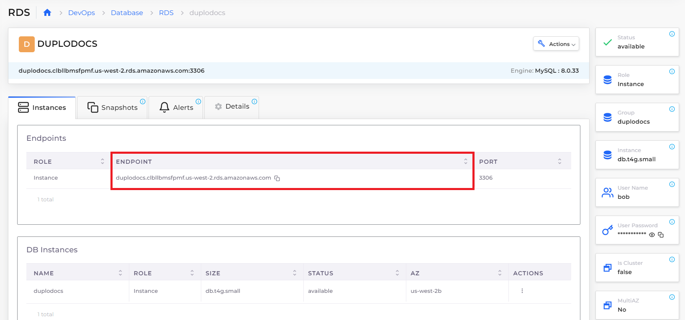

# Step 3: Create an RDS database (optional)


Creating an RDS database is not essential to running a DuploCloud Service. However, as most services also incorporate an RDS, this step is included to demonstrate the ease of creating a database in DuploCloud. To skip this step, proceed to the [Services section of this tutorial](quick-start-eks-services/).


An [AWS RDS](https://aws.amazon.com/free/database/?trk=83add82a-8e52-4837-bc73-c323da62d78c\&sc\_channel=ps\&ef\_id=CjwKCAjwp6CkBhB\_EiwAlQVyxYi50yWfBj5SSxs6-gaDSqftnxbBO6Plfy0pYWyyxrZ3zI0goU6bLRoCGkQQAvD\_BwE:G:s\&s\_kwcid=AL!4422!3!610000101516!e!!g!!amazon%20database%20hosting!11086562318!108339552363) is a managed Relational Database Service that is easy to set up and maintain in DuploCloud for AWS public cloud environments. RDSs support many databases including MySQL, PostgreSQL, MariaDB, Oracle BYOL, or SQL Server. &#x20;

See the [DuploCloud AWS Database documentation](../aws-services/database/) for more information.

_Estimated time to complete Step 3: 5 minutes._

## Prerequisites 

Before creating an RDS, verify that you accomplished the tasks in the previous tutorial steps. Using the DuploCloud Portal, confirm that:

* An [Infrastructure and Plan](step-1-infrastructure.md) exist, both with the name **NONPROD**.
* The **NONPROD** infrastructure has [Kubernetes (EKS or ECS) **Enabled**](step-1-infrastructure.md#check-your-work).&#x20;
* A Tenant with the name [**dev01** has been created](step-2-tenant.md).

### Select the Tenant you created

In the **Tenant** list box, on the upper-left side of the DuploCloud Portal, select the **dev01** Tenant that you created.

<figure><figcaption></figcaption></figure>

## Creating an RDS database 

1. In the DuploCloud Portal, navigate to **DevOps** -> **Database**. The **Database** page displays.
2.  In the **RDS** tab, click **Add**. The **Create a RDS** page displays.\

    

    <figure><figcaption>
<strong>Create a RDS</strong> page
</figcaption></figure>

    

3. From the table below, enter the values that correspond to the fields on the **Create a RDS** page. Accept all other default values for fields not specified.&#x20;
4. Click **Create**. The **DUPLODOCS** database displays in the **RDS** tab with a **Status** of **Submitted**. Database creation takes approximately ten (10) minutes.&#x20;


DuploCloud prepends **DUPLO** to the name of your RDS database instance.


| Create a RDS page field | Value                               |
| ----------------------- | ----------------------------------- |
| **RDS Name**            | `docs`                              |
| **User Name**           | _`YOUR_DUPLOCLOUD_ADMIN_USER_NAME`_ |
| **User password**       | _`YOUR_DUPLOCLOUD_ADMIN_PASSWORD`_  |
| **Rds Engine**          | `MySQL`                             |
| **Rds Engine Version**  | _`LATEST_AVAILABLE_VERSION`_        |
| **Rds Instance Size**   | `db.t4g.medium`                     |
| **Storage size in GB**  | `20`                                |

## Validating RDS database creation 

You can monitor the status of database creation using the **RDS** tab and the **Status** column.&#x20;

In the DuploCloud Portal **Database** page, in the **RDS** tab, when the database **Status** is **Available**, the database's endpoint is ready for connection by a DuploCloud Service, which you create and start in the [next step](step-4-create-a-rds-database.md#checking-your-work).

### Troubleshooting database creation failures

Faults are shown in the DuploCloud Portal by clicking the Fault/Alert (  ) Icon. Common database faults that may cause database creation to fail include:

* Invalid passwords - Passwords cannot have special characters like quotes, @, commas, etc. Use a combination of upper and lower-case letters and numbers.
* Invalid encryption - Encryption is not supported for small database instances (micro, small, or medium).

<figure><figcaption>
<strong>RDS</strong> tab with <strong>DUPLODOCS</strong> database with <strong>Status Available</strong>; Fault/Alert Icon highlighted at top
</figcaption></figure>

## Verifying database endpoints 

1. In the **RDS** tab, select the **DUPLODOCS** database you created.
2.  Note the database **Endpoint**, the database name, and the database credentials. For security, the database is automatically placed in a private subnet to prevent all access from the internet. Access to the database is automatically set up for all resources (EC2 instances, containers, Lambdas, etc) inthe DuploCloud **dev01** Tenant. You need the Endpoint to connect to the database from an application running in the EC2 instance.\

    

    <figure><figcaption>
<strong>DUPLODOCS</strong> database <strong>Endpoint</strong> highlighted
</figcaption></figure>

    


When you place a DuploCloud Service in a live production environment, consider passing the database endpoint, name, and credentials to a DuploCloud Service using [Environment Variables](../use-cases/passing-secrets/passing-config-and-secrets/setting-environment-variables-from-config.md), via [AWS Secrets Manager](https://docs.aws.amazon.com/secretsmanager/latest/userguide/intro.html), or [Kubernetes Secrets](../use-cases/passing-secrets/passing-config-and-secrets/setting-environment-variables-from-config.md#setting-environment-variables-from-a-kubernetes-secret).&#x20;


## Checking your work

When your [database is available](step-4-create-a-rds-database.md#1-toc-title) and you have [verified the endpoint](step-4-create-a-rds-database.md#1-toc-title-1), choose one of these three paths to create a DuploCloud Service and continue this tutorial.

* [Creating an AWS EKS Service](quick-start-eks-services/) in DuploCloud running Docker containers
* [Creating an AWS ECS Service](quick-start-ecs-services/) in DuploCloud running Docker containers
* [Creating a DuploCloud native Docker Service](quick-start-duplocloud-docker-services/)


Not sure what kind of Duplcloud Service you want to create? Consider the following:

* AWS EKS is a managed [Kubernetes ](https://kubernetes.io/)service. AWS ECS is a fully managed container orchestration service using AWS technology. For a full discussion of the benefits of EKS vs. ECS, consult this [AWS blog](https://aws.amazon.com/blogs/containers/amazon-ecs-vs-amazon-eks-making-sense-of-aws-container-services/).
* [Docker Containers](https://docs.docker.com/get-started/) are ideal for lightweight deployments and run on any platform,, using GitHub and other open-source tools.

