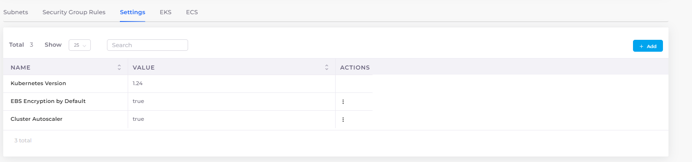

# Autoscaling Groups (ASGs)

Configure Autoscaling Groups (ASG) to ensure the application load is scaled based on the number of EC2 instances configured. Autoscaling detects unhealthy instances and launches new EC2 instances. ASG is also cost-effective as EC2 Instances are dynamically created as per the application requirement within minimum and maximum count limits.&#x20;

Before you create ASGs, you must enable the **Cluster AutoScaler** option for your Infrastructure.

## Prerequisite&#x20;

### Configuring Cluster Autoscaler for your Infrastructure

The Cluster AutoScaler automatically adjusts the number of nodes in your cluster when Pods fail or are rescheduled onto other nodes.&#x20;

1. In the DuploCloud Portal, navigate to **Administrator** -> **Infrastructure**. The **Infrastructure** page displays.
2. Select the Infrastructure with which you want to use Cluster AutoScaler.
3. Click the **Settings** tab.
4.  Click **Add**. The **Add Infra - Set Custom Data** pane displays.\

    

    

    

5. From the **Setting Name** list box, select **Cluster Autoscaler**.
6. Select **Enable** to enable EKS.
7.  Click **Set**. Your configuration is displayed in the Settings tab.\

    <figure><figcaption>
<strong>Cluster Autoscaler</strong> configuraton enabled with <strong>Value true</strong>
</figcaption></figure>

## Creating Autoscaling Groups (ASG)


The Use for Cluster Autoscaling option will not be available until you enable the [Cluster Autoscaler option in your Infrastructure](auto-scaling-groups.md#configuring-cluster-autoscaler-for-your-infrastructure).


1. In the DuploCloud Portal, navigate to **DevOps** -> **Hosts**.
2. In the **ASG** tab, click **Add**. The **Add ASG** page is displayed.
3. Select **Use for Cluster Autoscaling**.
4. In the **Friendly Name** field, enter the name of the ASG.
5. In the **Instance Count** field, enter the desired capacity for the Autoscaling group.
6. In the **Minimum Instances** field, enter the minimum number of instances. The Autoscaling group ensures that the total number of instances is always greater than or equal to the minimum number of instances.
7. In the **Maximum Instances** field, enter the maximum number of instances. The Autoscaling group ensures that the total number of instances is always less than or equal to the maximum number of instances.
8.  From the **Platform** list box, select **Linux Docker/Native** to run a Docker service or select **EKS Linux** to run services using EKS.\

     (1).png>)
9. Click **Add**. Your ASG is added and displayed in the **ASG** tab.

## Viewing Hosts in Autoscaling Groups

View the Hosts created as part of ASG creation from ASG View Details Page.

 (1).png>)

## **Creating an Amazon EC2 Autoscaling Policy**

Refer to AWS [Documentation](https://docs.aws.amazon.com/autoscaling/ec2/userguide/as-scale-based-on-demand.html#as-how-scaling-policies-work) for detailed steps on creating Scaling policies for the Autoscaling Group created

## **Creating Services using Autoscaling Groups**

The DuploCloud Portal provides the ability to configure Services based on the platforms **EKS Linux** and **Linux Docker/Native**.  Select the ASG based on the platform used when creating services and Autoscaling groups.

 (1).png>)

 (1).png>)
