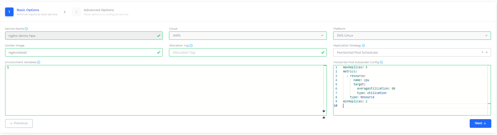
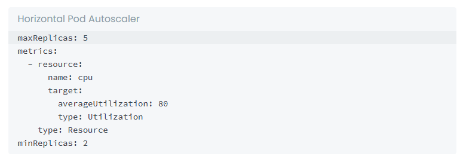

# Autoscaling in Kubernetes

## Prerequisites

Before autoscaling can be configured for your Kubernetes service, make sure that:

1. [Autoscaling Group (ASG)](auto-scaling-groups.md) is setup in the DuploCloud tenant
2. [Cluster Autoscaler](../disaster-recovery/kubernetes-cluster/enable-cluster-autoscaler.md) is enabled for your DuploCloud infrastructure

## Kubernetes Horizontal Pod Autoscaler (HPA)

Horizontal Pod Autoscaler (HPA) automatically scales the Deployment and its ReplicaSet. HPA checks the metrics configured in regular intervals and then scales the replicas up or down accordingly.

### Configuring Services with HPA

You can configure HPA while creating a Deployment Service from the DuploCloud Portal.

1. In the DuploCloud Portal, navigate **DevOps** > **Containers** > **EKS/Native.**
2. In the **Service** tab, create a new [Service](../../aws-services/containers/) by clicking **Add**.
3.  In **Add Service - Basic Options**, from the **Replication Strategy** list box, select **Horizontal Pod Scheduler**_._ \

    

    

    

4.  In the **Horizontal Pod Autoscaler Config** field, add a sample configuration, as shown below. Update the minimum/maximum Replica Count in the `resource` attributes, based on your requirements. \

    

    <figure><figcaption>
<strong>Horizontal Pod Autoscaler Config</strong> field in <strong>Basic Options</strong>, on the <strong>Add Service</strong> page
</figcaption></figure>

    

5. Click **Next** to navigate to **Advanced Options**.
6.  In **Advanced Options**, in the **Other Container Config** field, ensure your resource attributes, such as `Limits` and `Requests`, are set to work with your HPA configuration, as in the example below.\

    

    

    

7. At the bottom of the **Advanced Options** page, click **Create**.


For HPA Configures Services, **Replica** is set as _Auto_ in the DuploCloud Portal


When your services are running, **Replicas: Auto** is displayed on the Service page.

