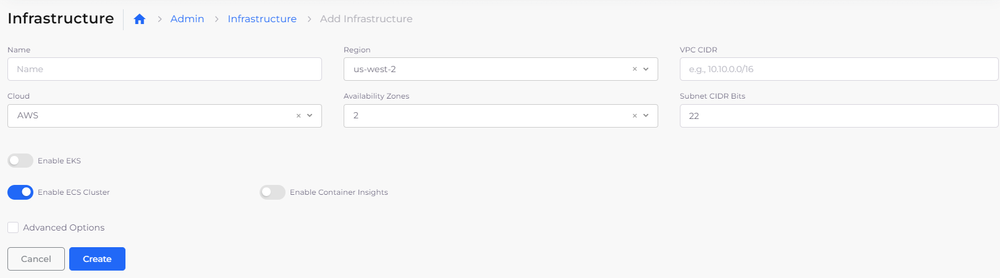
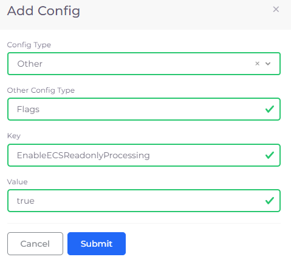

# ECS Initial Setup

Setting up an Infrastructure that uses ECS is similar to creating an [Infrastructure that uses EKS](../kubernetes-cluster/), except that during creation, instead of selecting **Enable EKS**, you select **Enable ECS Cluster**.&#x20;

<figure><figcaption>
<strong>Add Infrastructure</strong> page with <strong>Enable ECS Cluster</strong> selected
</figcaption></figure>

For information about ECS Services, see the [Containers and Services](../../aws-services/containers.md) documentation.

## Enable Read Only Processing for an ECS cluster

1. In the DuploCloud Portal, navigate to **Administrator** -> **System Settings**.
2. Click the **System Config** tab.
3. Click **Add**. The **Add Config** pane displays.
4.  From the **Config Type** list box, select **Other**. The **Other Config Type** field displays.

    <figure><figcaption>
<strong>Add Config</strong> pane with <strong>Other Config Type</strong> field
</figcaption></figure>
5. In the **Other Config Type** field, enter **Flags**.
6. In the **Key** field, enter **EnableECSReadonlyProcessing**.
7. In the Value field, enter **true**.
8. Click **Submit**.&#x20;

In the **System Config** tab, the **EnableECSReadonlyProcessing Key** displays a **Value** of **true.** &#x20;

<figure><figcaption>
<strong>System Config</strong> tab on <strong>System Settings</strong> page with <strong>EnableECSReadonlyProcessing Key</strong> displaying <strong>Value true</strong>
</figcaption></figure>
