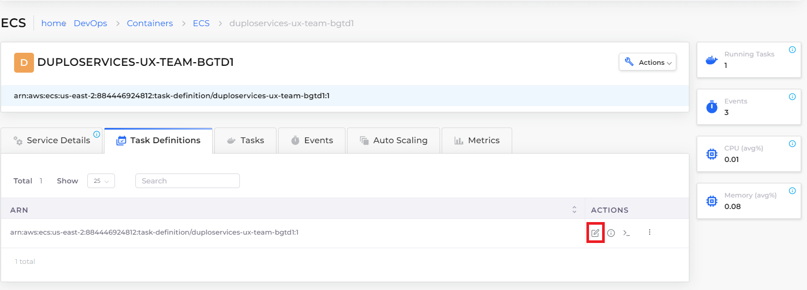

# Enable ECS logging and auditing

To generate logs for AWS ECS clusters, you must first create an Elasticsearch logging container. Once auditing is enabled, your container logging data can be captured for analysis.

## Before you begin

* [Create a Task Definition](../../../aws-services/containers.md#7-toc-title)
* Define at least one [service and container](../../../aws-services/containers.md).

## Creating an ECS Logging Container

1. In the DuploCloud Portal, navigate to **Administrator** -> **Tenant**. The **Tenant** page displays.
2. From the **Name** column, select the Tenant that is running the container for which you want to enable logging.
3. Click the **Settings** tab.
4. Click **Add**. The **Add Tenant Feature** pane displays.
5. From the **Select Feature** list box, select **Other**. The **Configuration** field displays.
6. In the **Configuration** field, enter **enable\_ecs\_elasticsearch\_logging**.&#x20;
7. In the field below the **Configuration** field, enter **True**.
8. Click **Add**. In the **Settings** tab, **enable\_ecs\_elasticsearch\_logging** displays a **Value** of **True**.&#x20;

<figure><figcaption><p><strong>Settings</strong> tab with <strong>enable_ecs_elasticsearch_logging</strong> displaying a <strong>Value</strong> of <strong>True</strong></p></figcaption></figure>

## Enable Auditing for ECS Logging

1.  In the DuploCloud Portal, in the **Tenant** list box at the top left of the DuploCloud Portal, ensure that the Tenant for which you [created a logging container](enable-ecs-logging-and-auditing.md#creating-an-ecs-logging-container) is selected. In the example below, the selected Tenant is named **dev01**.

    <figure><figcaption></figcaption></figure>
2. Navigate to **Administrator** -> **Diagnostics -> Audit**. The **Audit** page displays.
3. In the **Deployment Status** area, select both **Create Audit Indices** and **Update default plan config**. **Completed** displays to indicate that audit configuration is successful.

<figure><figcaption><p><strong>Audit</strong> tab with <strong>Deployment Status</strong> area</p></figcaption></figure>

## Verifying ECS logging is enabled&#x20;

You can verify that ECS logging is enabled for a specific container.

1. In the DuploCloud Portal, navigate to **DevOps** -> **Containers** -> **ECS**.
2.  In the **Task Definitions** tab, select the **Task Definition Family Name** in which your container is defined. The Task Definition Family Name detail page displays. In the example below the Task Definition Family Name is **DUPLOSERVICES-UX-TEAM-BGTD1**.

    <figure><figcaption><p>The Task Definition Family Name detail page with <strong>Task Defintions</strong> tab</p></figcaption></figure>
3. Click the **Task Definitions** tab.
4.  Click the Task Definition Icon (  ) to edit the Task Definition. The **Edit Task Definition** page displays your defined **Container**s.

    <figure><figcaption><p><strong>Task Definitions</strong> Icon (highligted) in Task Definitions tab</p></figcaption></figure>

In the **Container - 1** area, in the **Container Other Config** field, your `LogConfiguration` is displayed.

<figure><figcaption><p><strong>Container Other Config</strong> field in the <strong>Container - 1</strong> area of the Task Definition editor</p></figcaption></figure>

## Configuring a custom S3 bucket for auditing in another AWS account

You can create an S3 bucket for auditing in another account, other than the DuploCloud Master Account.&#x20;

### Prerequisites

1. Verify that the S3 bucket exists in another account, and note the bucket name. In this example, we assume a BUCKET\_REGION of **us-west-2** and a BUCKET name of **audit-s2-bucket-another-account**.
2. Ensure that your S3 bucket has `Duplo Master` permission to access the `S3:PutObject`. Refer to the code snippet below for an example.

```
{
  "Version": "2012-10-17",
  "Statement": [
  {
            "Effect": "Allow",
            "Principal": {
                "AWS": "arn:aws:iam::accountid:role/duplomaster"
            },
            "Action": "S3:PutObject",
            "Resource": [
                "arn:aws:s3:::arn:aws:s3:::bucknetname/*",
                "arn:aws:s3:::arn:aws:s3:::bucketname"
            ]
        }
  ]
}
```

## Configuring S3 bucket region and bucket name

1. In the DuploCloud Portal, navigate to **Administrator** -> **System Settings**.
2. Click the **System Config** tab.

### Configuring the S3 Bucket Region

Continuing the example above, configure the **S3BUCKET\_REGION**.

1. Click **Add**. The **Add Config** pane displays.
2. From the **Config Type** list box, select **AppConfig**.
3. in the **Key** list box, enter **DUPLO\_AUDIT\_S3BUCKET\_REGION**.
4. In the **Value** field, enter **us-west-2**.
5. Click **Submit**.

### Configuring Bucket Name

Continuing the example above, configure the **S3BUCKET** name.

1. Click **Add**. The **Add Config** pane displays.
2. From the **Config Type** list box, select **AppConfig**.
3. in the **Key** list box, enter **DUPLO\_AUDIT\_S3BUCKET**.
4. In the **Value** field, enter **audit-s2-bucket-another-account**.
5. Click **Submit**.

Your S3 bucket region and name configurations are displayed in the **System Config** tab.&#x20;

<figure><figcaption><p><strong>System Config</strong> tab with <strong>AppConfig</strong>s for S3 bucket region and name</p></figcaption></figure>


Contact your DuploCloud Support team if you have additional questions or issues.


## Viewing detailed auditing diagnostics

To view complete auditing reports and logs, navigate to the **Diagnostics** -> **Audit** page in the DuploCloud Portal.

<figure><figcaption><p>Audit page in the DuploCloud Portal</p></figcaption></figure>
