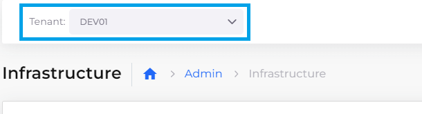

# Enable ECS logging

To generate logs for AWS ECS clusters, you must first create an Elasticsearch logging container. Once auditing is enabled, your container logging data can be captured for analysis.

## Before you begin

* [Create a Task Definition](../../../aws-services/containers.md#7-toc-title)
* Define at least one [service and container](../../../aws-services/containers.md).

## Creating an ECS Logging Container

1. In the DuploCloud Portal, navigate to **Administrator** -> **Tenant**. The **Tenant** page displays.
2. From the **Name** column, select the Tenant that is running the container for which you want to enable logging.
3. Click the **Settings** tab.
4. Click **Add**. The **Add Tenant Feature** pane displays.
5. From the **Select Feature** list box, select **Other**. The **Configuration** field displays.
6. In the **Configuration** field, enter **enable\_ecs\_elasticsearch\_logging**.&#x20;
7. In the field below the **Configuration** field, enter T**rue**.
8. Click **Add**. In the Settings tab, **enable\_ecs\_elasticsearch\_logging** displays a **Value** of **True**.&#x20;

<figure><figcaption>
<strong>Settings</strong> tab with <strong>enable_ecs_elasticsearch_logging</strong> displaying a <strong>Value</strong> of <strong>True</strong>
</figcaption></figure>

## Enable Auditing for ECS Logging

1.  In the DuploCloud Portal, in the **Tenant** list box at the top left of the DuploCloud Portal, ensure that the Tenant for which you [created a logging container](enable-ecs-logging.md#creating-an-ecs-logging-container) is selected. In the example below, the selected Tenant is named **dev01**.

    <figure><figcaption></figcaption></figure>
2. Navigate to **Administrator** -> **Diagnostics -> Audit**. The **Audit** page displays.
3. In the **Deployment Status** area, select both **Create Audit Indices** and **Update default plan config**. **Completed** displays to indicate that audit configuration is successful.

<figure><figcaption>
<strong>Audit</strong> tab with <strong>Deployment Status</strong> area
</figcaption></figure>

## Verifying ECS logging is enabled&#x20;

You can verify that ECS logging is enabled for a specific container.

1. In the DuploCloud Portal, navigate to **DevOps** -> **Containers** -> **ECS**.
2.  In the **Task Definitions** tab, select the **Task Definition Family Name** in which your container is defined. The Task Definition Family Name detail page displays. In the example below the Task Definition Family Name is **DUPLOSERVICES-UX-TEAM-BGTD1**.

    <figure><figcaption>
The Task Definition Family Name detail page with <strong>Task Defintions</strong> tab
</figcaption></figure>
3. Click the **Task Definitions** tab.
4.  Click the Task Definition Icon (  ) to edit the Task Definition. The **Edit Task Definition** page displays your defined **Container**s.

    <figure><figcaption>
<strong>Task Definitions</strong> Icon (highligted) in Task Definitions tab
</figcaption></figure>

In the **Container - 1** area, in the **Container Other Config** field, your `LogConfiguration` is displayed.

<figure><figcaption>
<strong>Container Other Config</strong> field in the <strong>Container - 1</strong> area of the Task Definition editor
</figcaption></figure>
