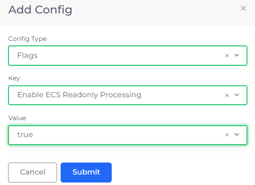
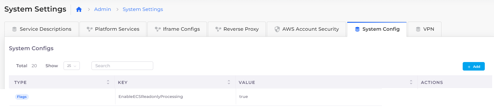

# Enable read-only processing for an ECS cluster

If you previously configured an ECS cluster outside of the DuploCloud Portal, use this procedure to configure and access it, as a read-only cluster, within DuploCloud.&#x20;

## Configure read-only processing for an ECS cluster

1. In the DuploCloud Portal, navigate to **Administrator** -> **System Settings**.
2. Click the **System Config** tab.
3. Click **Add**. The **Add Config** pane displays.
4.  From the **Config Type** list box, select **Flags**.\

    

    <figure><figcaption>
<strong>Add Config</strong> pane with <strong>Other Config Type</strong> field 
</figcaption></figure>

    

5. In the **Key** field, enter **EnableECSReadonlyProcessing**.
6. In the **Value** field, enter **true**.
7. Click **Submit**.&#x20;

In the **System Config** tab, the **EnableECSReadonlyProcessing Key** displays a **Value** of **true.** &#x20;

<figure><figcaption>
<strong>System Config</strong> tab on <strong>System Settings</strong> page with <strong>EnableECSReadonlyProcessing Key</strong> displaying <strong>Value true</strong>
</figcaption></figure>
