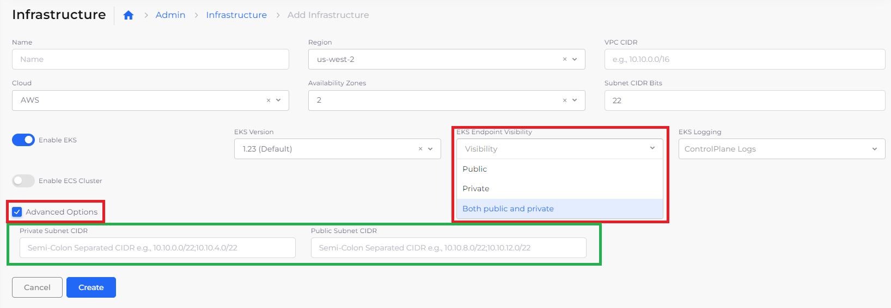
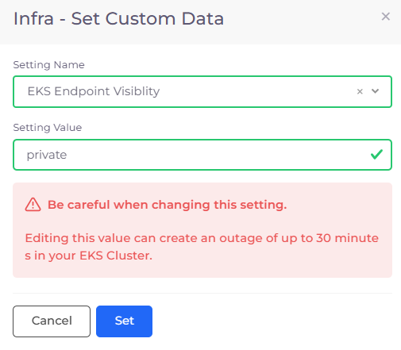

# Enable EKS endpoints

AWS SDKs and the AWS Command Line Interface (AWS CLI) automatically use the default public endpoint for each service in an AWS Region. However, when you create an Infrastructure in DuploCloud, you can specify a custom **Private** endpoint, a custom **Public** endpoint, or **Both public and private** custom endpoints. If you specify no endpoints, the default **Public** endpoint is used.


Modifying endpoints can incur an outage of up to thirty (30) minutes in your EKS cluster. Plan your update accordingly to minimize disruption for your users.


For more information about AWS Endpoints, see the [AWS documentation](https://docs.aws.amazon.com/general/latest/gr/rande.html).

## Specifying custom EKS endpoints and visibility

1. Follow the steps in the section [Creating an Infrastructure](../../disaster-recovery.md). Before clicking **Create**, specify **EKS Endpoint Visibility**.
2. From the **EKS Endpoint Visibility** list box, select **Public**, **Private**, or **Both public and private**.&#x20;
3. Click **Advanced Options.**
4. Using the **Private Subnet CIDR** and **Public Subnet CIDR** fields, specify CIDRs for alternate public and private endpoints.&#x20;
5. Click **Create**.

<figure><figcaption>
<strong>Infrastructure</strong> page with <strong>EKS Endpoint Visibility</strong> field and <strong>Advanced Options</strong> for specifying custom subnet CIDRs
</figcaption></figure>

## Updating existing EKS endpoint visibility

To change the visibility for EKS endpoints you have already created:

1. In the DuploCloud Portal, navigate to **Administrator** -> **Infrastructure**. The **Infrastructure** page displays.
2. From the **Name** column, select the Infrastructure for which you want to modify EKS endpoints.
3. Click the **Settings** tab.
4. In the **EKS Endpoint Visibility** row, in the **Actions** column, click the (  ) icon and select **Update Setting**. The **Infra - Set Custom Data** pane displays.
5. From the **Setting Value** list box, select the desired type of visibility for endpoints (**private**, **public**, or **both**).
6. Click **Set**.

<figure><figcaption>
<strong>Infra - Custom Data</strong> pane with <strong>Setting Value</strong> for <strong>EKS Endpoint Visibility</strong>
</figcaption></figure>

