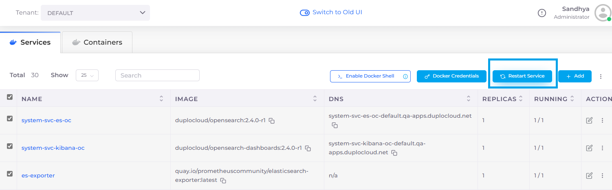

# Docker registry credentials and Kubernetes secrets

## Set Docker Registry Credentials and Kubernetes Secrets

1. In the DuploCloud Portal, navigate to  **DevOps** -> **Containers** -> **EKS/Native**. Docker registry credentials are passed to the Kubernetes cluster as `kubernetes.io/dockerconfigjson`.
2. Click **Docker Credentials**. The **Set Docker registry Creds** pane displays.
3. Supply the credentials and click **Submit**.
4. Enable the Docker Shell Service by clicking **Enable Docker Shell**.

## Add multiple Docker Registry Credentials

You can pull images from multiple Docker registries by adding multiple Docker Registry Credentials.

1. In the DuploCloud Portal, click **Administrator**-> **Plan**. The **Plans** page displays. &#x20;
2. Select the Plan in the **Name** column.
3. Click the **Config** tab.
4. Click **Add**. The **Add Config** pane displays.

<figure><figcaption>
<strong>Add Config</strong> pane
</figcaption></figure>

### Set Kubernetes Secrets

Optionally, set and reference Kubernetes secrets in your deployment by configuring the secrets with the **EKS/Native** option.&#x20;

1. In the DuploCloud Portal, navigate to **DevOps** -> **Containers** -> **EKS/Native**.&#x20;
2. Select the Service from the **Name** column.
3. Click the **K8S Secrets** tab. The **Kubernetes Secrets** page displays.

<figure><figcaption>
<strong>Kubernetes Secrets</strong> page
</figcaption></figure>
