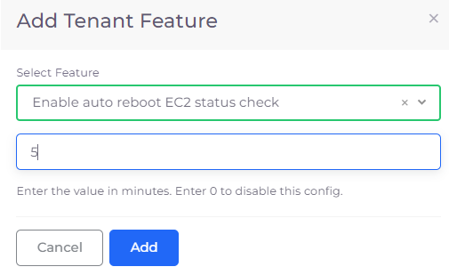
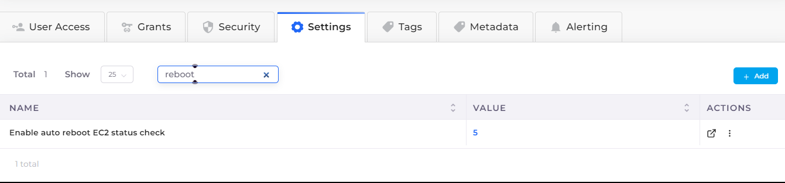

# Automatic fault healing

## Auto-rebooting a host upon a failed AWS status check

If an EC2 Host fails Status Check in AWS, the Host can be configured to reboot automatically. To do this, you configure the DuploCloud Tenant containing the EC2 Host to initiate an auto-reboot when needed.&#x20;

1. In the DuploCloud Portal, Navigate to **Adminstrator** -> **Tenant**.
2. From the **Name** column, select the Tenant in which the EC2 Host is defined.&#x20;
3. Click the **Settings** tab.&#x20;
4.  Click **Add**. The **Add Tenant Feature** pane displays.\

    

    <figure><figcaption>
<strong>Add Tenant Feature</strong> pane for <strong>Enable auto reboot</strong> feature ​ 
</figcaption></figure>

    

5. From the **Select Feature** list box, select **Enable** auto reboot EC2 status check.
6. In the field below the **Select Feature** box, enter a numeric value for the number of minutes that the system waits before auto-rebooting the host, following a status check failure in AWS.
7. Click **Add**. The **Enable auto reboot EC2 status check** configuration appears in the **Settings** tab.

<figure><figcaption>
<strong>Settings</strong> tab displaying configured <strong>Enable auto reboot</strong> feature
</figcaption></figure>

\
