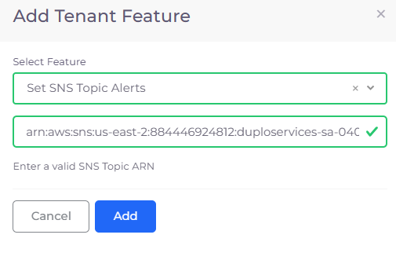
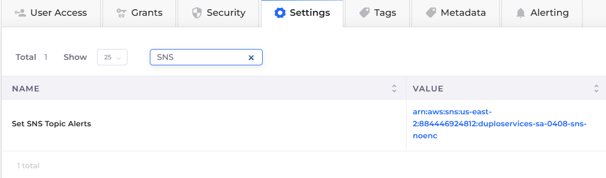

# SNS Topic Alerts

SNS Topic Alerts provide a flexible and scalable means of sending notifications and alerts across different AWS services and external endpoints, allowing you to stay informed about important events and incidents happening in your AWS environment.

SNS is a fully managed service that enables you to publish messages to topics. The messages can be delivered to subscribers or endpoints, such as email, SMS, mobile push notifications, or even HTTP endpoints.

Configuring this setting will attach the SNS Topic to the alerts in the **OK** and **Alarm** state.

## Configuring Tenants to set SNS Topic Alerts

1. In the DuploCloud Portal, navigate to **Administrator** -> **Tenants**. The **Tenants** page displays.
2. Select the Tenant for which you want to set SNS Topic Alerts from the **Name** column.
3. Click **Settings**.
4. Click **Add**. The **Add Tenant Feature** pane displays.
5. From the **Select Feature** list box, select **Set SNS Topic Alerts**.
6.  In the field below the **Select Feature** list box, enter a **valid SNS Topic ARN**.\
    \

    

    <figure><figcaption>
<strong>Add Tenant Feature</strong> pane for <strong>Set SNS Topic Alerts</strong> feature
</figcaption></figure>

    

7.  Click **Add**. The configuration is displayed in the **Settings** tab.\

    

    <figure><figcaption>
<strong>Settings</strong> tab displaying <strong>Set SNS Topic Alerts</strong> ARN
</figcaption></figure>

    

