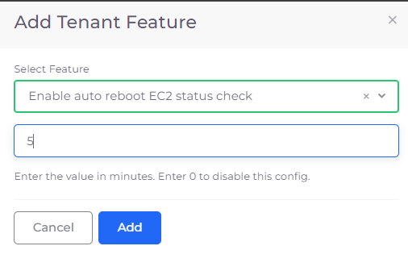
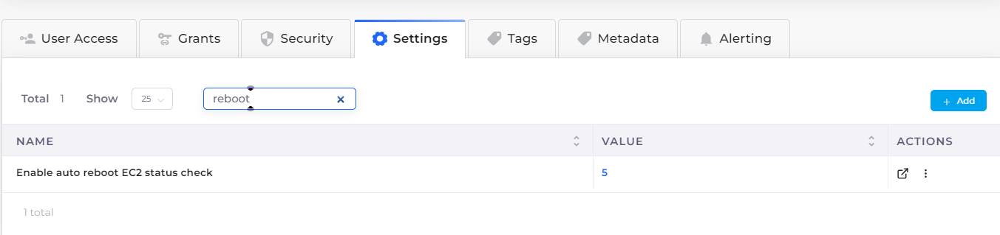

# Hosts (VMs)

Once we have the Infrastructure (Networking, Kubernetes cluster, and other common configurations) and an environment (Tenant) setup, the next step is typically to launch EC2 virtual machines (VMs). You create VMs to be:

* EKS Worker Nodes
* Worker Nodes (Docker Host), if the built-in container orchestration is used.

You also create VMs if Regular nodes are not part of any container orchestration; for example, where a user manually connects and installs apps, as when using Microsoft SQL Server in a VM, Running an IIS application, and such custom use cases.

## Adding a Host (VM)

Add a Virtual Machine Host. DuploCloud AWS supports **EC2**, **ASG**, and **BYOH** (Bring Your Own Host) types. Use **BYOH** for any VMs that are not **EC2** or **ASG**.&#x20;

1. Ensure you have selected the appropriate Tenant from the **Tenant** list box at the top of the DuploCloud Portal.
2. In the DuploCloud Portal, navigate to **DevOps -> Hosts**.&#x20;
3. Click the tab that corresponds to the type of Host you want to create (**EC2**, **ASG**, or **BYOH**).
4. Click **Add**.


If you add custom code for EC2 or ASG hosts using the **Base64 Data** field, your custom code overrides the code needed to start the EC2 or ASG hosts and the hosts cannot connect to EKS. Instead, [use this procedure](hosts-vms.md#adding-custom-code-for-ec2-and-asg-hosts-in-eks) to add custom code directly in EKS.&#x20;


 (1) (1).png>)

While all the lower-level details like IAM roles, Security groups, and others are abstracted away from the user (as they are derived from the Tenant), standard application-centric inputs are required to be provided. This includes a Name, Instance size, Availability Zone choice, Disk size, Image ID, etc. Most of these are optional, some are published as a list of user-friendly choices by the admin in the plan (Image or AMI ID is one such example). Other than these AWS centric parameter there is two DuploCloud platform-specific value to be provided:

**Agent Platform**: This is applicable if the VM is going to be used as a host for [container orchestration](https://docs.duplocloud.com/docs/aws/container-deployments/container-orchestrators) by the platform. The choices are:

* EKS Linux: If this is to be added to the EKS cluster i.e. EKS is the chosen approach for container orchestration
* Linux Docker: If this is to be used for hosting Linux containers using the [Builtin Container orchestration](../container-deployments/)      &#x20;
* Docker Windows: If this is to be used for hosting Windows containers using the [Builtin Container orchestration](../container-deployments/)
* None: If the VM is going to be used for non-Container Orchestration purposes and contents inside the VM will be self-managed by the user

**Allocation Tags (Optional)**: If the VM is being used for containers, then you have the option to set a label on the VM. This label can be then specified during docker app deployment to ensure that the application containers are pinned to a specific set of nodes. Thus you get the ability to split a tenant further into separate pools of servers and deploy applications on them.&#x20;


If a VM is being used for container orchestration make sure that the Image ID  corresponds to an Image for that container orchestration. This should be already set up for you and the list box will have self-descriptive Image IDs for example "EKS Worker", "Duplo-Docker", "Windows Docker" etc. Anything that starts with Duplo would be an image for the Built-in container orchestration &#x20;


### Connect your EC2 Instance

If you want to connect your EC2 instance remotely using SSH, [follow these steps](../aws-services/virtual-machines/ssh-ec2-instance.md).

## Auto-rebooting a host&#x20;

You can configure a host to reboot automatically if it fails an automated status check in AWS. To do so, add the following configuration to the DuploCloud Tenant in which the EC2 Host resides.

1. In the DuploCloud Portal, Navigate to **Adminstrator** -> **Tenant**.
2. From the **Name** column, select the Tenant in which the EC2 Host is defined.
3. Click the **Settings** tab.
4.  Click **Add**. The **Add Tenant Feature** pane displays.\


    <figure><figcaption><p><strong>Add Tenant Feature</strong> pane with <strong>Enable auto reboot EC2 status check feature</strong> selected</p></figcaption></figure>


5. From the **Select Feature** list box select **Enable auto reboot EC2 status check**.
6. In the field below the **Select Feature** box, enter a numeric value for the number of minutes that the system waits before auto-rebooting the host, following a status check failure in AWS.
7.  Click **Add**. The **Enable auto reboot EC2 status check** configuration appears in the **Settings** tab.\


    <figure><figcaption><p>Tenant Settings tab with  <strong>Enable auto reboot EC2 status check feature</strong> configured</p></figcaption></figure>


## Adding custom code for EC2 and ASG hosts in EKS

If you add custom code for EC2 or ASG hosts using the **Base64 Data** field, your custom code overrides the code needed to start the EC2 or ASG hosts and the hosts cannot connect to EKS.&#x20;

To avoid this issue, add the following `bash` command in your EKS instance to include your custom code, replacing:

* MYINFRA with the name of the DuploCloud Infrastructure, and
* MYTENANT with the name of the DuploCloud Tenant

```bash
#!/bin/bash
set -o xtrace
/etc/eks/bootstrap.sh duploinfra-MYINFRA --kubelet-extra-args '--node-labels=tenantname=duploservices-MYTENANT'

# Custom user code:
echo "hello world"
```
