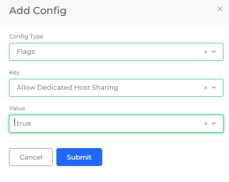
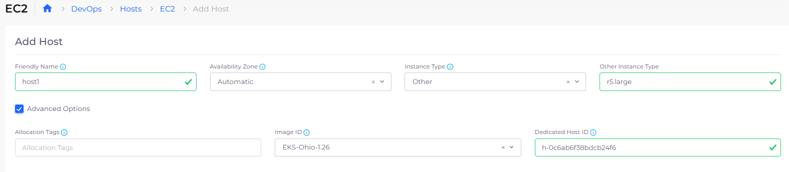
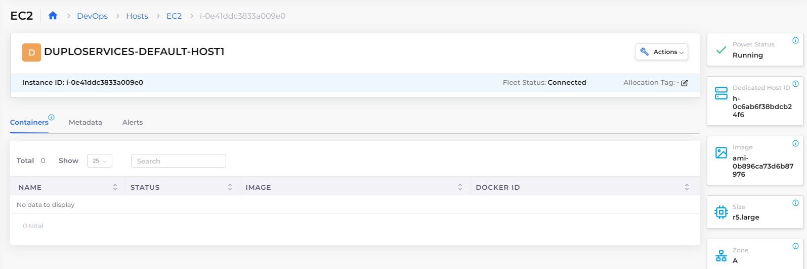

# Launch Instances in Dedicated Host

## Configuring dedicated hosts to launch EC2 instances

Use dedicated hosts to launch Amazon EC2 instances and provide additional visibility and control over how instances are placed on a physical server; enabling you to use the same physical server, if needed.

### Prerequisites

Configure the DuploCloud Portal to allow dedicated host sharing.

1. In the DuploCloud Portal, navigate to **Administrator** -> **System Settings**.
2. Click the **System Config** tab.
3.  Click **Add**. The **Add Config** pane displays.\

    

    <figure><figcaption>
<strong>Add Config</strong> pane with <strong>Key</strong> for <strong>Allow Dedicated Host Sharing</strong> 
</figcaption></figure>

    

4. In the **Config Type** field, select **Flags**.
5. In the **Key** field, select **Allow Dedicated Host Sharing**.
6. In the **Value** field, select **true**.
7. Click **Submit**. The configuration is displayed in the **System Config** tab.

### Configuring dedicated hosts to launch EC2 instances

1. In the DuploCloud Portal, navigate to **DevOps** -> **Hosts**.
2. In the EC2 tab, click **Add**. The **Add Host** page displays.
3. After completing the required fields to configure your Host, select **Advanced Options**. The advanced options display.
4.  In the **Dedicated Host ID** field, enter the ID of the dedicated host created in AWS. The ID is used to launch a specific instance on a dedicated host. See the screenshot below for an example.\

    

    <figure><figcaption>
<strong>EC2</strong> page with <strong>Advanced Options</strong> displayed including <strong>Dedciated Host ID</strong>
</figcaption></figure>

    

5. Click **Add**. The dedicated host is displayed in the **EC2** tab.

### Viewing EC2 instances launched in a Dedicated host

After you create ec2 instances, view them by doing the following:

1. In the DuploCloud Portal, navigate to **DevOps** -> **Hosts**.
2.  In the **EC2** tab, select the **Host** from the Name column. The **Dedicated Host ID** card on the Host page displays the ID of the dedicated host.\

    

    <figure><figcaption>
<strong>Dedicated Host ID</strong> card on the Host page displaying ID of dedicated host
</figcaption></figure>

    

