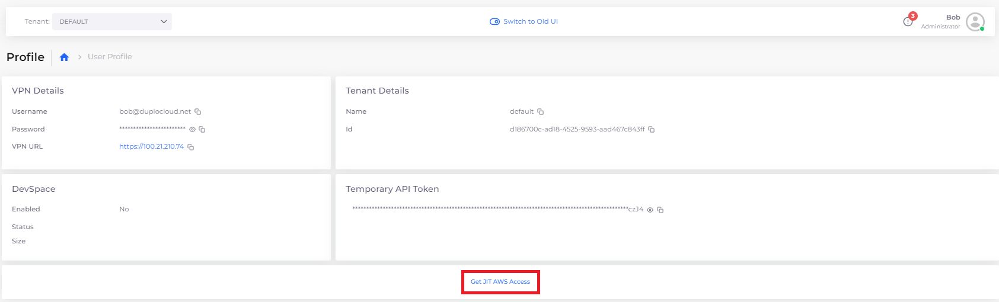
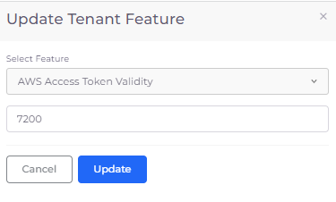
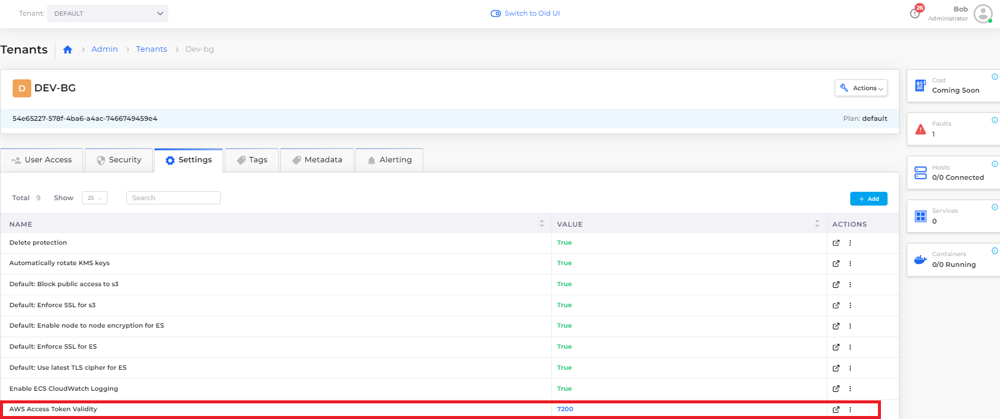

# JIT Access

DuploCloud users can obtain Just-In-Time (JIT) access to the AWS Console. This access is restricted to resources that the user has access to in the DuploCloud portal. With JIT access, DuploCloud administrators have admin-level access within the AWS Console and the access is generated in real-time and revoked, by default, in one hour.

## Access using the UI

You can obtain AWS JIT access directly from the DuploCloud UI.&#x20;

1. In the DuploCloud portal, navigate to **User** -> **Profile**.
2. Click the link **Get JIT AWS Access**.  This page links directly to the AWS Console.

<figure><figcaption><p>DuploCloud User Profile page</p></figcaption></figure>

## Access using the command line

Obtain access through the command line interface (CLI).

1. Download the latest **.zip** archive from [https://github.com/duplocloud/duplo-jit/releases](https://github.com/duplocloud/duplo-jit/releases) for your operating system.
2. Extract the archive and add **duplo-jit** to your $PATH environment variable. **duplo-jit** must obtain an AWS JIT session using a [DuploCloud API Token](https://docs.duplocloud.com/docs/administrator-tools/access-control/api-tokens). This token can be specified either as part of your local AWS configuration or can be obtained interactively, using your DuploCloud portal session.&#x20;

#### Obtain credentials using an API Token

1. [Obtain a DuploCloud API Token](https://docs.duplocloud.com/docs/administrator-tools/access-control/api-tokens).
2. Edit the AWS Config file (**\~/.aws/config)** and add the following, as shown in the example below:

```
[profile ENV_NAME]
region=us-west-2
credential_process=duplo-jit aws --admin --host https://ENV_NAME.duplocloud.net --token <DUPLO_TOKEN>
```

#### Obtain credentials interactively

Replace `--token <DUPLO_TOKEN>` in the API Token example above with `--interactive`.

When you make the first AWS call, you are prompted to grant authorization through the DuploCloud portal, as shown below.&#x20;

<figure><figcaption><p><strong>Local Access Requested</strong> prompt</p></figcaption></figure>

Upon successful authorization, A Just-In-Time token is provided, which is valid for one hour. When the token expires, you are prompted to re-authorize the request.

## Accessing the AWS Console

Obtain access to the AWS console.

### **Accessing the AWS Console from the CLI**

As long as you use the AWS\_PROFILE that matches the profile name you set in [the section above](jit-access.md#access-using-the-command-line), the AWS CLI obtains the required access credentials.

For example:

`AWS_PROFILE=ENV_NAME aws ec2 describe-instances`

### **Obtaining a link to the AWS Console Url**

To obtain a link to the AWS Console, run one of the following commands, which copy the Console URL to your clipboard that you can use in any browser.

All of these examples assume Administrator role access, passing the `--admin` flag. If you are obtaining JIT access for a User role (not Administrator), ensure that you replace the `--admin` argument in the following code snippets with `--tenant`` `_`YOUR_TENANT`_.


If you are receiving errors when attempting to retrieve credentials, try running the command with the `--no-cache` argument.


#### Using an API Token

```
duplo-jit aws --admin --host "https://ENV_NAME.duplocloud.net" --token <DUPLO_TOKEN> | jq -r .ConsoleUrl | pbcopy
```

#### Obtain a link interactively

```
duplo-jit aws --admin --host "https://ENV_NAME.duplocloud.net" --interactive | jq -r .ConsoleUrl | pbcopy
```

#### Obtain a link by configuring your `zsh` shell

Add the following to your `.zshrc` file:

```
function jitnow() {
  duplo-jit aws --admin --no-cache --host "https://$1.duplocloud.net" --interactive | jq -r .ConsoleUrl | pbcopy
}
```


usage is `jitnow portalname`


### Configuring session timeout

By default, JIT sessions expire after one hour. This can be modified in the DuploCloud Portal for a specific Tenant.&#x20;

1. displaysIn the DuploCloud Portal, navigate to **Administrator** -> **Tenant**.
2. Select the Tenant from the **Name** column for which you want to change the expiration period.
3. Click the **Settings** tab.
4. Click **Add** to add a custom timeout setting. The Add Tenant Feature pane displays.
5. Select **AWS Access Token Validity** from the Select Feature list box.
6. In the field below (the value), specify the desired timeout period in seconds. in the example below, we specify **7200** seconds or two hours, overriding the default of **3600** seconds, or one hour.
7. Click **Update**. The new **Value** is displayed in the **Tenant Settings** tab.

<figure><figcaption><p><strong>Update Tenant Feature</strong> pane to specify new default timeout in seconds</p></figcaption></figure>

<figure><figcaption><p><strong>AWS Access Token Validity</strong> settings updated with a value of <strong>7200</strong> (seconds)</p></figcaption></figure>


If you are increasing the session timeout beyond the AWS default of 1 hour, you also need to update the maximum session duration value for the IAM role assigned to your DuploCloud tenant.&#x20;

Access the AWS Console as an Administrator using [the instructions above](jit-access.md#accessing-the-aws-console). In the AWS Console, navigate IAM -> Roles and modify the value for your tenant accordingly. For example, if your Tenant is named DEV01, and you need to set a timeout of two hours (7200 seconds), locate the IAM role **duploservices-dev01** and modify the **Maximum Session Duration** to two hours.


