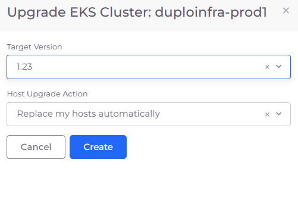
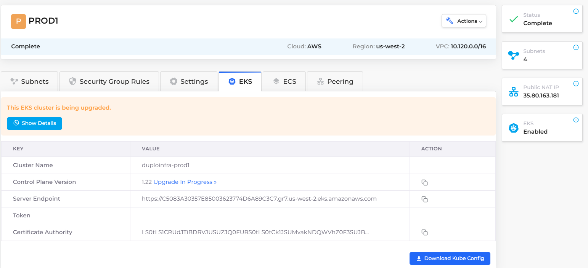
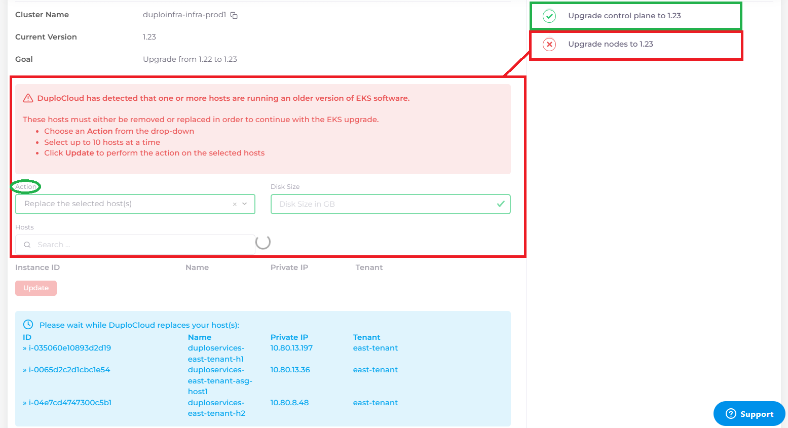

# Upgrading the EKS version

AWS frequently updates the version of EKS based on new features that are available in the Kubernetes platform. DuploCloud automates this upgrade in the DuploCloud Portal.


**IMPORTANT: An EKS version upgrade can cause downtime to your application depending on the number of replicas you have configured for your services. Schedule this upgrade outside of your business hours to minimize disruption.**


### About the upgrade process

The upgrade process:

* Updates the EKS Control Plane to the latest version
* Relaunches all Hosts to deploy the latest version on all nodes.

After the upgrade process completes successfully, you optionally assign allocation tags to Hosts.

### Starting the upgrade&#x20;

To upgrade the EKS version, in the DuploCloud Portal:&#x20;

1. Click **Administrator** -> **Infrastructure.**
2. Select the Infrastructure that you want to upgrade to the latest EKS version.
3.  Select the **EKS** tab. If an Infrastructure upgrade is available, an **Upgrade** link appears in the **Value** column.

    .png>)
4. Click the **Upgrade** link. The **Upgrade EKS Cluster** pane displays.
5. From the **Target Version** list box, select the version to which you want to upgrade.&#x20;
6. From the **Host Upgrade Action**, select the method by which you want to upgrade hosts.
7. Click **Create**. The upgrade process begins.

<figure><figcaption>
<strong>Upgrade EKS Cluster</strong> pane
</figcaption></figure>

### Monitoring the upgrade&#x20;

The **EKS Upgrade Details** page displays that the upgrade is **In Progress**.

<figure><figcaption>
<strong>EKS Upgrade Details</strong> page displaying upgrade <strong>In Progress</strong>
</figcaption></figure>

Find more details about the upgrade by selecting your Infrastructure and clicking the EKS tab, and then click **Show Details**. The **EKS Upgrade Details** window displays.

<figure><figcaption>
<strong>Show Details</strong> button on the Infrastructure <strong>EKS</strong> tab with upgrade in progress
</figcaption></figure>

### Upgrade completion

The **EKS Upgrade Details** window displays the progress of updates for all versions and Hosts. Green checkmarks indicate successful completion in the **Status** list. Red **X**s indicate **Action**s you must take to complete the upgrade process.

<figure><figcaption>
<strong>EKS Upgrade Details</strong> window with <strong>Status</strong> list and <strong>Actions</strong> to be performed 
</figcaption></figure>

### Assign allocation tags

If any of your Hosts use allocation tags, you must assign allocation tags to the Hosts:

1. After your Hosts are online and available, navigate to **DevOps** -> **Hosts**.
2. Select the host group tab (**EC2**, **ASG**, etc.) on the **Hosts** screen.&#x20;
3. Click the **Add** button.
4. Name the Host and provide other configuration details on the **Add Host** form.
5. Select **Advanced Options**.
6. Edit the **Allocation Tag** field.&#x20;
7. Click **Create** and define your allocation tags.
8. Click **Add** to assign the allocation tags to the Host.

<figure><figcaption>
Allocation tags in the <strong>Add Host</strong> screen
</figcaption></figure>

&#x20; &#x20;

&#x20;                                 &#x20;
