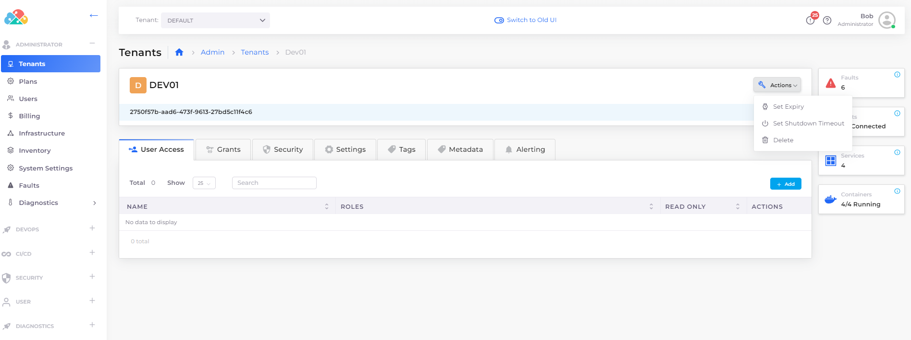
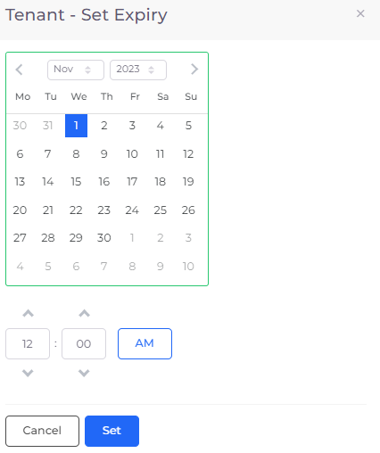
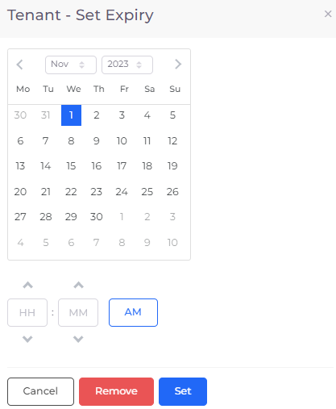

# Set Tenant expiration

## Managing Tenant expiration

You can specify a date and time when a Tenant will expire. At the specified date and time, the Tenant is deleted from the DuploCloud Portal.

### Setting a Tenant's expiration date&#x20;

1. In the DuploCloud Portal, navigate to **Administrator** -> **Tenant**. The **Tenants** page displays.
2. From the **Name** column, select the Tenant for which you want to set an expiration date.
3.  Click the **Actions** menu and select **Set Expiry**. The **Tenant - Set Expiry** pane displays.\

    <figure><figcaption>
<strong>Tenant</strong> page with <strong>Actions</strong> menu, including <strong>Set Expiry</strong> option.
</figcaption></figure>

4.  Use the calendar to set a date and time for the Tenant to be deleted.\

    <figure><figcaption>
Setting a Tenant expiration date with the <strong>Tenant - Set Expiry</strong> pane, with calendar
</figcaption></figure>

5. Click **Set**.

### Updating or removing a Tenant's expiration date

1. In the DuploCloud Portal, navigate to **Administrator** -> **Tenant**. The **Tenants** page displays.
2. From the **Name** column, select the Tenant for which you want to update or remove an expiration date.
3.  Click the **Actions** menu and select **Set Expiry**. The **Tenant - Set Expiry** pane displays.\

    <figure><figcaption>
Updating a Tenant expiration date with the <strong>Tenant - Set Expiry</strong> pane, with calendar, and <strong>Remove</strong> button
</figcaption></figure>

4. Use the calendar to change the date and time when you want the Tenant deleted and click **Set**. To remove a Tenant's expiration date, click **Remove**.&#x20;

